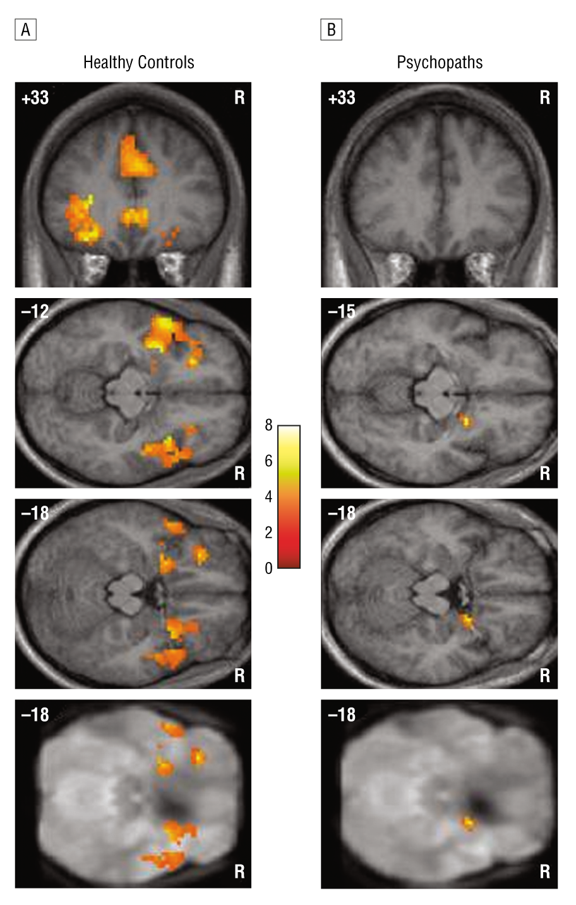
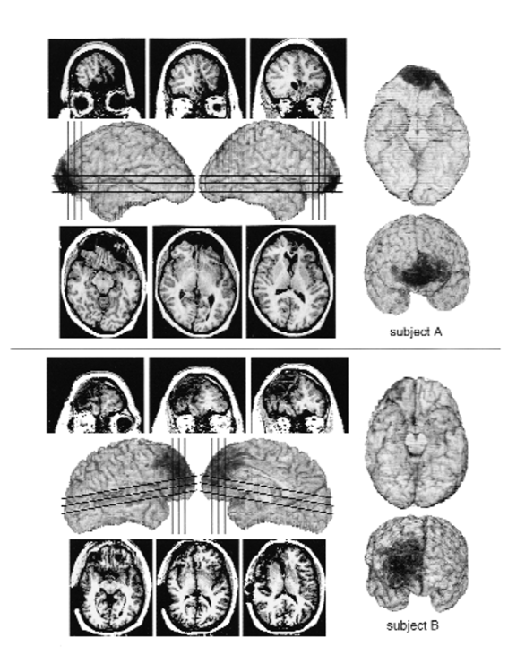
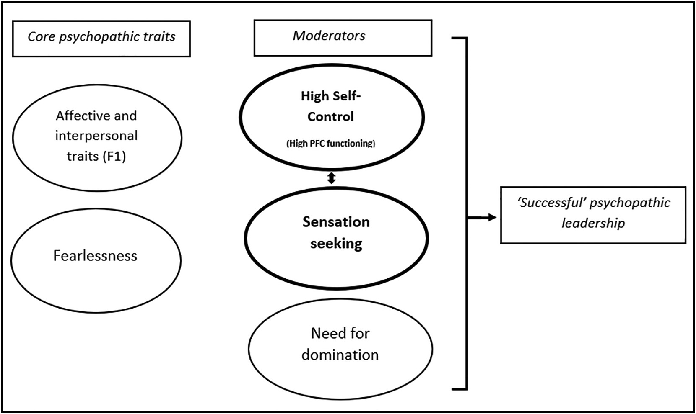
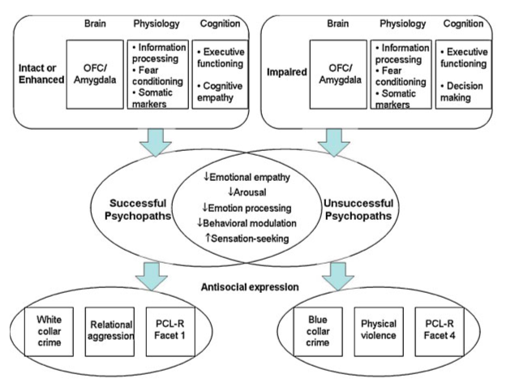

## Abstract

The post aims to give a brief review of psychopathy as a neuropsychiatric disorder. It starts with a discussion of features that define the psychopath. Then it takes a closer look at some of the traits, such as empathy, to show the general beliefs and controversy across the studies with the provided overview of the dysfunctions in the brain and impairments that stem from them. Lastly, the post includes an overview of research on “successful” and “unsuccessful” psychopaths and assesses the literature-based opinion on whether psychopathy can be treated.

## Disclaimer

As for mental health research in general, results can often be controversial. Therefore, even if I did not mention the study that failed to reproduce the same results or found the opposite results, it does not mean that such studies do not exist.

And no, this post is not about Vladimir Putin, although there is a reason to believe that he might have some psychopathic features.

## Basic Traits of Psychopathy

> *Wanted charming, aggressive, carefree people who are impulsively irresponsible but are good at handling people and at looking after number one.*

This is a snippet of an advertisement in a Boston newspaper aimed to recruit participants with psychopathy for a study conducted by Cathy Widom in the seventies (Widom, 1977[^34]). This short sentence gives a perfect overview of the complex disorder. A typical representative would normally have high irresponsibility and impulsivity rates, grandiose sense of self-worth, show an anti-social behavior, but at the same time could be extremely charming. The combination of these traits can make one relatively dangerous for society and consequently psychopathy is often associated with violent behavior.

But as one could guess, *typical* does not mean *every*, that is why we cannot imply that all psychopaths have the same set of traits and psychopathy does not necessarily make one an offender. Originally research on psychopathy was biased toward convicted subjects, but over the last decades have been shifted to investigating the psychopathy in the general population. Indeed, many individuals with psychopathy are not violent, as the media could portray them, but rather organized and foresighted. Some of them can be highly successful in their professional careers and can be found in all areas of life (e.g., business, banking, law).

To this date, the etiology of psychopathy is not well established (Perez, 2012[^25]), however, several neural correlates and impairments can be distinguished, which will be reviewed later.

## Assessment

Harpur et al. (1989)[^12] have suggested a two-factor model of psychopathy, which divides it into primary, or Factor 1, and secondary, or Factor 2. Factor 1 covers interpersonal and affective traits, such as callousness and grandiosity. Whereas Factor 2 comprises impulsive and anti-social behavior. Primary psychopathy can be also named "successful" psychopathy, since it can be beneficial for achieving life-goals and increasing power in society. In fact, the estimated prevalence of psychopathy in the business world is 3-4% compared to 0.6-1% in the general population (Babiak & Hare, 2006[^40]). On the other hand, secondary psychopathy is the one that is more likely to lead to criminal behavior (Skeem et al., 2011[^30]).

Psychopathy Checklist-Revised (PCL-R) is a commonly used measure of psychopathy (Hare, 2003[^39]), which consists of four facets. These facets can be further summarized by two higher-order factors. The PCL-R involves a relatively time-consuming (around 2 hours) semi-structured interview and file review that is used by the interviewer to rate the presence of 20 characteristics.

**Factor 1**:

* *Facet 1 (Interpersonal)*
  * Glibness/superficial harm
  * Grandiose sense of self-worth
  * Pathological lying
  * Conning/manipulative
* *Facet 2 (Affective)*
  * Lack of remorse of guilt
  * Shallow affect
  * Callousness/Lack of empathy
  * Failure to accept responsibility for own actions

**Factor 2**:

* *Facet 3 (Lifestyle)*
  * Need for stimulation/proneness to boredom
  * Impulsivity
  * Irresponsibility
  * Lack of realistic, long-term goals
* *Facet 4 (Antisocial)*
  * Early behavioral problems
  * Poor behavioral controls
  * Jouvenile delinquency
  * Revocation of conditional release
  * Criminal versatility

**Items that did not saturate any factor:**

* Promiscuous sexual behavior
* Many short-term marital relationships

<b>Table 1</b>. Elements of the PCL-R (Hare, 2003)

Research has shown that Factor 2 traits of psychopathy are associated with environmental factors (e.g., childhood trauma). There is also a positive correlation with depression, substance abuse symptoms, and anxiety, whereas Factor 1 has little or no association with these factors.

## Can Psychopaths Feel Empathy?

Even though it is commonly believed that psychopaths do not have empathy (the ability *to understand* and *share* the feelings of another), the results across studies are not homogeneous. Moreover, the term "empathy" is often used interchangeably with the terms "sympathy" or "compassion" (the ability *to be concerned* about the well-being of another), while they may have slightly different meanings (van Dongen, 2020[^32]).

Review from Burghart and Mier (2022)[^4] showed rather low to moderate associations between different aspects and psychopathy, such as empathy (*r*=−0.31), empathic concern (*r*=−0.29), alexithymia (*r*= 0.21), and personal distress (*r*=−0.14). The results also varied by psychopathy factors, and some were moderated by gender. For example, women are characterized by more emotional dysregulation than men (Kreis & Cooke, 2011[^41]).

Results from van Dongen et al. (2018)[^33] showed that participants with higher "meanness" scores showed empathy for the perpetrator, but not the victim, while passively watching the pictures of aggressive (physical, sexual, or verbal) and neutral situations between two individuals. Also, meanness was positively correlated with subjective ratings of aggressive pictures, indicating that such situations were rather "enjoyable".

Positive association with alexithymia can be of particular interest since it suggests that subjects with psychopathy struggle to identify and describe emotions experienced by themselves. The study by Garofalo and colleagues showed that emotion dysregulation plays a role in explaining the connection between psychopathy and aggression (Garofalo et al., 2020[^7]). Additionally, Shane and Groat (2018)[^29] have shown that subjects with psychopathy can increase or decrease their emotional response if they are asked to do so.

Similar results have been achieved by Meffert et al. (2013)[^19]. 20 male subjects with psychopathy have watched videos of hand interactions, with 4 conditions depicted, love (hands caressing), pain (one hand hitting the other), social exclusion (one hand pushing away the other friendly hand), and neutral (approaching hand touching the other and getting a non-emotional response) videos. Results showed reduced activation of brain areas involved in empathy compared to controls. However, similarly to Shane & Groat (2018)[^29], reduction became less prominent when subjects were instructed to emphasize the person in the video. These findings suggest that psychopaths *can* empathize with people around, but the corresponding neural system is "switched off" by default. This finding can also be implemented for violence prevention and treatment in the population by means "teaching" individuals with psychopathy to empathize other people.

## Brain Malfunctions

Functional magnetic resonance imaging (fMRI) studies suggest that subjects with psychopathy have impairments in several brain regions compared to healthy controls.

Birbaumer et al. (2005)[^2] study showed reduced amygdala and orbitofrontal cortex (OFC) activation during the aversive differential conditioning experiment (Figure 1). OFC has been associated with the anticipation of punishment and reward and the ability to adapt learning in a volatile environment. The interaction of the amygdala and OFC seems to be crucial for encoding expected outcomes during learning. Subjects were presented with a set of 4 male neutral faces, which were used as conditional stimulus (CS). Painful pressure was used as an unconditional stimulus (US). Healthy controls showed sustained activation of the left amygdala throughout the acquisition phase, whereas the psychopaths displayed only right amygdala activation. Additionally, psychopaths showed reduced OFC activation, especially in the second half of the acquisition phase when the learned association needs to be translated into behavioral responses. Authors suggest that the psychopaths acquired some knowledge about the association between the CS and US but never processed the emotional significance of the association. However, intact the cognitive stimulus processing was intact.

<figure>
  </img>
  <figcaption><b>Figure 1</b>. Activation clusters for the contrast conditioned stimulus (CS) followed by the unconditioned stimulus (US) (CS+ condition) minus the CS never followed by the US (CS− condition) during acquisition for the healthy control subjects (A) and the psychopaths (B). Adopted from Birbaumer et al. (2005).</figcaption>
</figure>

## In Love with Fear?

Since amygdala is a key player in fear/risk processing, such impairments can explain a lack of fear in the psychopathic population to some extent. One of the earliest studies by Hare (1965)[^38] showed that psychopathic traits were related to lower and delayed arousal when anticipating an electric shock. Similarly, Blair et al. (2004)[^3] study showed that subjects with psychopathy performed worse at passive avoidance learning task (learning the association between numbers and point rewards, which could be positive or negative). Furthermore, their performance was not modulated by the level of punishment, compared to the control group. This could explain the good performance on tasks involving rewards only.

Kiehl et al. (2001)[^14] study compared three groups of subjects, criminal psychopaths, criminal non-psychopaths, and noncriminal controls, during the affective memory task. Subjects were asked to remember and later recognize a list of 12 words presented on a screen. The list of words included "negative" words (such as "hate") and "neutral" words (such as "chair"). Results revealed that criminal psychopaths showed less affect-related activity, compared to the neutral baseline, than did criminal non-psychopaths and noncriminal controls in the rostral and caudal anterior cingulate, posterior cingulate, left inferior frontal gyrus, right amygdala, and ventral striatum. Importantly, there were no group differences in the above regions for processing neutral stimuli compared to the resting condition. These data suggest that the observed abnormalities in these regions for criminal psychopaths are limited to anomalies in processing affective stimuli and are not due to difficulties in processing neutral stimuli.

Psychopathy is also associated with a lower startle response (Oskarsson et al., 2021[^21]). Strikingly, in Levenston et al. (2000)[^17] study the startle response became the same for pleasant (erotic or thrilling images) and aversive (threat and victim scenes) stimuli over time. The subjective rating and heart rate deceleration for aversive images were also lower compared to the control group, which could be seen as subjects from the psychopathy group showed "a pleasurable response to the distress of others".

According to the proposed Fear Enjoyment hypothesis (Hosker-Field et al., 2016[^13]) individuals high in psychopathic traits may experience positive affect in fear-inducing situations. They found that people with psychopathic traits, specifically Factor 1 traits, responded similarly to excitement and fear inducing videos (a skydiving clip was used as an excitement-inducing stimulus and a clip of a man being buried alive was from the movie "The Vanishing" was used as a fear-inducing stimulus). Finally, people with psychopathic traits were more likely to use positive descriptors when asked to explain what "fear" feels like and in their description of physiological experiences of fear. The Fear Enjoyment Hypothesis also overlaps with research that suggest that psychopathic traits are associated with the enjoyment of misfortune in others.

## Disturbances in Decision-Making

Michael Koenigs has reviewed the neuroimaging data and revealed two particular regions in PFC that show abnormal function, ventromedial prefrontal cortex (vmPFC) and anterior cingulate cortex (ACC) (Koenigs, 2012[^15]). It is believed that vmPFC is involved in many cognitive functions, such as risk and fear processing, decision-making, self-control, and morality, and ACC is associated with emotion regulation and social behavior. Psychopathy was associated with significant reductions in prefrontal gray matter in these two regions. Additionally, both psychopaths and patients with vmPFC lesions show reduced autonomic arousal to emotionally charged stimuli.

In the earlier study, Koenigs used a group of prisoners (6 with primary psychopathy, 6 with secondary psychopathy, and 22 non-psychopaths) to play Ultimatum Game and Dictator Game. In the Ultimatum Game one player, the proposer, is endowed with a sum of money (Koenigs et al., 2010[^16]). The proposer's task is to split the money with another player, the responder. The responder may accept it or reject it. If the responder accepts, the money is split as it was proposed. If the responder rejects, both players receive nothing. Both players know in advance the consequences of the responder accepting or rejecting the offer. In the Dictator Game, there are again two players with an opportunity to split a sum of money. However, in this case, the responder has no choice but to accept whatever split the proposer offers. Results were compared with the performance of vmPFC lesion patients and data revealed that primary psychopaths and vmPFC lesion patients have somewhat similar economic decision-making performance. Both groups showed significantly reduced Ultimatum acceptance rates and significantly lower Dictator offers, whereas this was not the case for secondary psychopaths. These results also suggest that primary and secondary psychopaths may differ in their decision-making.

Another comparison between subjects with psychopathy and subjects with lesions can be done with the help of Anderson et al. (1999)[^1] study. The authors looked at two subjects with early onset of frontal lobe damage due to the accident and tumor that happened in their early life (Figure 2). These subjects showed impairment of social and moral behavior, such as failure to comply with rules, confrontations with peers and adults, explosive outbursts of anger, and thievery. Additionally, during the Gambling Task, they failed to choose options with low immediate reward but positive long-term gains; rather, they persisted in choosing response options that provided high immediate reward but higher long-term loss. This is so-called myopic decision-making, which can be observed in subjects with psychopathy as well (Newman et al., 1992[^20]).

<figure>
  </img>
  <figcaption><b>Figure 2</b>. 3-D reconstructed brain of patient 1 (subject A) and patient 2 (subject B). Adopted from Anderson et al. (1999)</figcaption>
</figure>

Another brain region that can be distinguished in subjects with psychopathy is the striatum, which is increased in volume compared to healthy controls (Glenn et al., 2010[^9]; Choy et al., 2022[^5]). Striatum plays a role in motor and action planning, decision-making, motivation, reinforcement, and reward perception. This structural difference may partially underlie the reward-seeking and decision-making deficits associated with psychopathy. It has been also shown that psychopathy is associated with great tendencies to make risky selections in the context of risky decision-making (Yao et al., 2019[^36]).

## Need for Control

The large body of literature shows the association between psychopathy and socially dominant behavior. A comprehensive review by Palmen et al. (2021)[^23] points out that social dominance is a characteristic of the primary psychopathy, particularly interpersonal and affective traits, which in turn leads to sociable behavior. Individuals with secondary psychopathy, on the other hand, may be more socially withdrawn.

In the study of Lobbestael et al. (2017)[^18] 91 subjects underwent an identical interview with the subordinate or dominant interviewers. Dominant behavior towards the dominant interviewer has positively correlated with the high Factor 1 psychopathic traits. However, it was not the case for subjects with the high Factor 2 scores, who showed reduced defense distancing towards the interviewer (allowing the dominant interviewer to approach more closely).

After the examining results of an online questionnaire (with 3531 participants) Glenn and colleagues (2017)[^8] found that subjects with psychopathy may even value power and control over people much more than financial success. Furthermore, financial success can be viewed only as a tool to achieve power.

Son Hing et al. (2007)[^31] hypothesize that subjects with high social dominance rates have a greater chance to become leaders. Additionally, dominant behavior makes them look competent and proficient in their leadership, which is not necessarily the case. Using their charming and self-presentation skills they could easily create a perfect (but fake) image of a good leader and manipulate decision-makers into hiring them (Palmen et al., 2021[^23]). In the earlier study, Palmen et al. (2019)[^22] proposed the model of the psychopathic leader (Figure 3). It suggests psychopathic individuals prefer leadership positions in order to fulfill the need for sensation seeking, gain financial success, and have control over other people.

<figure>
  </img>
  <figcaption><b>Figure 3</b>. The model of the psychopathic leader. Adopted from Palmen et al. (2019).</figcaption>
</figure>

However, while achievement of leadership positions is beneficial for the subject with psychopathy, it is not necessarily helpful for others and can harm organizations and employees. According to Palmen et al. (2021)[^23]:

> In several studies, psychopathic leaders were not only associated with their own negative job performance but their presence also had a negative impact on their employees. The studied employees were less committed to their organizations, exhibited lower work motivation, higher turn-over intentions, and higher job neglect. Furthermore, they felt dissatisfied with their supervisor and with their jobs and they experienced more frequent work-family related conflict.

## Psychopathy and Crime

If we combine empathy, lack of fear, and dominant behavior in one individual, we have a perfect candidate for an offender. According to research, not all psychopaths are criminals, but those who are criminals are likely to be psychopaths. While the prevalence of psychopathy is around 1% in the general population, 20-30% of the prison population are found to have a psychopathic personality (Hare, 1999[^11]). A review by Reidy et al. (2015)[^27] summarized that psychopaths commit some of the most severe acts of violence (which can result in greater injury and death) and at a higher rate compared to non-psychopathic offenders. Also, they have a higher chance to recidivate violently than non-psychopathic offenders.

Porter et al. (2003)[^26] assessed 18 psychopathic and 20 non-psychopathic offenders and showed that the rate of sadistic behavior in homicides was 1.5 higher compared to non-psychopaths (82.4% compared to 52.6%). Additionally, they found that sadistic behavior was associated with Factor 1 traits and hypothesized that it could be a result of a lack of empathy combined with a thrill-seeking propensity. Similar results have been achieved by Holt et al. (1999)[^42], where psychopaths were found to be significantly more sadistic than non-psychopaths in a sample of 41 violent inmates at a maximum-security prison.

It has been also shown that homicides by psychopathic offenders (mostly with Factor 1 traits) were mostly instrumental compared to the homicides by non-psychopathic offenders (Woodworth & Porter, 2002[^35]). This means that their actions were planned, lacked emotions, and were motivated by external goals, rather than being impulsive. The authors bring an example of an inmate who carefully planned and murdered his wife because it allowed him to get financial gains from her insurance policy. Although, these results may not agree with the knowledge that psychopaths generally have high impulsivity rates (Hare, 1996[^10]). Woodworth and Porter (2002)[^35] suggest the idea of "selective impulsivity", meaning that psychopaths may plan their actions to perform the crime since the stakes are high. Although this also does not lay with the idea of myopic decision making (Newman et al., 1992[^20]).

After reviewing the literature on "successful" and "unsuccessful" psychopaths, Gao et al. (2010)[^6] have suggested a model for these two aspects (Figure 4). While both groups have similar outcomes such as increased sensation-seeking (middle part), unsuccessful psychopathy seems to be more correlated with the impaired amygdala and OFC regions (top part), which may result in different manifestations (bottom part).

<figure>
  </img>
  <figcaption><b>Figure 4</b>. Neurobiological model of successful and unsuccessful psychopaths. Adopted from Gao et al. (2010).</figcaption>
</figure>

## Can Psychopathy be Cured?

Given everything that has been said, one reasonable question to ask is "Can someone with psychopathy be treated?". Unfortunately, research has not been very positive in this direction. While psychological interventions (e.g., cognitive behavior therapy, contingency management) are the most common choice of treatment, drug therapy has also been proposed (e.g., MDMA, oxytocin). But the initial problem with the treatment could be whether we even expect psychopaths to seek help. As one could imagine, psychopaths may perceive their traits as an advantage, rather than a disorder.

An extensive review from Salekin et al. (2010)[^28] goes over reviews research on the psychopathy treatment with adults and youth. Authors indicate that researchers have contrasting opinions on the matter. While some suggest that treatment can potentially better the condition, others believe that it will have no effect or even worsen it. They also rose three problems that can appear during the treatment: (1) due to their cunning and manipulative nature, psychopaths may be simply "playing along" with the therapist; (2) even if they come to the treatment they are not particularly motivated to change; and (3) due to callousness psychopathic individuals cannot make strong attachments to others and thus are not able to do well in psychotherapy. Overall results suggest that treatment for adults shows low to moderate success, whereas treatment for youth is more promising.

Moreover, some researchers have presumed that individuals with high levels of psychopathy maybe even untreatable (Harris and Rice, 2006[^37]).

## Summary and Conclusions

With everything being said, we can summarize the main points:

-   Psychopathy is a complex disorder with an unknown etiology and without well-established therapy.
-   Most commonly used model for psychopathy divides it into two factors, Factor 1 and Factor 2, which have different features.
-   Psychopaths tend to achieve leadership positions (e.g., in business or politics) due to the need for control and social dominance.
-   Individuals with psychopathy show impairments in several brain regions, including the amygdala, ventromedial prefrontal cortex, and orbitofrontal cortex.
-   Not all psychopaths are criminals, but those who are criminals are likely to be psychopaths.

## References

[^1]: Anderson, S. W., Bechara, A., Damasio, H., Tranel, D., & Damasio, A. R. (1999). Impairment of social and moral behavior related to early damage in human prefrontal cortex. *Nature Neuroscience, 2*(11), 1032--1037. <https://doi.org/10.1038/14833>
[^2]: Birbaumer, N., Veit, R., Lotze, M., Erb, M., Hermann, C., Grodd, W., & Flor, H. (2005). Deficient Fear Conditioning in Psychopathy. *Archives of General Psychiatry, 62*(7), 799. <https://doi.org/10.1001/archpsyc.62.7.799>
[^3]: Blair, R., Mitchell, D., Leonard, A., Budhani, S., Peschardt, K., & Newman, C. (2004). Passive avoidance learning in individuals with psychopathy: modulation by reward but not by punishment. *Personality and Individual Differences, 37*(6), 1179--1192. <https://doi.org/10.1016/j.paid.2003.12.001>
[^4]: Burghart, M., & Mier, D. (2022). No feelings for me, no feelings for you: A meta-analysis on alexithymia and empathy in psychopathy. *Personality and Individual Differences, 194*, 111658. <https://doi.org/10.1016/j.paid.2022.111658>
[^5]: Choy, O., Raine, A., & Schug, R. (2022). Larger striatal volume is associated with increased adult psychopathy. *Journal of Psychiatric Research, 149*, 185--193. <https://doi.org/10.1016/j.jpsychires.2022.03.006>
[^6]: Gao, Y., & Raine, A. (2010). Successful and unsuccessful psychopaths: A neurobiological model. *Behavioral Sciences & the Law*, n/a. <https://doi.org/10.1002/bsl.924>
[^7]: Garofalo, C., Neumann, C. S., & Velotti, P. (2020). Psychopathy and Aggression: The Role of Emotion Dysregulation. *Journal of Interpersonal Violence, 36*(23--24), NP12640--NP12664. <https://doi.org/10.1177/0886260519900946>
[^8]: Glenn, A. L., Efferson, L. M., Iyer, R., & Graham, J. (2017). Values, Goals, and Motivations Associated with Psychopathy. *Journal of Social and Clinical Psychology, 36*(2), 108--125. <https://doi.org/10.1521/jscp.2017.36.2.108>
[^9]: Glenn, A. L., Raine, A., Yaralian, P. S., & Yang, Y. (2010). Increased Volume of the Striatum in Psychopathic Individuals. Biological Psychiatry, 67(1), 52--58. <https://doi.org/10.1016/j.biopsych.2009.06.018>
[^10]: Hare, R. D. (1996). Psychopathy. *Criminal Justice and Behavior, 23*(1), 25--54. <https://doi.org/10.1177/0093854896023001004>
[^11]: Hare, R. D. (1999). *Without Conscience: The Disturbing World of the Psychopaths Among Us (1st ed.)*. The Guilford Press.
[^12]: Harpur, T. J., Hare, R. D., & Hakstian, A. R. (1989). Two-factor conceptualization of psychopathy: Construct validity and assessment implications. *Psychological Assessment: A Journal of Consulting and Clinical Psychology, 1*(1), 6--17. <https://doi.org/10.1037/1040-3590.1.1.6>
[^13]: Hosker-Field, A. M., Gauthier, N. Y., & Book, A. S. (2016). If not fear, then what? A preliminary examination of psychopathic traits and the Fear Enjoyment Hypothesis. *Personality and Individual Differences, 90*, 278--282. <https://doi.org/10.1016/j.paid.2015.11.016>
[^14]: Kiehl, K. A., Smith, A. M., Hare, R. D., Mendrek, A., Forster, B. B., Brink, J., & Liddle, P. F. (2001). Limbic abnormalities in affective processing by criminal psychopaths as revealed by functional magnetic resonance imaging. *Biological Psychiatry, 50*(9), 677--684. <https://doi.org/10.1016/s0006-3223(01)01222-7>
[^15]: Koenigs, M. (2012). The role of prefrontal cortex in psychopathy. *Reviews in the Neurosciences, 23*(3). <https://doi.org/10.1515/revneuro-2012-0036>
[^16]: Koenigs, M., Kruepke, M., & Newman, J. P. (2010). Economic decision-making in psychopathy: A comparison with ventromedial prefrontal lesion patients. *Neuropsychologia, 48*(7), 2198--2204. <https://doi.org/10.1016/j.neuropsychologia.2010.04.012>
[^17]: Levenston, G. K., Patrick, C. J., Bradley, M. M., & Lang, P. J. (2000). The psychopath as observer: Emotion and attention in picture processing. *Journal of Abnormal Psychology, 109*(3), 373--385. <https://doi.org/10.1037/0021-843x.109.3.373>
[^18]: Lobbestael, J., Arntz, A., Voncken, M., & Potegal, M. (2018). Responses to dominance challenge are a function of psychopathy level: A multimethod study. *Personality Disorders: Theory, Research, and Treatment, 9*(4), 305--314. <https://doi.org/10.1037/per0000252>
[^19]: Meffert, H., Gazzola, V., den Boer, J. A., Bartels, A. A. J., & Keysers, C. (2013). Reduced spontaneous but relatively normal deliberate vicarious representations in psychopathy. *Brain, 136*(8), 2550--2562. <https://doi.org/10.1093/brain/awt190>
[^20]: Newman, J. P., Kosson, D. S., & Patterson, C. M. (1992). Delay of gratification in psychopathic and nonpsychopathic offenders. *Journal of Abnormal Psychology, 101*(4), 630--636. <https://doi.org/10.1037/0021-843x.101.4.630>
[^21]: Oskarsson, S., Patrick, C. J., Siponen, R., Bertoldi, B. M., Evans, B., & Tuvblad, C. (2021). The startle reflex as an indicator of psychopathic personality from childhood to adulthood: A systematic review. *Acta Psychologica, 220*, 103427. <https://doi.org/10.1016/j.actpsy.2021.103427>
[^22]: Palmen, D. G., Derksen, J. J., & Kolthoff, E. (2020). High self-control may support 'success' in psychopathic leadership: Self-control versus impulsivity in psychopathic leadership. *Aggression and Violent Behavior, 50*, 101338. <https://doi.org/10.1016/j.avb.2019.101338>
[^23]: Palmen, D. G., Kolthoff, E. W., & Derksen, J. J. (2021). The need for domination in psychopathic leadership: A clarification for the estimated high prevalence of psychopathic leaders. *Aggression and Violent Behavior, 61*, 101650. <https://doi.org/10.1016/j.avb.2021.101650>
[^24]: Parrott, A. C. (2007). The psychotherapeutic potential of MDMA (3,4-methylenedioxymethamphetamine): an evidence-based review. *Psychopharmacology, 191*(2), 181--193. <https://doi.org/10.1007/s00213-007-0703-5>
[^25]: Perez, P. R. (2012). The etiology of psychopathy: A neuropsychological perspective. *Aggression and Violent Behavior, 17*(6), 519--522. <https://doi.org/10.1016/j.avb.2012.07.006>
[^26]: Porter, S., Woodworth, M., Earle, J., Drugge, J., & Boer, D. (2003). Characteristics of sexual homicides committed by psychopathic and nonpsychopathic offenders. *Law and Human Behavior, 27*(5), 459--470. <https://doi.org/10.1023/a:1025461421791>
[^27]: Reidy, D. E., Kearns, M. C., DeGue, S., Lilienfeld, S. O., Massetti, G., & Kiehl, K. A. (2015). Why psychopathy matters: Implications for public health and violence prevention. *Aggression and Violent Behavior, 24*, 214--225. <https://doi.org/10.1016/j.avb.2015.05.018>
[^28]: Salekin, R. T., Worley, C., & Grimes, R. D. (2010). Treatment of psychopathy: A review and brief introduction to the mental model approach for psychopathy. *Behavioral Sciences & the Law, 28*(2), 235--266. <https://doi.org/10.1002/bsl.928>
[^29]: Shane, M. S., & Groat, L. L. (2018). Capacity for upregulation of emotional processing in psychopathy: all you have to do is ask. *Social Cognitive and Affective Neuroscience, 13*(11), 1163--1176. <https://doi.org/10.1093/scan/nsy088>
[^30]: Skeem, J. L., Polaschek, D. L. L., Patrick, C. J., & Lilienfeld, S. O. (2011). Psychopathic Personality. *Psychological Science in the Public Interest, 12*(3), 95--162. <https://doi.org/10.1177/1529100611426706>
[^31]: Son Hing, L. S., Bobocel, D. R., Zanna, M. P., & McBride, M. V. (2007). Authoritarian dynamics and unethical decision making: High social dominance orientation leaders and high right-wing authoritarianism followers. *Journal of Personality and Social Psychology, 92*(1), 67--81. <https://doi.org/10.1037/0022-3514.92.1.67>
[^32]: van Dongen, J. D. M. (2020). The Empathic Brain of Psychopaths: From Social Science to Neuroscience in Empathy. *Frontiers in Psychology, 11*. <https://doi.org/10.3389/fpsyg.2020.00695>
[^33]: van Dongen, J. D. M., Brazil, I. A., van der Veen, F. M., & Franken, I. H. A. (2018). Electrophysiological correlates of empathic processing and its relation to psychopathic meanness. *Neuropsychology, 32*(8), 996--1006. <https://doi.org/10.1037/neu0000477>
[^34]: Widom, C. S. (1977). A methodology for studying noninstitutionalized psychopaths. *Journal of Consulting and Clinical Psychology, 45*(4), 674--683. <https://doi.org/10.1037/0022-006x.45.4.674>
[^35]: Woodworth, M., & Porter, S. (2002). In cold blood: Characteristics of criminal homicides as a function of psychopathy. *Journal of Abnormal Psychology, 111*(3), 436--445. <https://doi.org/10.1037/0021-843x.111.3.436>
[^36]: Yao, X., Zhang, F., Yang, T., Lin, T., Xiang, L., Xu, F., & He, G. (2019). Psychopathy and Decision-Making: Antisocial Factor Associated With Risky Decision-Making in Offenders. *Frontiers in Psychology, 10*. <https://doi.org/10.3389/fpsyg.2019.00166>
[^37]: Harris, G. T., & Rice, M. E. (2006). Treatment of Psychopathy: A Review of Empirical Findings. In C. J. Patrick (Ed.), *Handbook of psychopathy* (pp. 555–572). The Guilford Press.
[^38]: Hare, R. D. (1965). Psychopathy, Fear Arousal and Anticipated Pain. *Psychological Reports, 16*(2), 499–502. https://doi.org/10.2466/pr0.1965.16.2.499
[^39]: Hare, R. D. (2003). Hare Psychopathy Checklist-Revised (PCL-R). 2nd. *Toronto: MHS*.
[^40]: Babiak, P., & Hare, R. D. (2006). *Snakes in suits: When psychopaths go to work*. Regan Books/Harper Collins Publishers.
[^41]: Kreis, M. K. F., & Cooke, D. J. (2011). Capturing the Psychopathic Female: A Prototypicality Analysis of the Comprehensive Assessment of Psychopathic Personality (CAPP) Across Gender. *Behavioral Sciences & the Law, 29*(5), 634–648. https://doi.org/10.1002/bsl.1003
[^42]: Holt, S. E., Meloy, J. R., & Strack, S. (1999). Sadism and psychopathy in violent and sexually violent offenders. *The journal of the American Academy of Psychiatry and the Law, 27*(1), 23–32.