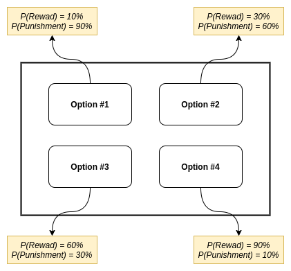
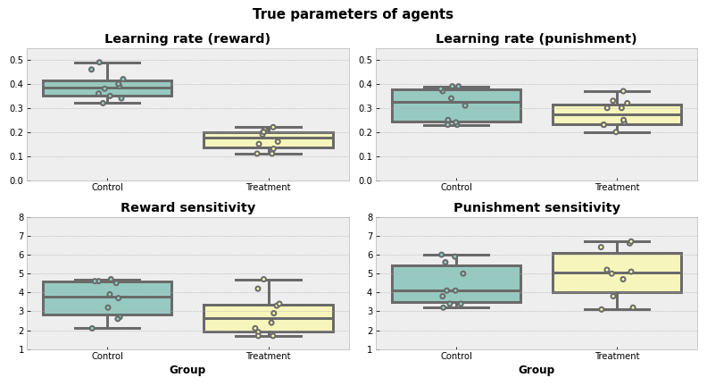
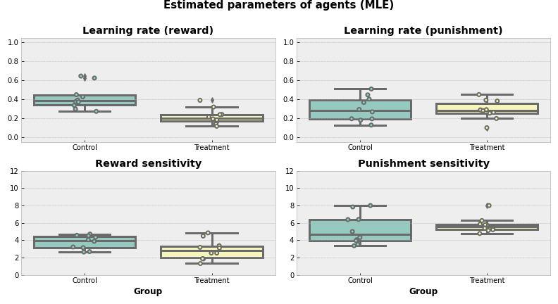
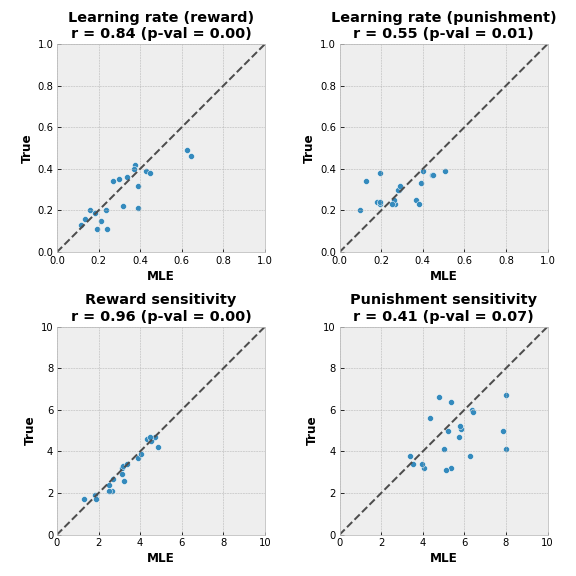
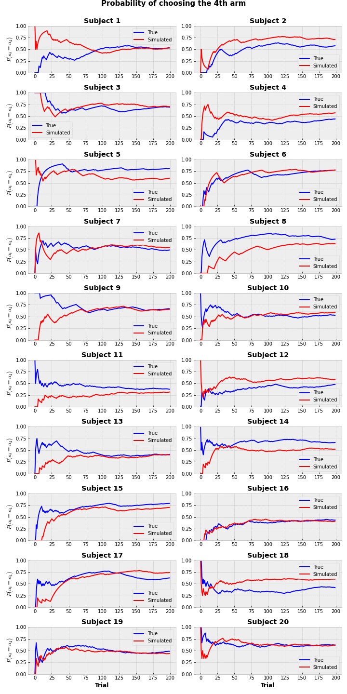

## Introduction

It is pretty clear that neuroscience is shaping the artificial intelligence (AI) field by means of new research questions and ideas. But at the same time AI also has a huge impact on the neuroscience field. Over the last decades reinforcement learning (RL) algorithms have been particularly useful in attempts to understand how humans and animals make decisions and they've provided methods to quantify the parameters of behavioral data, which could be also correlated to neuronal data. For example, temporal difference (TD) learning model has highlighted the role of dopamine in decision-making in a classical study of Schultz (1998)[^1].

Even though RL methods have been applied in a neuroscience field for quite some time, some may still be unsure how these methods can help with answering research questions or how to actually apply modeling in practice. While there are already several comprehensive articles on how to apply RL models to decision-making data, the purpose of this post is to provide an actual example of model fitting with coding guidelines and also to compare two main approaches, maximum likelihood estimation (MLE) and Bayesian method. Part 1 will focus on the MLE approach with the example code in Python, whereas part 2 will focus on the Bayesian approach written in R with the help of `hBayesDM` package. Both parts should be viewed as an overview, and not as means of selecting the one-size-fits-all approach. The explanations and basics of theory will be provided, however for a more in-depth overview reader might want to refer to Lockwood et al. (2021)[^2], Daw (2011)[^3] and Wilson et al. (2019)[^4].

**Objectives**:

1. How to answer research questions using modelling.
2. How to fit a RL model to behavioral data using MLE.
3. How to compare models and choose the best fitting one.
4. How to generate the data using RL model.

<details><summary><b><font color="#ff6969">Code</font></b></summary>
<p>

```python
import itertools
import numpy as np
import pandas as pd
import seaborn as sns
import matplotlib.pyplot as plt
import pingouin as pg
from tqdm import tqdm
from scipy.special import softmax, log_softmax
from scipy.optimize import minimize
from scipy.stats import chisquare


plt.style.use('bmh')
plt.rcParams['figure.facecolor'] = 'white'
```
</p>
</details>
<br>

**Research question**:

We hypothesize that treatment (could be anything, dopamine manipulations, exposure to stress, etc.) affects humans' reward sensitivity and the learning rate for a positive outcome (the speed of learning where the optimal choice is).

**Paradigm**:

We could test this using so-called multi-armed bandit (MAB) paradigm, with a slight modification. In our case, each "arm" can bring reward and punishment at the same time for each trial. The probabilities of outcomes are stationary over time. Subject has to make a decision (choose an "arm") at each trial. We will use a 4-armed bandit. 

We will also have two groups, control (CTR) and treatment (TRT), and compare the parameters between them.

## Data generation

For this article, we will generate **artificial** data, but we will treat it as **real-life** data (at least most of the time). In other words, we will generate data with a set of parameter values, but then we will try to recover them using the modeling. On the one hand, this will allow to perform a quantitative assessment of model fitting techniques (since we know the ground truth). On the other hand, we can see how to perform a model fitting in a "real-life".

We will use the model adapted from Seymour et al. (2012)[^5]. Parameters of the model are:

* learning rate for reward outcomes $\alpha^{\text{reward}}$ (how fast agent learns from the positive feedback)
* learning rate for punishment outcomes $\alpha^{\text{punishment}}$ (how fast agent learns from the negative feedback)
* reward sensitivity $R$ (how agent perceives positive feedback)
* punishment sensitivity $P$ (how agent perceives negative feedback)

**Model algorithm:**

* **for** *each step $t$ in episode* **do**
  * $\scriptsize Q(a_j)_t \leftarrow Q(a_j)^{\text{reward}}_t + Q(a_j)^{\text{punishment}}_t$
  * Select action $a_t$ using softmax policy $\scriptsize P(a_j = a_t) = \frac{e^{Q_j}}{\sum_{j}e^{Q_j}}$
  * Observe reward $r_t$ and punishment $p_t$ values
  * **for** *each action $a_j$ in possible actions* **do**
    * **if** $a_j$ == $a_t$ **do**
      * $\scriptsize Q(a_j)^{\text{reward}}_{t+1} - Q(a_j)^{\text{reward}}_t + \alpha^{\text{reward}} \left( R \cdot r_t - Q(a_j)^{\text{reward}}_t \right)$
      * $\scriptsize Q(a_j)^{\text{punishment}}_{t+1} \leftarrow Q(a_j)^{\text{punishment}}_t + \alpha^{\text{punishment}} \left( P \cdot p_t - Q(a_j)^{\text{punishment}}_t \right)$
    * **else**
      * $\scriptsize Q(a_j)^{\text{reward}}_{t+1} \leftarrow Q(a_j)^{\text{reward}}_t + \alpha^{\text{reward}} \left( - Q(a_j)^{\text{reward}}_t \right)$
      * $\scriptsize Q(a_j)^{\text{punishment}}_{t+1} \leftarrow Q(a_j)^{\text{punishment}}_t + \alpha^{\text{punishment}} \left( - Q(a_j)^{\text{punishment}}_t \right)$
    * **end**
  * **end**
* **end**

{}
A note on terminology. In neuroscience settings, we usually call participants "subjects", whereas in RL we usually refer to them as "agents" (which may also have more abstract meaning). Also, a set of consecutive trials is usually called a "session" in neuroscience, but an "episode" in RL. In this article we may use these terms interchangeably. 
{}

<details><summary><b><font color="#ff6969">Code</font></b></summary>
<p>

```python
def generate_agent_data(
    alpha_rew, alpha_pun, rew_sens,
    pun_sens, rew_prob, pun_prob, rew_vals,
    n_arms=4, n_trials=100):
    """
    Simulate agent data for N-armed bandit task.
        
    Arguments
    ----------
    alpha_rew : float
        Learning rate for rewarding trials. Should be in a (0, 1) range.
        
    alpha_pun : float
        Learning rate for punishing trials. Should be in a (0, 1) range.
        
    rew_sens : float
        Reward sensitivity (R)
        
    pun_sens : float
        Punishment sensitivity (P)
        
    rew_prob : array_like
        Probability of reward for each arm.
        
    pun_prob : array_like
        Probability of punishment for each arm.
        
    rew_vals : array_like
        Values of reward (first element) and punishment (second element).
        For example [100, -50] means that agent receives 100 a.u. during 
        the reward and looses 50 a.u. during the punishment.
        
    n_arms : int, default=4
        Number of arms in N-armed bandit task.
        
    n_trials : int, default=100
        Number of simulated trials for an agent
        
    Returns
    ----------
    actions : array of shape (n_trials,)
        Selected action by the agent at each trial.
        
    gains : array of shape (n_trials,)
        Agent's reward value at each trial.
    
    losses : array of shape (n_trials,)
        Agent's punishment value at each trial.
    
    Qs : array of shape (n_trials, n_arms)
        Value function for each arm at each trial.
    """
    
    actions = np.zeros(shape=(n_trials,), dtype=np.int32)
    gains = np.zeros(shape=(n_trials,), dtype=np.int32)
    losses = np.zeros(shape=(n_trials,), dtype=np.int32)
    Qs = np.zeros(shape=(n_trials, n_arms))
    
    # initial uniform values for both reward and punishment value function
    Q_rew = np.ones(shape=(n_arms,)) 
    Q_rew /= n_arms
    
    Q_pun = np.ones(shape=(n_arms,)) 
    Q_pun /= n_arms

    Qs[0] = Q_rew + Q_pun

    for i in range(n_trials):

        # choose the action based of softmax function
        prob_a = softmax(Qs[i])
        a = np.random.choice(a=range(n_arms), p=prob_a) # select the action
        # list of actions that were not selected
        a_left = list(range(n_arms)) 
        a_left.remove(a) 

        # reward 
        if np.random.rand() < rew_prob[a]: # if arm brings reward
            r = rew_vals[0]
        else:
            r = 0

        gains[i] = r
        # value function update for a chosen arm
        Q_rew[a] += alpha_rew * (rew_sens*r - Q_rew[a])
        # value function update for non-chosen arms
        for a_l in a_left:
            Q_rew[a_l] += alpha_rew*(-Q_rew[a_l])
                
        # punishment
        if np.random.rand() < pun_prob[a]:  # if arm brings punishment
            r = rew_vals[1]
        else:
            r = 0

        losses[i] = r
        Q_pun[a] += alpha_pun * (pun_sens*r - Q_pun[a])
        for a_l in a_left:
            Q_pun[a_l] += alpha_pun*(-Q_pun[a_l])
        
        # save the records
        actions[i] = a

        if i < n_trials-1:
            Qs[i+1] = Q_rew + Q_pun

    return actions, gains, losses, Qs
```

</p>
</details>

<br>

Initial parameters:

* Probabilities of reward for each option are: 10%, 30%, 60% and 90%.
* Probabilities of punishment for each option are: 90%, 60%, 30% and 10%.
* Value of the reward is $+1$, value of the punishment is $-1$.
* Each group (CTR and TRT) will consist of 10 subjects.
* Each subject will perform 200 trials.

<center></img></center>

We can see, that an "ideal" agent would learn that 4-th option is the best choice to maximize the total reward, since it has the highest probability of reward and lowest probability of punishment.

<details><summary><b><font color="#ff6969">Code</font></b></summary>
<p>

```python
# initial parameters
rew_probs = np.array([.1, .3, .6, .9]) # probability of reward of each arm
pun_probs = np.array([.9, .6, .3, .1]) # probability of punishment of each arm
rew_vals = np.array([1, -1]) # reward = 1, punishment = -1
n_subj = 10 # n subjects in each group
n_arms = 4
n_trials = 200

# ids of agents
ids = {'Control': list(range(1, 11)),
       'Treatment': list(range(11, 21))}

params = ['alpha_rew', 'alpha_pun', 'R', 'P']
param_names = {
    'alpha_rew': 'Learning rate (reward)',
    'alpha_pun': 'Learning rate (punishment)',
    'R': 'Reward sensitivity',
    'P': 'Punishment sensitivity'}
```


```python
# data generation
np.random.seed(1)
agent_data = pd.DataFrame()
true_params = {}

for subj in itertools.chain(*ids.values()):

    true_params[subj] = {}
    
    if subj in ids['Control']:
        # control group
        group = 'Control'
        alpha_rew = np.random.randint(low=30, high=50) / 100 # RV in [0.3, 0.5]
        alpha_pun = np.random.randint(low=20, high=40) / 100 # RV in [0.2, 0.4]
        rew_sens = np.random.randint(low=20, high=50) / 10 # RV in [2., 5.]
        pun_sens = np.random.randint(low=30, high=70) / 10 # RV in [3., 7.]
    elif subj in ids['Treatment']:
        # treatment group
        group = 'Treatment'
        alpha_rew = np.random.randint(low=10, high=25) / 100 # RV in [0.1, 0.25]
        alpha_pun = np.random.randint(low=20, high=40) / 100 # RV in [0.2, 0.4]
        rew_sens = np.random.randint(low=15, high=50) / 10 # RV in [1., 5.]
        pun_sens = np.random.randint(low=30, high=70) / 10 # RV in [3., 7.]
    else:
        raise ValueError(f'No subject with id {subj} found!')
    
    actions, gain, loss, Qs = generate_agent_data(
        alpha_rew=alpha_rew, 
        alpha_pun=alpha_pun,
        rew_sens=rew_sens,
        pun_sens=pun_sens,
        rew_prob=rew_probs,
        pun_prob=pun_probs,
        rew_vals=rew_vals,
        n_trials=n_trials)

    # add generated data to temporary data frame
    temp_df = pd.DataFrame({
        'group': group, 'subjID': subj, 'trial': range(1, n_trials+1),
        'choice': actions+1, 'gain': gain, 'loss': loss})

    agent_data = agent_data.append(temp_df)

    # update dictionary with true parameter values
    true_params[subj]['alpha_rew'] = alpha_rew
    true_params[subj]['alpha_pun'] = alpha_pun
    true_params[subj]['R'] = rew_sens
    true_params[subj]['P'] = pun_sens
```

</p>
</details>

<br>

Sample of generated data:

<div>
<style scoped>
    .dataframe tbody tr th:only-of-type {
        vertical-align: middle;
    }

    .dataframe tbody tr th {
        vertical-align: top;
    }

    .dataframe thead th {
        text-align: right;
    }
</style>
<table border="0" class="dataframe">
<caption>
<span id="tab:unnamed-chunk-2">Table 1: </span>Sample of the generated data 
</caption>
  <thead>
    <tr style="text-align: right;">
      <th></th>
      <th>group</th>
      <th>subjID</th>
      <th>trial</th>
      <th>choice</th>
      <th>gain</th>
      <th>loss</th>
    </tr>
  </thead>
  <tbody>
    <tr>
      <th>0</th>
      <td>Control</td>
      <td>1</td>
      <td>1</td>
      <td>1</td>
      <td>0</td>
      <td>-1</td>
    </tr>
    <tr>
      <th>1</th>
      <td>Control</td>
      <td>1</td>
      <td>2</td>
      <td>1</td>
      <td>0</td>
      <td>-1</td>
    </tr>
    <tr>
      <th>2</th>
      <td>Control</td>
      <td>1</td>
      <td>3</td>
      <td>3</td>
      <td>1</td>
      <td>0</td>
    </tr>
    <tr>
      <th>3</th>
      <td>Control</td>
      <td>1</td>
      <td>4</td>
      <td>3</td>
      <td>1</td>
      <td>0</td>
    </tr>
    <tr>
      <th>4</th>
      <td>Control</td>
      <td>1</td>
      <td>5</td>
      <td>1</td>
      <td>0</td>
      <td>-1</td>
    </tr>
    <tr>
      <th>5</th>
      <td>Control</td>
      <td>1</td>
      <td>6</td>
      <td>3</td>
      <td>1</td>
      <td>-1</td>
    </tr>
    <tr>
      <th>6</th>
      <td>Control</td>
      <td>1</td>
      <td>7</td>
      <td>4</td>
      <td>0</td>
      <td>0</td>
    </tr>
    <tr>
      <th>7</th>
      <td>Control</td>
      <td>1</td>
      <td>8</td>
      <td>3</td>
      <td>0</td>
      <td>0</td>
    </tr>
    <tr>
      <th>8</th>
      <td>Control</td>
      <td>1</td>
      <td>9</td>
      <td>1</td>
      <td>1</td>
      <td>-1</td>
    </tr>
    <tr>
      <th>9</th>
      <td>Control</td>
      <td>1</td>
      <td>10</td>
      <td>4</td>
      <td>1</td>
      <td>0</td>
    </tr>
  </tbody>
</table>
</div>


Even though this data is generated, that's the exact data you can get from a real behavioral experiment. Each row in a dataset represents a trial for a particular subject. `choice` column represents the option chosen, `gain` and `loss` represent the reward and punishment values for a given trial. Full generated data set can be found [here](https://github.com/ruslan-kl/rklymentiev.com/blob/master/content/post/computational-models-of-behavior-pt1/agent_data.csv).

<details><summary><b><font color="#ff6969">Code</font></b></summary>
<p>

```python
true_params_df = pd.DataFrame(true_params).T.reset_index(drop=False)
true_params_df.rename(columns={'index': 'subjID'}, inplace=True)
true_params_df['group'] = true_params_df['subjID'].apply(
    lambda x: 'Control' if x in ids['Control'] else (
        'Treatment' if x in ids['Treatment'] else 'Undefined'
    )
)
```

```python
# plot boxplots with true parameter values for each group
plt.figure(figsize=(11,6))
for (i, param) in enumerate(params):
    plt.subplot(2,2,i+1)
    sns.boxplot(
        y=param, x='group',
        data=true_params_df, linewidth=3,
        palette='Set3')
    sns.stripplot(
        y=param, x='group', data=true_params_df,
        jitter=0.1, linewidth=2, palette='Set3')
    if i < 2:
        plt.xlabel('')
        plt.ylim([0, .55]) # use the same scale for each parameter type
    else:
        plt.xlabel('Group', fontweight='bold')
        plt.ylim([1, 8])
        
    plt.ylabel('')
    plt.title(param_names[param], fontweight='bold')

plt.suptitle('True parameters of agents', fontsize=15, fontweight='bold')
plt.tight_layout()
plt.show()
```

</p>
</details>

    

    


That's how **true** parameters are distributed. Visually, it looks like TRT group on average has a lower learning rate for positive feedback compared to CTR.

{}
Reminder, that we don't have information about the true parameter values in real life. We have access to them here since we are working with the simulated data.
{}


## Maximum Likelihood Estimation

Now we want to recover the parameters of subjects and basically check if our hypothesis is true and treatment affects the learning rate for positive feedback and sensitivity to a reward. As told before, there are two main approaches to do this, fitting the model using MLE and Bayesian way. Here we will focus on the MLE.

The idea of MLE is pretty simple, however, math under the hood is a bit more sophisticated. We want to find such set of parameters $\hat{\Theta} = { \\{ \alpha^{\text{reward}}, \alpha^{\text{punishment}}, R, P \\} } $, that is more likely to be true. In a simplified version, one can start it by choosing 4 random values for $\hat{\Theta}$, putting them into the algorithm described in [data generation part](#data-generation), and then answering the question "What is the probability that actions were selected given these four parameters" (or in a notation way, $P(\text{data}|\Theta)$). After this, one would have to change the values and answer the same question again for a new set of values. After $n$ of such runs, the winning set of parameters is the one that gives the **highest** probability of the data occurrence. Or in other words, it is the maximum likelihood estimator.

But of course, no one would do that by hand and we can use function optimization techniques to deal with it. In Python we can use `minimize` function from SciPy package to find the estimated values with the help of [limited-memory Broyden–Fletcher–Goldfarb–Shanno algorithm](https://en.wikipedia.org/wiki/Limited-memory_BFGS). This algorithm is a variation of a [gradient descent optimization method](https://en.wikipedia.org/wiki/Gradient_descent).

Since the function is looking for a *minimum* value, we will change the sign of likelihood in our function (and now function `minimize` will find the minimum value, while it is actually the highest). Also, we are going to use the [logarithm of likelihood](https://en.wikipedia.org/wiki/Likelihood_function#Log-likelihood), not the likelihood value itself.

<details><summary><b><font color="#ff6969">Code</font></b></summary>
<p>

```python
def log_lik(x, *args):
    """
    Sum of negative log likelihoods over all trials.

    Arguments
    ----------
    x : tuple, list
        Parameters to estimate by MLE fit.

    args: tuple, list
        Input parameters for the model.

    Returns
    ----------
        Sum of negative log likelihoods.
    """

    alpha_rew, alpha_pun, rew_sens, pun_sens = x # parameters to estimate
    n_arms, actions, gain, loss = args # input values

    Q_rew = np.ones(shape=(n_arms,)) 
    Q_rew /= n_arms

    Q_pun = np.ones(shape=(n_arms,)) 
    Q_pun /= n_arms

    log_prob_actions = np.zeros(shape=(len(actions), n_arms)) 

    for i, (a, g, l) in enumerate(zip(actions, gain, loss)):

        a_left = list(range(n_arms)) # actions that were not selected
        a_left.remove(a)

        log_prob_action = log_softmax(Q_rew + Q_pun)
        log_prob_actions[i] = log_prob_action[a]

        Q_rew[a] += alpha_rew * (rew_sens*g - Q_rew[a])
        for a_l in a_left:
            Q_rew[a_l] += alpha_rew*(-Q_rew[a_l])

        Q_pun[a] += alpha_pun * (pun_sens*l - Q_pun[a])
        for a_l in a_left:
            Q_pun[a_l] += alpha_pun*(-Q_pun[a_l])

    return -np.sum(log_prob_actions)
    
    
def mle_fit(x0, fun, params, bounds):
    """
    Fit model parameters using MLE approach.

    Arguments
    ----------
    x0 : array-like
        Initial value for each of the parameter.

    fun : function
        Function name to use for optimization.

    params : list
        List of parameter names.

    bounds : tuple
        Tuple of the lower and upper bounds for parameters.

    Returns
    ----------
    output : dict
        Dictionary with the estimated parameters for each agent.

    Example call
    ----------
    mle_fit(
        x0=[0.5, 2], fun=logLike,
        params=['alpha', 'beta'],
        bounds=((0.1, 1), (0, 10))
    """

    output = {}

    for subj in tqdm(agent_data['subjID'].unique(), desc=f'Fit with x0: {x0}'):

        output[subj] = {}
        cond = agent_data['subjID'] == subj
        actions = (agent_data[cond]['choice'] - 1).to_list()
        gain = agent_data[cond]['gain'].to_list()
        loss = agent_data[cond]['loss'].to_list()

        result = minimize(
            fun=fun, x0=x0,
            method='L-BFGS-B', # Limited-memory Broyden–Fletcher–Goldfarb–Shanno algorithm
            args=(n_arms, actions, gain, loss),
            bounds=bounds)

        for (j,param) in enumerate(params):
            output[subj][param] = result.x[j]
        output[subj]['likelihood'] = result.fun

    return output


def best_params(all_params_list):
    """
    Find the best fitting parameters from a set of parameters.

    Arguments
    ----------
    all_params_list : list
        List with the dictionaries of fitted value.
        Each dictionary should look as following:
        {<subject>: {<parameter1>: <value>, ..., <likelihood>: <value>}}

    Returns
    ----------
    selected_params : dict
        Dictionary with the best fitted values.
    """

    # dictionary {<subject>: [<likelihood1>, <likelihood2>, ...]}
    likelihoods = {}
    for subj in itertools.chain(*ids.values()):
        likelihoods[subj] = []
        for param_set in all_params_list:
            likelihoods[subj].append(param_set[subj]['likelihood'])

    # select the lowest log likelihood among given models
    # {<subject>: <index of a set with the lowest log likelihood>}
    selected_set = {subj: np.argmin(lik) for (subj, lik) in likelihoods.items()}

    # new set of parameters for each subject with best fitted values
    selected_params = {}
    for subj in selected_set.keys():
        selected_params[subj] = all_params_list[selected_set[subj]][subj]

    return selected_params
```

</p>
</details>

<br>

### Different starting values

Before we start fitting, there is one big issue with MLE that we should be aware of. The algorithm can be stuck in a [local minimum](https://en.wikipedia.org/wiki/Local_optimum), meaning that the found set of parameters is not optimal in the *entire* parameter space. One of the ways to deal with this problem is to use several starting points. Here we will run MLE for 10 random starting values and choose the set that gives the minimum negative log likelihood for each subject.

We will also use bounds for the parameters (learning rates should be in a range $\[ 0, 1\]$ and sensitivities should be in a range $\[ 0, 8 \]$), however Daw (2009)[^3] argues against that.

<details><summary><b><font color="#ff6969">Code</font></b></summary>
<p>

```python
all_mle_params = []

for i in range(10):
    # generate random initial values
    np.random.seed(i)
    alpha0 = list(np.random.random(size=(2,)).round(2))
    sens0 = list(np.random.randint(low=0, high=80, size=(2,)) / 10)
    x0 = alpha0 + sens0

    mle_output = mle_fit(
        x0=x0, fun=log_lik,
        params=params,
        bounds=((0, 1), (0, 1), (0, 8), (0, 8)))

    all_mle_params.append(mle_output)

selected_params = best_params(all_mle_params)
```

    Fit with x0: [0.55, 0.72, 6.7, 6.7]: 100%|██████████| 20/20 [00:38<00:00,  1.91s/it]
    Fit with x0: [0.42, 0.72, 0.9, 7.5]: 100%|██████████| 20/20 [00:36<00:00,  1.81s/it]
    Fit with x0: [0.44, 0.03, 2.2, 4.3]: 100%|██████████| 20/20 [00:35<00:00,  1.78s/it]
    Fit with x0: [0.55, 0.71, 5.6, 7.2]: 100%|██████████| 20/20 [00:27<00:00,  1.38s/it]
    Fit with x0: [0.97, 0.55, 0.1, 7.2]: 100%|██████████| 20/20 [00:45<00:00,  2.25s/it]
    Fit with x0: [0.22, 0.87, 1.6, 7.3]: 100%|██████████| 20/20 [00:34<00:00,  1.74s/it]
    Fit with x0: [0.89, 0.33, 7.9, 6.2]: 100%|██████████| 20/20 [00:39<00:00,  1.98s/it]
    Fit with x0: [0.08, 0.78, 6.7, 2.3]: 100%|██████████| 20/20 [00:34<00:00,  1.75s/it]
    Fit with x0: [0.87, 0.97, 0.5, 0.8]: 100%|██████████| 20/20 [00:38<00:00,  1.91s/it]
    Fit with x0: [0.01, 0.5, 5.4, 5.6]: 100%|██████████| 20/20 [00:41<00:00,  2.09s/it]


</p>
</details>
<br>

Once we have selected the best fitting values, the following questions may arise:

* Are we sure that the selected values represent the global minimum? We are not sure. 
* Were 10 initial starting points enough? We don't know. 
* Would another optimization method find a better set of parameters? It could, but the overview of different optimization methods is beyond the scope of this article.

It may sound vague, but that's the sad truth about MLE, we are never sure that we've found the best parameters. Although, by trying different methods and initial values we can make it as good as possible.

<details><summary><b><font color="#ff6969">Code</font></b></summary>
<p>

```python
# convert dict to dataframe
mle_params_df = pd.DataFrame(selected_params).T.reset_index(drop=False)
mle_params_df.rename(columns={'index': 'subjID'}, inplace=True)
mle_params_df['group'] = mle_params_df['subjID'].apply(
    lambda x: 'Control' if x in ids['Control'] else (
        'Treatment' if x in ids['Treatment'] else 'Undefined'
    )
)
```


```python
# plot estimated parameters
plt.figure(figsize=(11,6))
for (i, param) in enumerate(params):
    plt.subplot(2,2,i+1)
    sns.boxplot(
        y=param, x='group',
        data=mle_params_df, linewidth=3,
        palette='Set3')
    sns.stripplot(
        y=param, x='group', data=mle_params_df,
        jitter=0.1, linewidth=2, palette='Set3')
    if i < 2:
        plt.xlabel('')
        plt.ylim([-0.05, 1.05]) # use the same scale for each parameter type
    else:
        plt.xlabel('Group', fontweight='bold')
        plt.ylim([0, 12])
        
    plt.ylabel('')
    plt.title(param_names[param], fontweight='bold')

plt.suptitle('Estimated parameters of agents (MLE)', fontsize=15, fontweight='bold')
plt.tight_layout()
plt.show()
```

</p>
</details>
    

    


Now, we can actually estimate how good the selected parameters are.

<details><summary><b><font color="#ff6969">Code</font></b></summary>
<p>

```python
# plot estimated parameters vs true parameters
plt.figure(figsize=(8,8))

for (i,param) in enumerate(params):

    plt.subplot(2,2,i+1)
    plt.axis('square')
    sns.scatterplot(x=mle_params_df[param], y=true_params_df[param])

    r_coef = pg.corr(true_params_df[param], mle_params_df[param])['r'][0]
    p_val = pg.corr(true_params_df[param], mle_params_df[param])['p-val'][0]

    if i < 2:
        lim = [0,1]
        plt.plot(lim, lim, ls="--", c=".3")
        plt.xlim(lim)
        plt.ylim(lim)
    else:
        lim = [0,10]
        plt.plot(lim, lim, ls="--", c=".3")
        plt.xlim(lim)
        plt.ylim(lim)

    plt.xlabel('MLE', fontweight='bold')
    plt.ylabel('True', fontweight='bold')
    plt.title(
        f'{param_names[param]}\nr = {r_coef:.2f} (p-val = {p_val:.2f})',
        fontweight='bold')

plt.tight_layout()
plt.show()
```

</p>
</details>
    

    


In the perfect world, all dots would lie on a diagonal line, meaning that fitted values (on the $x$ axis) match the real values (on the $y$ axis). In our case, we can see that MLE fit recovered values for reward sensitivity quite accurately, whereas punishment sensitivity values are not that aligned. 

{}
Yet another reminder, that we are able to make this type of comparison since we are using the generated data. In real life, we don't have access to the true parameters.
{}

Another caution is that we have 2 estimated values for punishment sensitivity that are equal to or are really close to 8, which was the upper threshold for the optimizing function. This could mean that a better fitting value lies beyond the threshold value.

## Model Comparison

By this point we have found the set of parameters for a model that fit data quite well, but what if our model is wrong? MLE will always return a set of best-fitting parameters, but if the chosen model doesn't represent the actual mechanism of subjects' decision making, the results are unreliable. One can deal with such an issue by trying out several models and comparing them.

What if our subjects don't really have the "competing" sides of positive and negative feedback and the learning rate and sensitivity are the same for both types of an outcome? We will also fit model to data and call this model "No Competition". Another possible scenario is that subjects don't update the action values for non-selected actions. We will call this model "No update". The model that we have fit before will be called "Full Model".

Now, in order to check these models, we just have to change the log likelihood function that we want to optimize. Once we find the likelihoods of the model, we can compare the models. There are several ways of doing it, but the most common ones are with the help of Akaike information criterion (AIC) or Bayesian information criterion (BIC):

$$AIC = 2k - 2 \text{ln} (\mathcal{\hat{L}})$$

$$BIC = k \ \text{ln}(n) - 2 \text{ln} (\mathcal{\hat{L}})$$

* $k$ - number of estimated parameters in the model
* $\mathcal{\hat{L}}$ - maximum value of the likelihood function for the model
* $n$ - the number of observations (number of trials in our case)

The first part for both equations (before the minus sign) represents the model complexity, whereas the second part (after the minus sign) represents the model performance. Basically, both criteria are looking for a better performing and less complex model. In practice, the lower the values, the better. 

<b>Model algorithm for "No Competition" model</b>:

* **for** *each step $t$ in episode* **do**
  * Select action $a_t$ using softmax policy $\scriptsize P(a_j = a_t) = \frac{e^{Q_j}}{\sum_{j}e^{Q_j}}$
  * Observe reward $r_t$ and punishment $p_t$ values. Outcome $\scriptsize o_t = r_t + p_t$
  * **for** *each action $a_j$ in possible actions* **do**
    * **if** $a_j$ == $a_t$ **do**
      * $\scriptsize Q(a_j)_{t+1} \leftarrow Q(a_j)_t + \alpha \left( S \cdot o_t - Q(a_j)_t \right)$
    * **else**
      * $\scriptsize Q(a_j)_{t+1} \leftarrow Q(a_j)_t + \alpha \left( - Q(a_j)_t \right)$
    * **end**
  * **end**
* **end**

<b>Model algorithm for "No Update" model</b>:


* **for** *each step $t$ in episode* **do**
  * $\scriptsize Q(a_j)_t \leftarrow Q(a_j)^{\text{reward}}_t + Q(a_j)^{\text{punishment}}_t$
  * Select action $a_t$ using softmax policy $\scriptsize P(a_j = a_t) = \frac{e^{Q_j}}{\sum_{j}e^{Q_j}}$
  * Observe reward $r_t$ and punishment $p_t$ values
  * $\scriptsize Q(a_t)^{\text{reward}}_{t+1} - Q(a_t)^{\text{reward}}_t + \alpha^{\text{reward}} \left( R \cdot r_t - Q(a_t)^{\text{reward}}_t \right)$
  * $\scriptsize Q(a_t)^{\text{punishment}}_{t+1} \leftarrow Q(a_t)^{\text{punishment}}_t + \alpha^{\text{punishment}} \left( P \cdot p_t - Q(a_t)^{\text{punishment}}_t \right)$
* **end**


<details><summary><b><font color="#ff6969">Code</font></b></summary>
<p>

```python
def log_lik_no_compet(x, *args):
    """
    Sum of negative log likelihoods over all trials for "No Competition" model.

    Arguments
    ----------
    x : tuple, list
        Parameters to estimate by MLE fit.

    args: tuple, list
        Input parameters for the model.

    Returns
    ----------
        Sum of negative log likelihoods.
    """

    alpha, outcome_sens = x # parameters to estimate
    n_arms, actions, gain, loss = args # input values

    Qs = np.ones(shape=(n_arms,))
    Qs /= n_arms

    log_prob_actions = np.zeros(shape=(len(actions), n_arms))

    for i, (a, g, l) in enumerate(zip(actions, gain, loss)):

        r = g + l

        a_left = list(range(n_arms)) # actions that were not selected
        a_left.remove(a)

        log_prob_action = log_softmax(Qs)
        log_prob_actions[i] = log_prob_action[a]

        Qs[a] += alpha * (outcome_sens*r - Qs[a])
        for a_l in a_left:
            Qs[a_l] += alpha*(-Qs[a_l])

    return -np.sum(log_prob_actions)


def log_lik_no_update(x, *args):
    """
    Sum of negative log likelihoods over all trials for "No Update" model.

    Arguments
    ----------
    x : tuple, list
        Parameters to estimate by MLE fit.

    args: tuple, list
        Input parameters for the model.

    Returns
    ----------
        Sum of negative log likelihoods.
    """

    alpha_rew, alpha_pun, rew_sens, pun_sens = x # parameters to estimate
    n_arms, actions, gain, loss = args # input values

    Q_rew = np.ones(shape=(n_arms,))
    Q_rew /= n_arms

    Q_pun = np.ones(shape=(n_arms,))
    Q_pun /= n_arms

    log_prob_actions = np.zeros(shape=(len(actions), n_arms))

    for i, (a, g, l) in enumerate(zip(actions, gain, loss)):

        log_prob_action = log_softmax(Q_rew + Q_pun)
        log_prob_actions[i] = log_prob_action[a]

        Q_rew[a] += alpha_rew * (rew_sens*g - Q_rew[a])
        Q_pun[a] += alpha_pun * (pun_sens*l - Q_pun[a])

    return -np.sum(log_prob_actions)


def aic(k, L):
    """
    Get the value of Akaike information criterion (AIC).

    Arguments
    ----------
    k : int
        Number of estimated parameters in the model

    L : float
        Logarithm of a maximum value of the likelihood function for the model

    Returns
    ----------
        AIC value
    """

    return 2*k - 2*L

def bic(k, n, L):
    """
    Get the value of Bayesian information criterion (BIC).

    Arguments
    ----------
    k : int
        Number of estimated parameters in the model.

    n : int
        The number of observations.

    L : float
        Logarithm of a maximum value of the likelihood function for the model

    Returns
    ----------
        BIC value
    """

    return k*np.log(n) - 2*L
```

</p>
</details>
<br>

For both new models, we will also fit 10 different initial parameters and select the optimal ones before comparing models between each other.

<details><summary><b><font color="#ff6969">Code</font></b></summary>
<p>

```python
all_mle_params_no_compet = []

for i in range(10):
    # generate random initial values
    np.random.seed(i)
    alpha0 = round(np.random.random(), 2)
    sens0 = np.random.randint(low=0, high=80) / 10
    x0 = [alpha0, sens0]

    mle_output = mle_fit(
        x0=x0, fun=log_lik_no_compet,
        params=['alpha', 'outcome_sens'],
        bounds=((0, 1), (0, 8)))

    all_mle_params_no_compet.append(mle_output)

selected_params_no_compet = best_params(all_mle_params_no_compet)
```

    Fit with x0: [0.55, 6.4]: 100%|██████████| 20/20 [00:12<00:00,  1.61it/s]
    Fit with x0: [0.42, 1.2]: 100%|██████████| 20/20 [00:16<00:00,  1.18it/s]
    Fit with x0: [0.44, 7.2]: 100%|██████████| 20/20 [00:09<00:00,  2.08it/s]
    Fit with x0: [0.55, 0.3]: 100%|██████████| 20/20 [00:20<00:00,  1.01s/it]
    Fit with x0: [0.97, 5.5]: 100%|██████████| 20/20 [00:09<00:00,  2.16it/s]
    Fit with x0: [0.22, 6.1]: 100%|██████████| 20/20 [00:12<00:00,  1.63it/s]
    Fit with x0: [0.89, 7.9]: 100%|██████████| 20/20 [00:08<00:00,  2.29it/s]
    Fit with x0: [0.08, 2.5]: 100%|██████████| 20/20 [00:14<00:00,  1.39it/s]
    Fit with x0: [0.87, 0.5]: 100%|██████████| 20/20 [00:19<00:00,  1.01it/s]
    Fit with x0: [0.01, 5.4]: 100%|██████████| 20/20 [00:24<00:00,  1.24s/it]


```python
all_mle_params_no_update = []

for i in range(10):
    # generate random initial values
    np.random.seed(i*10)
    alpha0 = list(np.random.random(size=(2,)).round(2))
    sens0 = list(np.random.randint(low=0, high=80, size=(2,)) / 10)
    x0 = alpha0 + sens0

    mle_output = mle_fit(
        x0=x0, fun=log_lik_no_update,
        params=params,
        bounds=((0, 1), (0, 1), (0, 8), (0, 8)))

    all_mle_params_no_update.append(mle_output)

selected_params_no_update = best_params(all_mle_params_no_update)
```

    Fit with x0: [0.55, 0.72, 6.7, 6.7]: 100%|██████████| 20/20 [00:18<00:00,  1.10it/s]
    Fit with x0: [0.77, 0.02, 6.4, 2.8]: 100%|██████████| 20/20 [00:15<00:00,  1.28it/s]
    Fit with x0: [0.59, 0.9, 2.8, 0.9]: 100%|██████████| 20/20 [00:25<00:00,  1.27s/it]
    Fit with x0: [0.64, 0.38, 1.2, 2.3]: 100%|██████████| 20/20 [00:35<00:00,  1.79s/it]
    Fit with x0: [0.41, 0.06, 5.6, 5.0]: 100%|██████████| 20/20 [00:22<00:00,  1.10s/it]
    Fit with x0: [0.49, 0.23, 3.3, 0.4]: 100%|██████████| 20/20 [00:32<00:00,  1.60s/it]
    Fit with x0: [0.3, 0.19, 1.5, 7.2]: 100%|██████████| 20/20 [00:44<00:00,  2.21s/it]
    Fit with x0: [0.93, 0.87, 6.0, 5.9]: 100%|██████████| 20/20 [00:17<00:00,  1.15it/s]
    Fit with x0: [0.52, 0.7, 1.0, 5.0]: 100%|██████████| 20/20 [00:45<00:00,  2.26s/it]
    Fit with x0: [0.15, 0.16, 6.7, 3.9]: 100%|██████████| 20/20 [00:46<00:00,  2.34s/it]


```python
# combine selected value for each model in one list
all_models = [selected_params, selected_params_no_update, selected_params_no_compet]
model_names = ['Full Model', 'No Update', 'No Competition']

metrics = {}
# dictionary will look like
# {<subject>:
#     {<Model Name>:
#         {'AIC': <value>},
#         {'BIC': <value>}
#     }
# }

for subj in itertools.chain(*ids.values()):

    metrics[subj] = {}

    for (i,m) in enumerate(all_models):

        metrics[subj][model_names[i]] = {}

        metrics[subj][model_names[i]]['AIC'] = int(aic(
            k=len(m[subj])-1,
            L=-m[subj]['likelihood']))

        metrics[subj][model_names[i]]['BIC'] = int(bic(
            k=len(m[subj])-1,
            n=n_trials,
            L=-m[subj]['likelihood']))
```


```python
# convert dictionary to data frame for better visualization
metrics_df = pd.DataFrame({})

for (i, subj) in enumerate(itertools.chain(*ids.values())):
    temp = pd.DataFrame(metrics[subj]).reset_index(drop=False)
    temp.rename(columns={'index': 'metric'}, inplace=True)
    temp['subjID'] = subj
    metrics_df = metrics_df.append(temp)

metrics_df.set_index(['subjID', 'metric']).style.highlight_min(
    axis=1,
    props='color:black; font-weight:bold; background-color:lightgreen;')
```

</p>
</details>
<br>


<style type="text/css">
#T_e2d81_row0_col2, #T_e2d81_row1_col2, #T_e2d81_row2_col0, #T_e2d81_row3_col0, #T_e2d81_row4_col0, #T_e2d81_row5_col0, #T_e2d81_row6_col0, #T_e2d81_row7_col2, #T_e2d81_row8_col0, #T_e2d81_row9_col0, #T_e2d81_row10_col0, #T_e2d81_row11_col2, #T_e2d81_row12_col0, #T_e2d81_row13_col0, #T_e2d81_row14_col0, #T_e2d81_row15_col2, #T_e2d81_row16_col0, #T_e2d81_row17_col0, #T_e2d81_row18_col0, #T_e2d81_row19_col0, #T_e2d81_row20_col0, #T_e2d81_row21_col0, #T_e2d81_row22_col0, #T_e2d81_row23_col0, #T_e2d81_row24_col0, #T_e2d81_row25_col0, #T_e2d81_row26_col0, #T_e2d81_row27_col0, #T_e2d81_row28_col0, #T_e2d81_row29_col0, #T_e2d81_row30_col0, #T_e2d81_row31_col0, #T_e2d81_row32_col0, #T_e2d81_row33_col0, #T_e2d81_row34_col0, #T_e2d81_row35_col0, #T_e2d81_row36_col0, #T_e2d81_row37_col2, #T_e2d81_row38_col0, #T_e2d81_row39_col0 {
  color: black;
  font-weight: bold;
  background-color: lightgreen;
}
</style>
<table id="T_e2d81_">
<caption>
<span id="tab:unnamed-chunk-2">Table 2: </span>Model comparison for all subjects
</caption>
  <thead>
    <tr>
      <th class="blank" >&nbsp;</th>
      <th class="blank level0" >&nbsp;</th>
      <th class="col_heading level0 col0" >Full Model</th>
      <th class="col_heading level0 col1" >No Update</th>
      <th class="col_heading level0 col2" >No Competition</th>
    </tr>
    <tr>
      <th class="index_name level0" >subjID</th>
      <th class="index_name level1" >metric</th>
      <th class="blank col0" >&nbsp;</th>
      <th class="blank col1" >&nbsp;</th>
      <th class="blank col2" >&nbsp;</th>
    </tr>
  </thead>
  <tbody>
    <tr>
      <th id="T_e2d81_level0_row0" class="row_heading level0 row0" rowspan="2">1</th>
      <th id="T_e2d81_level1_row0" class="row_heading level1 row0" >AIC</th>
      <td id="T_e2d81_row0_col0" class="data row0 col0" >1696</td>
      <td id="T_e2d81_row0_col1" class="data row0 col1" >1807</td>
      <td id="T_e2d81_row0_col2" class="data row0 col2" >1692</td>
    </tr>
    <tr>
      <th id="T_e2d81_level1_row1" class="row_heading level1 row1" >BIC</th>
      <td id="T_e2d81_row1_col0" class="data row1 col0" >1709</td>
      <td id="T_e2d81_row1_col1" class="data row1 col1" >1821</td>
      <td id="T_e2d81_row1_col2" class="data row1 col2" >1699</td>
    </tr>
    <tr>
      <th id="T_e2d81_level0_row2" class="row_heading level0 row2" rowspan="2">2</th>
      <th id="T_e2d81_level1_row2" class="row_heading level1 row2" >AIC</th>
      <td id="T_e2d81_row2_col0" class="data row2 col0" >1257</td>
      <td id="T_e2d81_row2_col1" class="data row2 col1" >1479</td>
      <td id="T_e2d81_row2_col2" class="data row2 col2" >1281</td>
    </tr>
    <tr>
      <th id="T_e2d81_level1_row3" class="row_heading level1 row3" >BIC</th>
      <td id="T_e2d81_row3_col0" class="data row3 col0" >1270</td>
      <td id="T_e2d81_row3_col1" class="data row3 col1" >1492</td>
      <td id="T_e2d81_row3_col2" class="data row3 col2" >1288</td>
    </tr>
    <tr>
      <th id="T_e2d81_level0_row4" class="row_heading level0 row4" rowspan="2">3</th>
      <th id="T_e2d81_level1_row4" class="row_heading level1 row4" >AIC</th>
      <td id="T_e2d81_row4_col0" class="data row4 col0" >1044</td>
      <td id="T_e2d81_row4_col1" class="data row4 col1" >1262</td>
      <td id="T_e2d81_row4_col2" class="data row4 col2" >1054</td>
    </tr>
    <tr>
      <th id="T_e2d81_level1_row5" class="row_heading level1 row5" >BIC</th>
      <td id="T_e2d81_row5_col0" class="data row5 col0" >1057</td>
      <td id="T_e2d81_row5_col1" class="data row5 col1" >1275</td>
      <td id="T_e2d81_row5_col2" class="data row5 col2" >1060</td>
    </tr>
    <tr>
      <th id="T_e2d81_level0_row6" class="row_heading level0 row6" rowspan="2">4</th>
      <th id="T_e2d81_level1_row6" class="row_heading level1 row6" >AIC</th>
      <td id="T_e2d81_row6_col0" class="data row6 col0" >1802</td>
      <td id="T_e2d81_row6_col1" class="data row6 col1" >1922</td>
      <td id="T_e2d81_row6_col2" class="data row6 col2" >1806</td>
    </tr>
    <tr>
      <th id="T_e2d81_level1_row7" class="row_heading level1 row7" >BIC</th>
      <td id="T_e2d81_row7_col0" class="data row7 col0" >1816</td>
      <td id="T_e2d81_row7_col1" class="data row7 col1" >1935</td>
      <td id="T_e2d81_row7_col2" class="data row7 col2" >1812</td>
    </tr>
    <tr>
      <th id="T_e2d81_level0_row8" class="row_heading level0 row8" rowspan="2">5</th>
      <th id="T_e2d81_level1_row8" class="row_heading level1 row8" >AIC</th>
      <td id="T_e2d81_row8_col0" class="data row8 col0" >863</td>
      <td id="T_e2d81_row8_col1" class="data row8 col1" >1046</td>
      <td id="T_e2d81_row8_col2" class="data row8 col2" >882</td>
    </tr>
    <tr>
      <th id="T_e2d81_level1_row9" class="row_heading level1 row9" >BIC</th>
      <td id="T_e2d81_row9_col0" class="data row9 col0" >876</td>
      <td id="T_e2d81_row9_col1" class="data row9 col1" >1059</td>
      <td id="T_e2d81_row9_col2" class="data row9 col2" >889</td>
    </tr>
    <tr>
      <th id="T_e2d81_level0_row10" class="row_heading level0 row10" rowspan="2">6</th>
      <th id="T_e2d81_level1_row10" class="row_heading level1 row10" >AIC</th>
      <td id="T_e2d81_row10_col0" class="data row10 col0" >924</td>
      <td id="T_e2d81_row10_col1" class="data row10 col1" >1058</td>
      <td id="T_e2d81_row10_col2" class="data row10 col2" >930</td>
    </tr>
    <tr>
      <th id="T_e2d81_level1_row11" class="row_heading level1 row11" >BIC</th>
      <td id="T_e2d81_row11_col0" class="data row11 col0" >937</td>
      <td id="T_e2d81_row11_col1" class="data row11 col1" >1072</td>
      <td id="T_e2d81_row11_col2" class="data row11 col2" >936</td>
    </tr>
    <tr>
      <th id="T_e2d81_level0_row12" class="row_heading level0 row12" rowspan="2">7</th>
      <th id="T_e2d81_level1_row12" class="row_heading level1 row12" >AIC</th>
      <td id="T_e2d81_row12_col0" class="data row12 col0" >1470</td>
      <td id="T_e2d81_row12_col1" class="data row12 col1" >1733</td>
      <td id="T_e2d81_row12_col2" class="data row12 col2" >1516</td>
    </tr>
    <tr>
      <th id="T_e2d81_level1_row13" class="row_heading level1 row13" >BIC</th>
      <td id="T_e2d81_row13_col0" class="data row13 col0" >1483</td>
      <td id="T_e2d81_row13_col1" class="data row13 col1" >1747</td>
      <td id="T_e2d81_row13_col2" class="data row13 col2" >1523</td>
    </tr>
    <tr>
      <th id="T_e2d81_level0_row14" class="row_heading level0 row14" rowspan="2">8</th>
      <th id="T_e2d81_level1_row14" class="row_heading level1 row14" >AIC</th>
      <td id="T_e2d81_row14_col0" class="data row14 col0" >1097</td>
      <td id="T_e2d81_row14_col1" class="data row14 col1" >1253</td>
      <td id="T_e2d81_row14_col2" class="data row14 col2" >1098</td>
    </tr>
    <tr>
      <th id="T_e2d81_level1_row15" class="row_heading level1 row15" >BIC</th>
      <td id="T_e2d81_row15_col0" class="data row15 col0" >1110</td>
      <td id="T_e2d81_row15_col1" class="data row15 col1" >1266</td>
      <td id="T_e2d81_row15_col2" class="data row15 col2" >1105</td>
    </tr>
    <tr>
      <th id="T_e2d81_level0_row16" class="row_heading level0 row16" rowspan="2">9</th>
      <th id="T_e2d81_level1_row16" class="row_heading level1 row16" >AIC</th>
      <td id="T_e2d81_row16_col0" class="data row16 col0" >1066</td>
      <td id="T_e2d81_row16_col1" class="data row16 col1" >1472</td>
      <td id="T_e2d81_row16_col2" class="data row16 col2" >1089</td>
    </tr>
    <tr>
      <th id="T_e2d81_level1_row17" class="row_heading level1 row17" >BIC</th>
      <td id="T_e2d81_row17_col0" class="data row17 col0" >1079</td>
      <td id="T_e2d81_row17_col1" class="data row17 col1" >1485</td>
      <td id="T_e2d81_row17_col2" class="data row17 col2" >1095</td>
    </tr>
    <tr>
      <th id="T_e2d81_level0_row18" class="row_heading level0 row18" rowspan="2">10</th>
      <th id="T_e2d81_level1_row18" class="row_heading level1 row18" >AIC</th>
      <td id="T_e2d81_row18_col0" class="data row18 col0" >1710</td>
      <td id="T_e2d81_row18_col1" class="data row18 col1" >1821</td>
      <td id="T_e2d81_row18_col2" class="data row18 col2" >1749</td>
    </tr>
    <tr>
      <th id="T_e2d81_level1_row19" class="row_heading level1 row19" >BIC</th>
      <td id="T_e2d81_row19_col0" class="data row19 col0" >1724</td>
      <td id="T_e2d81_row19_col1" class="data row19 col1" >1834</td>
      <td id="T_e2d81_row19_col2" class="data row19 col2" >1756</td>
    </tr>
    <tr>
      <th id="T_e2d81_level0_row20" class="row_heading level0 row20" rowspan="2">11</th>
      <th id="T_e2d81_level1_row20" class="row_heading level1 row20" >AIC</th>
      <td id="T_e2d81_row20_col0" class="data row20 col0" >1987</td>
      <td id="T_e2d81_row20_col1" class="data row20 col1" >2147</td>
      <td id="T_e2d81_row20_col2" class="data row20 col2" >2064</td>
    </tr>
    <tr>
      <th id="T_e2d81_level1_row21" class="row_heading level1 row21" >BIC</th>
      <td id="T_e2d81_row21_col0" class="data row21 col0" >2000</td>
      <td id="T_e2d81_row21_col1" class="data row21 col1" >2160</td>
      <td id="T_e2d81_row21_col2" class="data row21 col2" >2070</td>
    </tr>
    <tr>
      <th id="T_e2d81_level0_row22" class="row_heading level0 row22" rowspan="2">12</th>
      <th id="T_e2d81_level1_row22" class="row_heading level1 row22" >AIC</th>
      <td id="T_e2d81_row22_col0" class="data row22 col0" >1805</td>
      <td id="T_e2d81_row22_col1" class="data row22 col1" >1874</td>
      <td id="T_e2d81_row22_col2" class="data row22 col2" >1857</td>
    </tr>
    <tr>
      <th id="T_e2d81_level1_row23" class="row_heading level1 row23" >BIC</th>
      <td id="T_e2d81_row23_col0" class="data row23 col0" >1818</td>
      <td id="T_e2d81_row23_col1" class="data row23 col1" >1887</td>
      <td id="T_e2d81_row23_col2" class="data row23 col2" >1864</td>
    </tr>
    <tr>
      <th id="T_e2d81_level0_row24" class="row_heading level0 row24" rowspan="2">13</th>
      <th id="T_e2d81_level1_row24" class="row_heading level1 row24" >AIC</th>
      <td id="T_e2d81_row24_col0" class="data row24 col0" >1967</td>
      <td id="T_e2d81_row24_col1" class="data row24 col1" >2100</td>
      <td id="T_e2d81_row24_col2" class="data row24 col2" >1988</td>
    </tr>
    <tr>
      <th id="T_e2d81_level1_row25" class="row_heading level1 row25" >BIC</th>
      <td id="T_e2d81_row25_col0" class="data row25 col0" >1980</td>
      <td id="T_e2d81_row25_col1" class="data row25 col1" >2113</td>
      <td id="T_e2d81_row25_col2" class="data row25 col2" >1994</td>
    </tr>
    <tr>
      <th id="T_e2d81_level0_row26" class="row_heading level0 row26" rowspan="2">14</th>
      <th id="T_e2d81_level1_row26" class="row_heading level1 row26" >AIC</th>
      <td id="T_e2d81_row26_col0" class="data row26 col0" >1455</td>
      <td id="T_e2d81_row26_col1" class="data row26 col1" >1572</td>
      <td id="T_e2d81_row26_col2" class="data row26 col2" >1489</td>
    </tr>
    <tr>
      <th id="T_e2d81_level1_row27" class="row_heading level1 row27" >BIC</th>
      <td id="T_e2d81_row27_col0" class="data row27 col0" >1468</td>
      <td id="T_e2d81_row27_col1" class="data row27 col1" >1585</td>
      <td id="T_e2d81_row27_col2" class="data row27 col2" >1495</td>
    </tr>
    <tr>
      <th id="T_e2d81_level0_row28" class="row_heading level0 row28" rowspan="2">15</th>
      <th id="T_e2d81_level1_row28" class="row_heading level1 row28" >AIC</th>
      <td id="T_e2d81_row28_col0" class="data row28 col0" >998</td>
      <td id="T_e2d81_row28_col1" class="data row28 col1" >1135</td>
      <td id="T_e2d81_row28_col2" class="data row28 col2" >1042</td>
    </tr>
    <tr>
      <th id="T_e2d81_level1_row29" class="row_heading level1 row29" >BIC</th>
      <td id="T_e2d81_row29_col0" class="data row29 col0" >1011</td>
      <td id="T_e2d81_row29_col1" class="data row29 col1" >1148</td>
      <td id="T_e2d81_row29_col2" class="data row29 col2" >1049</td>
    </tr>
    <tr>
      <th id="T_e2d81_level0_row30" class="row_heading level0 row30" rowspan="2">16</th>
      <th id="T_e2d81_level1_row30" class="row_heading level1 row30" >AIC</th>
      <td id="T_e2d81_row30_col0" class="data row30 col0" >1975</td>
      <td id="T_e2d81_row30_col1" class="data row30 col1" >2050</td>
      <td id="T_e2d81_row30_col2" class="data row30 col2" >2035</td>
    </tr>
    <tr>
      <th id="T_e2d81_level1_row31" class="row_heading level1 row31" >BIC</th>
      <td id="T_e2d81_row31_col0" class="data row31 col0" >1988</td>
      <td id="T_e2d81_row31_col1" class="data row31 col1" >2064</td>
      <td id="T_e2d81_row31_col2" class="data row31 col2" >2042</td>
    </tr>
    <tr>
      <th id="T_e2d81_level0_row32" class="row_heading level0 row32" rowspan="2">17</th>
      <th id="T_e2d81_level1_row32" class="row_heading level1 row32" >AIC</th>
      <td id="T_e2d81_row32_col0" class="data row32 col0" >1272</td>
      <td id="T_e2d81_row32_col1" class="data row32 col1" >1410</td>
      <td id="T_e2d81_row32_col2" class="data row32 col2" >1307</td>
    </tr>
    <tr>
      <th id="T_e2d81_level1_row33" class="row_heading level1 row33" >BIC</th>
      <td id="T_e2d81_row33_col0" class="data row33 col0" >1285</td>
      <td id="T_e2d81_row33_col1" class="data row33 col1" >1424</td>
      <td id="T_e2d81_row33_col2" class="data row33 col2" >1314</td>
    </tr>
    <tr>
      <th id="T_e2d81_level0_row34" class="row_heading level0 row34" rowspan="2">18</th>
      <th id="T_e2d81_level1_row34" class="row_heading level1 row34" >AIC</th>
      <td id="T_e2d81_row34_col0" class="data row34 col0" >1897</td>
      <td id="T_e2d81_row34_col1" class="data row34 col1" >2039</td>
      <td id="T_e2d81_row34_col2" class="data row34 col2" >1927</td>
    </tr>
    <tr>
      <th id="T_e2d81_level1_row35" class="row_heading level1 row35" >BIC</th>
      <td id="T_e2d81_row35_col0" class="data row35 col0" >1911</td>
      <td id="T_e2d81_row35_col1" class="data row35 col1" >2052</td>
      <td id="T_e2d81_row35_col2" class="data row35 col2" >1933</td>
    </tr>
    <tr>
      <th id="T_e2d81_level0_row36" class="row_heading level0 row36" rowspan="2">19</th>
      <th id="T_e2d81_level1_row36" class="row_heading level1 row36" >AIC</th>
      <td id="T_e2d81_row36_col0" class="data row36 col0" >1889</td>
      <td id="T_e2d81_row36_col1" class="data row36 col1" >1932</td>
      <td id="T_e2d81_row36_col2" class="data row36 col2" >1894</td>
    </tr>
    <tr>
      <th id="T_e2d81_level1_row37" class="row_heading level1 row37" >BIC</th>
      <td id="T_e2d81_row37_col0" class="data row37 col0" >1902</td>
      <td id="T_e2d81_row37_col1" class="data row37 col1" >1946</td>
      <td id="T_e2d81_row37_col2" class="data row37 col2" >1901</td>
    </tr>
    <tr>
      <th id="T_e2d81_level0_row38" class="row_heading level0 row38" rowspan="2">20</th>
      <th id="T_e2d81_level1_row38" class="row_heading level1 row38" >AIC</th>
      <td id="T_e2d81_row38_col0" class="data row38 col0" >1627</td>
      <td id="T_e2d81_row38_col1" class="data row38 col1" >1724</td>
      <td id="T_e2d81_row38_col2" class="data row38 col2" >1658</td>
    </tr>
    <tr>
      <th id="T_e2d81_level1_row39" class="row_heading level1 row39" >BIC</th>
      <td id="T_e2d81_row39_col0" class="data row39 col0" >1640</td>
      <td id="T_e2d81_row39_col1" class="data row39 col1" >1737</td>
      <td id="T_e2d81_row39_col2" class="data row39 col2" >1664</td>
    </tr>
  </tbody>
</table>


As one can see from the results table, BIC and AIC values don't always agree. And even though "No Competition" model showed lower BIC and AIC values for some of the subjects, we will select the "Full Model" as a winning one, since it fits better for the majority of subjects.

### Comparison to the Random Choice Model

One can also check whether the subject performed actions at random with the help of "classical" statistical approaches, such as [Chi-square test](https://en.wikipedia.org/wiki/Chi-squared_test). 

Our null hypothesis is that actions were selected at random. If this was true in our case, then for 200 trials, we would see 50 selections of each option. An alternative hypothesis is that number of selections of each option is different from 50. Significance level $\alpha$ is going to be 0.05. We will perform the Chi-square test for each subject separately.

<details><summary><b><font color="#ff6969">Code</font></b></summary>
<p>

```python
alpha = 0.05
chisq_results = {}

for subj in itertools.chain(*ids.values()):
    # get the list of observed counts of choices
    obs = agent_data[agent_data['subjID'] == subj]['choice']\
      .value_counts()\
      .sort_index()\
      .to_list()
    chisq_results[subj] = chisquare(f_obs=obs)[1]

if np.sum(np.array(list(chisq_results.values())) < alpha) == n_subj*2:
    print('Rejecting the null hypothesis for all subjects.')
else:
    print('Some subject may have chosen actions at random.')
```

    Rejecting the null hypothesis for all subjects.

</p>
</details>
<br>

Results above show that we were able to reject the null hypothesis for all the subjects, meaning that the counts of choices are not equal (or in other words, choices were not selected at random) at the significance level of 0.05.

## Model Validation

After we have selected the model, we could proceed to the model validation. In this step, we try to replicate the original data with the selected parameters and check whether they fit. We will use the same function `generate_agent_data` that we used to generate the initial set using the estimated values from MLE results and see how artificial data differs from the original one. As a measure of comparison, we can check the ratio of selection of 4-th window (the one with the highest reward probability and lowest punishment probability). This will allow us to indirectly compare the action value functions (if estimated parameters were close to the real parameters, the action value function over the trials would be approximately the same and thus the probability of choosing each option would also be roughly the same).

<details><summary><b><font color="#ff6969">Code</font></b></summary>
<p>

```python
# data generation
sim_data = pd.DataFrame()

for subj in itertools.chain(*ids.values()):

    actions, gain, loss, Qs = generate_agent_data(
        alpha_rew=selected_params[subj]['alpha_rew'],
        alpha_pun=selected_params[subj]['alpha_pun'],
        rew_sens=selected_params[subj]['R'],
        pun_sens=selected_params[subj]['P'],
        rew_prob=rew_probs,
        pun_prob=pun_probs,
        rew_vals=rew_vals,
        n_trials=n_trials)

    temp_df = pd.DataFrame({
        'subjID': subj, 'choice': actions+1, 'gain': gain, 'loss': loss})

    sim_data = sim_data.append(temp_df)
```


```python
plt.figure(figsize=(10,20))
for (j, subj) in enumerate(itertools.chain(*ids.values())):
    cumavg_true = []
    cumavg_sim = []

    plt.subplot(10, 2, j+1)
    for i in range(n_trials):
        cumavg_true.append(np.mean(agent_data[agent_data['subjID'] == subj]['choice'][:i+1] == 4))
        cumavg_sim.append(np.mean(sim_data[sim_data['subjID'] == subj]['choice'][:i+1] == 4))

    plt.plot(cumavg_true, color='blue', label='True')
    plt.plot(cumavg_sim, color='red', label='Simulated')
    plt.legend()
    plt.title(f'Subject {subj}', fontweight='bold')
    plt.ylim([0,1])
    if (j+2) % 2 == 0: # for odd indeces
        plt.ylabel('$P(a_t = a_4)$')
        
    if j in [18, 19]:
        plt.xlabel('Trial', fontweight='bold')

plt.suptitle('Probability of choosing the 4th arm', y = 1.01, fontsize=15, fontweight='bold')
plt.tight_layout()
plt.show()
```

</p>
</details>

    

    


Probabilities (of ratio) of selection of the 4th option don't always perfectly match between true and simulated values, but it's fairly close. We can make a conclusion, that model captured the real behavior pretty well.

## Groups Comparison

Once we have selected the model and confirmed, that it can reproduce the real behavioral data, we can come to the main research question we had in the beginning: does treatment change the reward sensitivity and learning rate for a positive outcome?

We have our selected parameters for each subject, now it comes again to the statistical analysis. We will use a two-sample $t$-test to see whether there is a significant difference between the samples of parameters at the significance level $\alpha$ of 0.05.

**Results**

<details><summary><b><font color="#ff6969">Code</font></b></summary>
<p>

```python
for param in params:
    print(f"==Results for {param_names[param]}==")
    ttest_res = pg.ttest(
        x=mle_params_df[mle_params_df['group'] == 'Control'][param],
        y=mle_params_df[mle_params_df['group'] == 'Treatment'][param])
    display(ttest_res)
    print()
```

</p>
</details>
<br>

Results for learning rate (reward):


<div>
<style scoped>
    .dataframe tbody tr th:only-of-type {
        vertical-align: middle;
    }

    .dataframe tbody tr th {
        vertical-align: top;
    }

    .dataframe thead th {
        text-align: right;
    }
</style>
<table border="0" class="dataframe">
  <thead>
    <tr style="text-align: right;">
      <th></th>
      <th>T</th>
      <th>dof</th>
      <th>alternative</th>
      <th>p-val</th>
      <th>CI95%</th>
      <th>cohen-d</th>
      <th>BF10</th>
      <th>power</th>
    </tr>
  </thead>
  <tbody>
    <tr>
      <th>T-test</th>
      <td>4.188352</td>
      <td>18</td>
      <td>two-sided</td>
      <td>0.000552</td>
      <td>[0.1, 0.3]</td>
      <td>1.873088</td>
      <td>48.259</td>
      <td>0.977033</td>
    </tr>
  </tbody>
</table>
</div>


    
Results for learning rate (punishment):


<div>
<style scoped>
    .dataframe tbody tr th:only-of-type {
        vertical-align: middle;
    }

    .dataframe tbody tr th {
        vertical-align: top;
    }

    .dataframe thead th {
        text-align: right;
    }
</style>
<table border="0" class="dataframe">
  <thead>
    <tr style="text-align: right;">
      <th></th>
      <th>T</th>
      <th>dof</th>
      <th>alternative</th>
      <th>p-val</th>
      <th>CI95%</th>
      <th>cohen-d</th>
      <th>BF10</th>
      <th>power</th>
    </tr>
  </thead>
  <tbody>
    <tr>
      <th>T-test</th>
      <td>0.169418</td>
      <td>18</td>
      <td>two-sided</td>
      <td>0.867357</td>
      <td>[-0.1, 0.12]</td>
      <td>0.075766</td>
      <td>0.401</td>
      <td>0.052959</td>
    </tr>
  </tbody>
</table>
</div>


    
Results for reward sensitivity:


<div>
<style scoped>
    .dataframe tbody tr th:only-of-type {
        vertical-align: middle;
    }

    .dataframe tbody tr th {
        vertical-align: top;
    }

    .dataframe thead th {
        text-align: right;
    }
</style>
<table border="0" class="dataframe">
  <thead>
    <tr style="text-align: right;">
      <th></th>
      <th>T</th>
      <th>dof</th>
      <th>alternative</th>
      <th>p-val</th>
      <th>CI95%</th>
      <th>cohen-d</th>
      <th>BF10</th>
      <th>power</th>
    </tr>
  </thead>
  <tbody>
    <tr>
      <th>T-test</th>
      <td>1.981033</td>
      <td>18</td>
      <td>two-sided</td>
      <td>0.063076</td>
      <td>[-0.05, 1.79]</td>
      <td>0.885945</td>
      <td>1.463</td>
      <td>0.466243</td>
    </tr>
  </tbody>
</table>
</div>


    
Results for punishment sensitivity:


<div>
<style scoped>
    .dataframe tbody tr th:only-of-type {
        vertical-align: middle;
    }

    .dataframe tbody tr th {
        vertical-align: top;
    }

    .dataframe thead th {
        text-align: right;
    }
</style>
<table border="0" class="dataframe">
  <thead>
    <tr style="text-align: right;">
      <th></th>
      <th>T</th>
      <th>dof</th>
      <th>alternative</th>
      <th>p-val</th>
      <th>CI95%</th>
      <th>cohen-d</th>
      <th>BF10</th>
      <th>power</th>
    </tr>
  </thead>
  <tbody>
    <tr>
      <th>T-test</th>
      <td>-0.751089</td>
      <td>18</td>
      <td>two-sided</td>
      <td>0.462306</td>
      <td>[-1.77, 0.84]</td>
      <td>0.335897</td>
      <td>0.485</td>
      <td>0.109741</td>
    </tr>
  </tbody>
</table>
</div>


    
$t$-test results showed that there is only a significant difference between the learning rate for a reward with the large effect size. One could argue that difference for reward sensitivity is also statistically different with the medium effect size.

Another general issue with this approach is that each estimated value of the parameter has its own value of uncertainty (which can be estimated using the inverse of Hessian matrix), but by doing the $t$-test (or another alternative test) we are losing this uncertainty and use the values as if they were fixed. Bayesian approach doesn't have this issue and we can see it in the 2nd part of the article.

## Summary and Limitations

We have looked at how one can fit RL model to the behavioral data using MLE approach and select the best fitting values. Then we have introduced the idea of models comparison and model validation. Lastly, we have used statistical analysis to answer the research question using selected model parameters. 

However, there are several limitations of this review. First of all, data was artificially generated and parameters were selected for simplicity from a given range. Real behavioral data can be much noisier. 

Secondly, it is worth mentioning, that the initial data was generated with the research question in mind (<s>cheating</s>) to make it more exciting, that's why the results came up significantly different. Although it doesn't change the modeling and analysis steps. 

[**►Computational Models of Behavior, part 2: Bayesian Inference**](https://rklymentiev.com/post/computational-models-of-behavior-pt2/)


## References

[^1]: Schultz W. (1998). Predictive reward signal of dopamine neurons. *Journal of neurophysiology, 80*(1), 1–27. https://doi.org/10.1152/jn.1998.80.1.1
[^2]: Lockwood, P. L., & Klein-Flügge, M. C. (2021). Computational modelling of social cognition and behaviour-a reinforcement learning primer. *Social cognitive and affective neuroscience, 16*(8), 761–771. https://doi.org/10.1093/scan/nsaa040
[^3]: Daw, N. (2011). Trial-by-trial data analysis using computational models. *Affect, Learning and Decision Making, Attention and Performance XXIII*. 23. https://doi.org/10.1093/acprof:oso/9780199600434.003.0001
[^4]: Wilson, R. C., & Collins, A. G. (2019). Ten simple rules for the computational modeling of behavioral data. *eLife, 8*, e49547. https://doi.org/10.7554/eLife.49547
[^5]: Seymour, B., Daw, N. D., Roiser, J. P., Dayan, P., & Dolan, R. (2012). Serotonin selectively modulates reward value in human decision-making. *The Journal of neuroscience : the official journal of the Society for Neuroscience, 32*(17), 5833–5842. https://doi.org/10.1523/JNEUROSCI.0053-12.2012


