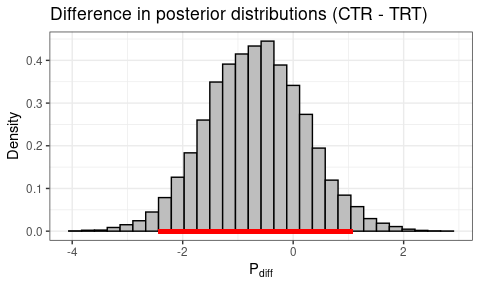

## Recap on the Previous Part

In the [previous part](https://rklymentiev.com/post/computational-models-of-behavior-pt1/) we saw an example of fitting a model to behavioral data using maximum likelihood estimation (MLE). The original data set was artificially generated using the modification of a Q-learning model (Seymour et al., 2012[^1]) for a 4-armed bandit paradigm, where each option had a unique probability of reward and punishment. We went over model comparison, model validation, and how to finally answer a research question using the fitted parameters. We have also discussed that MLE comes with its limitations, such as the possibility that the algorithm will be stuck at the local minimum, meaning that the fitted parameters may not be optimal.

In this part we are going to look at another approach, Bayesian inference. And particular we will use the `hBayesDM: hierarchical Bayesian modeling of Decision-Making tasks` package (Ahn et al, 2017[^2]), which was built on top of the `RStan` interface (Stan Development Team, 2020[^3]) for Bayesian data analysis. We are going to use the same data set and will try to answer the same question: "*Does treatment affect humans’ reward sensitivity and the learning rate for a positive outcome?*". 

Even though there is a [Python version](https://hbayesdm.readthedocs.io/en/develop/) of `hBayesDM` package, we will do it in R, since I personally prefer to perform "hardcore statistical analysis" in R. 

And once again, these posts have been designed to show an example of **how** to fit the models. Reader can refer to Gelman et al. (2013)[^4] for the in-depth overview of Bayesian inference.

**Objectives**:

1. How to answer research questions using modeling.
2. How to fit reinforcement learning (RL) models to behavioral data using Bayesian inference.
3. How to compare models and choose the best fitting one.
4. Compassion of MLE and Bayesian inference results.

Just to remind ourselves, that's how the initial data set and the distribution of **true** parameters (which have been used to generate the data) look like:

<details><summary><b><font color="#ff6969">Code</font></b></summary>
<p>

```r
library(hBayesDM)
library(tidyverse)
library(knitr)
library(kableExtra)
library(gridExtra)
library(grid)
```

```r
agent_data <- read.csv("agent_data.csv", sep = ",")
true_params <- read.csv("true_params.csv", sep = ",")
```

```r
head(agent_data, n = 10) %>% 
  kable(caption = "Initial data sample") %>% 
  kable_classic_2()
```

</p>
</details>
<br>

<table class=" lightable-classic-2" style="font-family: &quot;Arial Narrow&quot;, &quot;Source Sans Pro&quot;, sans-serif; margin-left: auto; margin-right: auto;">
<caption>
<span id="tab:unnamed-chunk-2">Table 1: </span>Sample of the initial data 
</caption>
<thead>
<tr>
<th style="text-align:left;">
group
</th>
<th style="text-align:right;">
subjID
</th>
<th style="text-align:right;">
trial
</th>
<th style="text-align:right;">
choice
</th>
<th style="text-align:right;">
gain
</th>
<th style="text-align:right;">
loss
</th>
</tr>
</thead>
<tbody>
<tr>
<td style="text-align:left;">
Control
</td>
<td style="text-align:right;">
1
</td>
<td style="text-align:right;">
1
</td>
<td style="text-align:right;">
1
</td>
<td style="text-align:right;">
0
</td>
<td style="text-align:right;">
-1
</td>
</tr>
<tr>
<td style="text-align:left;">
Control
</td>
<td style="text-align:right;">
1
</td>
<td style="text-align:right;">
2
</td>
<td style="text-align:right;">
1
</td>
<td style="text-align:right;">
0
</td>
<td style="text-align:right;">
-1
</td>
</tr>
<tr>
<td style="text-align:left;">
Control
</td>
<td style="text-align:right;">
1
</td>
<td style="text-align:right;">
3
</td>
<td style="text-align:right;">
3
</td>
<td style="text-align:right;">
1
</td>
<td style="text-align:right;">
0
</td>
</tr>
<tr>
<td style="text-align:left;">
Control
</td>
<td style="text-align:right;">
1
</td>
<td style="text-align:right;">
4
</td>
<td style="text-align:right;">
3
</td>
<td style="text-align:right;">
1
</td>
<td style="text-align:right;">
0
</td>
</tr>
<tr>
<td style="text-align:left;">
Control
</td>
<td style="text-align:right;">
1
</td>
<td style="text-align:right;">
5
</td>
<td style="text-align:right;">
1
</td>
<td style="text-align:right;">
0
</td>
<td style="text-align:right;">
-1
</td>
</tr>
<tr>
<td style="text-align:left;">
Control
</td>
<td style="text-align:right;">
1
</td>
<td style="text-align:right;">
6
</td>
<td style="text-align:right;">
3
</td>
<td style="text-align:right;">
1
</td>
<td style="text-align:right;">
-1
</td>
</tr>
<tr>
<td style="text-align:left;">
Control
</td>
<td style="text-align:right;">
1
</td>
<td style="text-align:right;">
7
</td>
<td style="text-align:right;">
4
</td>
<td style="text-align:right;">
0
</td>
<td style="text-align:right;">
0
</td>
</tr>
<tr>
<td style="text-align:left;">
Control
</td>
<td style="text-align:right;">
1
</td>
<td style="text-align:right;">
8
</td>
<td style="text-align:right;">
3
</td>
<td style="text-align:right;">
0
</td>
<td style="text-align:right;">
0
</td>
</tr>
<tr>
<td style="text-align:left;">
Control
</td>
<td style="text-align:right;">
1
</td>
<td style="text-align:right;">
9
</td>
<td style="text-align:right;">
1
</td>
<td style="text-align:right;">
1
</td>
<td style="text-align:right;">
-1
</td>
</tr>
<tr>
<td style="text-align:left;">
Control
</td>
<td style="text-align:right;">
1
</td>
<td style="text-align:right;">
10
</td>
<td style="text-align:right;">
4
</td>
<td style="text-align:right;">
1
</td>
<td style="text-align:right;">
0
</td>
</tr>
</tbody>
</table>

<details><summary><b><font color="#ff6969">Code</font></b></summary>
<p>

```r
p1 <- ggplot(true_params, aes(y = alpha_rew, x = group, fill = group)) +
  geom_boxplot() +
  geom_jitter(position=position_jitter(0.1)) +
  theme(legend.position = "none") +
  labs(
    y = expression(alpha[rew]),
    x = "") +
  ylim(0, .55)

p2 <- ggplot(true_params, aes(y = alpha_pun, x = group, fill = group)) +
  geom_boxplot() +
  geom_jitter(position=position_jitter(0.1)) +
  theme(legend.position = "none") +
  labs(
    y = expression(alpha[pun]),
    x = "") +
  ylim(0, .55)

p3 <- ggplot(true_params, aes(y = R, x = group, fill = group)) +
  geom_boxplot() +
  geom_jitter(position=position_jitter(0.1)) +
  theme(legend.position = "none") +
  labs(
    y = expression(R),
    x = "Group") +
  ylim(1, 8)

p4 <- ggplot(true_params, aes(y = P, x = group, fill = group)) +
  geom_boxplot() +
  geom_jitter(position=position_jitter(0.1)) +
  theme(legend.position = "none") +
  labs(
    y = expression(P),
    x = "Group") +
  ylim(1, 8)


grid.arrange(
  p1, p2, p3, p4, nrow = 2,
  top = textGrob("True Parameters", gp = gpar(font=2)))
```
</p>
</details>

</img>

## Intuition Behind Bayesian Analysis

The ideas behind MLE and Bayesian analysis (BA) are conceptually different. In MLE we are looking for a set of parameters $\hat{\Theta}$ that maximize the likelihood function given the observed data $X = \{ x_1, x_2, ..., x_T \}$ for a specific model:

$$\hat{\Theta}_{ML} = \underset{\Theta}{\text{arg max}} \left \{ \mathcal{L} (\Theta | X) \right \} = \underset{\Theta}{\text{arg max}} \left \{ \prod _{i=1}^{T} P(x_i | \Theta) \right \}$$

$T$ - number of observations (trials).

In BA we are looking for a probability of the set of parameters $\hat{\Theta}$ of the model, given the data $X$. In a formal way:

$$P(\Theta|X) = \frac{P(X|\Theta) \cdot P(\Theta)}{P(X)}$$

* $P(X|\Theta)$ is the **likelihood**, or probability that the observed data would happen given the set of parameters.
* $P(\Theta)$ is the **prior probability** of a model.
* $P(X)$ is the probability (or **evidence**) of a given data. It can be also called normalizing constant since it assures that the posterior probability function sums up to one.
* $P(\Theta|X)$ is the **posterior probability** of the hypothesis given the observed data.

It is difficult (or even impossible) to find the exact value of $P(X)$, that's why the equation above is simplified to the following equation:

$$P(\Theta|X) \propto P(X|\Theta) \cdot P(\Theta)$$

Over the last decays, several algorithms have been developed to draw samples from the posterior distribution based on this equation. In particular, `rstan` package uses [Hamiltonian Monte Carlo](https://en.wikipedia.org/wiki/Hamiltonian_Monte_Carlo) algorithm, which is a part of a [Markov chain Monte Carlo](https://en.wikipedia.org/wiki/Markov_chain_Monte_Carlo) family of algorithms.

Also, as the name of the package suggests, `hBayesDM` uses the [hierarchical Bayesian approach](https://en.wikipedia.org/wiki/Bayesian_hierarchical_modeling) to fit the models. In our case, this means that each subject will have a unique set of parameters $\Theta$, or in other words, we allow the within-subject variation.

The benefit of `hBayesDM` is that there is a [big variety of models](http://ccs-lab.github.io/hBayesDM/reference/index.html) predefined for different paradigms, so we don't have to write them from scratch. Stan files with the model specifications can be found [here](https://github.com/CCS-Lab/hBayesDM/tree/develop/commons/stan_files).

Let us fit the model introduced by Seymour et al. (2012) with the help of `bandit4arm_4par` function. Note, that we are going to fit the model separately for control and treatment groups since at the end we are interested in parameters comparison between the groups. 

Based on the [model specification](https://github.com/CCS-Lab/hBayesDM/blob/develop/commons/stan_files/bandit4arm_4par.stan), that's how the model structure looks like:

</img>

* $m$, $\sigma$ - hyperparameters of the model that will affect the parameters $ \left \{ \alpha^{\text{reward}}, \alpha^{\text{punishment}}, R, P \right \}$ for each subject;
* $S$ - number of subjects;
* $y$ - choice data.

Priors:

$$\mu \sim \mathcal{N} (\mu = 0, \sigma=1)$$

$$\sigma \sim \mathcal{N} (\mu = 0, \sigma=0.2)$$

$$\alpha^{\text{reward}}_{\text{prior}} \sim \mathcal{N} (\mu = 0, \sigma=1)$$

$$\alpha^{\text{punishment}}_{\text{prior}} \sim \mathcal{N} (\mu = 0, \sigma=1)$$

$$R_{\text{prior}} \sim \mathcal{N} (\mu = 0, \sigma=1)$$

$$P_{\text{prior}} \sim \mathcal{N} (\mu = 0, \sigma=1)$$

Transformation of parameters:

$$\alpha^{\text{reward}} = \Phi (\mu + \sigma \alpha^{\text{reward}}_{\text{prior}}) $$

$$\alpha^{\text{punishment}} = \Phi (\mu + \sigma \alpha^{\text{punishment}}_{\text{prior}}) $$

$$R = \Phi (\mu + \sigma R_{\text{prior}}) \cdot 30 $$

$$P = \Phi (\mu + \sigma P_{\text{prior}}) \cdot 30$$

$\Phi(\cdot)$ is the standard normal cumulative distribution function, which can take any value in a $ \left [ 0, 1 \right ]$ range. By multiplying $R$ and $P$ by $30$ we allow sensitivity values to be in a $ \left [ 0, 30 \right ]$ range.

```r
# model fit
# control group
output_ctr <- bandit4arm_4par(
  data = filter(agent_data, group == "Control"), # subset of the data
  niter = 4000, # amount of total itirations
  nwarmup = 1000, # amount of initial itirations. 
  # warmup trials will not be included in the final model
  nchain = 4, # amount of Markov chains
  ncore = 2, # amount machine's cores to use
  inc_postpred = TRUE # include simulated posterior data
)

# treatment group
output_trt <- bandit4arm_4par(
  data = filter(agent_data, group == "Treatment"),
  niter = 4000, nwarmup = 1000, nchain = 4,
  ncore = 2, inc_postpred = TRUE)
```


## Model Diagnostics

Once the models have been fitted it is important to check for convergence of MCMC algorithm. In a simple way, one could check it visually. According to the `hBayesDM` recommendations, the plot of chains' values should look like "furry caterpillars". In a bit more technical terms, we want to check whether values are centered around a stationary point without any change of pattern (e.g., increase of mean).

**Control (CTR) Group**:

```r
plot(output_ctr, type = "trace", inc_warmup = TRUE)
```

</img>

**Treatment (TRT) Group**:

```r
plot(output_trt, type = "trace", inc_warmup = TRUE)
```

</img>

Note, that these plots show the chain values for parameters' posterior distribution for the **group**, not the individual posterior distributions.

Another approach for a convergence check is the [R-hat](https://mc-stan.org/rstan/reference/Rhat.html) metric that compares the between- and within-chain estimates for model parameters (Vehtari et al., 2019[^5]). The good value of $\hat{R}$ is considered to be under 1.05. 

**CTR Group**:

```r
rhat(output_ctr, less = 1.01)
```

    # TRUE: All Rhat values are less than 1.01

**TRT Group**:

```r
rhat(output_trt, less = 1.01)
```

    # TRUE: All Rhat values are less than 1.01
    

As we can see, our model seems to converge for both of the groups.

## Model Comparison

As discussed in part 1, it is always a good strategy to compare several models, since, as we know, all models are wrong. `hBayesDM` package makes model comparison really easy.

For simplicity we will add two models for comparison:

`bandit4arm_lapse`: model with 4 parameters ($\alpha^{\text{reward}}$, $\alpha^{\text{punishment}}$, $R$, $P$) and noise ($\epsilon$).

**Model algorithm:**

* **for** *each step $t$ in episode* **do**
  * $\scriptsize Q(a_j)_t \leftarrow Q(a_j)^{\text{reward}}_t + Q(a_j)^{\text{punishment}}_t$
  * Select action $a_t$ using softmax policy $\scriptsize P(a_j = a_t) = \frac{e^{Q_j}}{\sum_{j}e^{Q_j}} \left( (1- \epsilon) + \frac{\epsilon}{J} \right) $
  * Observe reward $r_t$ and punishment $p_t$ values
  * **for** *each action $a_j$ in possible actions* **do**
    * **if** $a_j$ == $a_t$ **do**
      * $\scriptsize Q(a_j)^{\text{reward}}_{t+1} - Q(a_j)^{\text{reward}}_t + \alpha^{\text{reward}} \left( R \cdot r_t - Q(a_j)^{\text{reward}}_t \right)$
      * $\scriptsize Q(a_j)^{\text{punishment}}_{t+1} \leftarrow Q(a_j)^{\text{punishment}}_t + \alpha^{\text{punishment}} \left( P \cdot p_t - Q(a_j)^{\text{punishment}}_t \right)$
    * **else**
      * $\scriptsize Q(a_j)^{\text{reward}}_{t+1} \leftarrow Q(a_j)^{\text{reward}}_t + \alpha^{\text{reward}} \left( - Q(a_j)^{\text{reward}}_t \right)$
      * $\scriptsize Q(a_j)^{\text{punishment}}_{t+1} \leftarrow Q(a_j)^{\text{punishment}}_t + \alpha^{\text{punishment}} \left( - Q(a_j)^{\text{punishment}}_t \right)$
    * **end**
  * **end**
* **end**


`bandit4arm_singleA_lapse`: model with the single learning rate for both reward and punishment ($\alpha$) and noise.

**Model algorithm:**

* **for** *each step $t$ in episode* **do**
  * $\scriptsize Q(a_j)_t \leftarrow Q(a_j)^{\text{reward}}_t + Q(a_j)^{\text{punishment}}_t$
  * Select action $a_t$ using softmax policy $\scriptsize P(a_j = a_t) = \frac{e^{Q_j}}{\sum_{j}e^{Q_j}} \left( (1- \epsilon) + \frac{\epsilon}{J} \right) $
  * Observe reward $r_t$ and punishment $p_t$ values
  * **for** *each action $a_j$ in possible actions* **do**
    * **if** $a_j$ == $a_t$ **do**
      * $\scriptsize Q(a_j)^{\text{reward}}_{t+1} - Q(a_j)^{\text{reward}}_t + \alpha \left( R \cdot r_t - Q(a_j)^{\text{reward}}_t \right)$
      * $\scriptsize Q(a_j)^{\text{punishment}}_{t+1} \leftarrow Q(a_j)^{\text{punishment}}_t + \alpha \left( P \cdot p_t - Q(a_j)^{\text{punishment}}_t \right)$
    * **else**
      * $\scriptsize Q(a_j)^{\text{reward}}_{t+1} \leftarrow Q(a_j)^{\text{reward}}_t + \alpha \left( - Q(a_j)^{\text{reward}}_t \right)$
      * $\scriptsize Q(a_j)^{\text{punishment}}_{t+1} \leftarrow Q(a_j)^{\text{punishment}}_t + \alpha \left( - Q(a_j)^{\text{punishment}}_t \right)$
    * **end**
  * **end**
* **end**

Leave-one-out cross-validation information criterion (LOOIC) can be used for model selection (Vehtari et al., 2017[^6]). The lower the value, the better the fit.

<details><summary><b><font color="#ff6969">Code</font></b></summary>
<p>

```r
# control group
# model with noise
output_ctr_lapse <- bandit4arm_lapse(
  data = filter(agent_data, group == "Control"),
  niter = 4000, nwarmup = 1000, nchain = 4,
  ncore = 2, inc_postpred = TRUE)

# model with single learning rate
output_ctr_singleA <- bandit4arm_singleA_lapse(
  data = filter(agent_data, group == "Control"),
  niter = 4000, nwarmup = 1000, nchain = 4,
  ncore = 2, inc_postpred = TRUE)

# treatment group
# model with noise
output_trt_lapse <- bandit4arm_lapse(
  data = filter(agent_data, group == "Treatment"),
  niter = 4000, nwarmup = 1000, nchain = 4,
  ncore = 3, inc_postpred = TRUE)

# model with single learning rate
output_trt_singleA <- bandit4arm_singleA_lapse(
  data = filter(agent_data, group == "Treatment"),
  niter = 4000, nwarmup = 1000, nchain = 4,
  ncore = 3, inc_postpred = TRUE)
```

```r
# compare models for CTR group
df <- printFit(output_ctr, output_ctr_lapse, output_ctr_singleA, ic = "looic") 
df %>% 
  kable(caption = "Model comparison for CTR group") %>% 
  kable_classic_2() %>%
  row_spec(
    which(df$LOOIC == min(df$LOOIC)), bold = T,
    background = "#d6f5d6")

# compare models for TRT group  
df <- printFit(output_trt, output_trt_lapse, output_trt_singleA, ic = "looic") 
df %>% 
  kable(caption = "Model comparison for TRT group") %>% 
  kable_classic_2() %>%
  row_spec(
    which(df$LOOIC == min(df$LOOIC)), bold = T,
    background = "#d6f5d6")
```
</p>
</details>
<br>

<table class=" lightable-classic-2" style="font-family: &quot;Arial Narrow&quot;, &quot;Source Sans Pro&quot;, sans-serif; margin-left: auto; margin-right: auto;">
<caption>
<span id="tab:unnamed-chunk-14">Table 2: </span>Model comparison for CTR group
</caption>
<thead>
<tr>
<th style="text-align:left;">
Model
</th>
<th style="text-align:right;">
LOOIC
</th>
<th style="text-align:right;">
LOOIC Weights
</th>
</tr>
</thead>
<tbody>
<tr>
<td style="text-align:left;font-weight: bold;background-color: #d6f5d6 !important;">
bandit4arm_4par
</td>
<td style="text-align:right;font-weight: bold;background-color: #d6f5d6 !important;">
3292.845
</td>
<td style="text-align:right;font-weight: bold;background-color: #d6f5d6 !important;">
0.5553943
</td>
</tr>
<tr>
<td style="text-align:left;">
bandit4arm_lapse
</td>
<td style="text-align:right;">
3295.377
</td>
<td style="text-align:right;">
0.1565749
</td>
</tr>
<tr>
<td style="text-align:left;">
bandit4arm_singleA_lapse
</td>
<td style="text-align:right;">
3294.158
</td>
<td style="text-align:right;">
0.2880308
</td>
</tr>
</tbody>
</table>


<table class=" lightable-classic-2" style="font-family: &quot;Arial Narrow&quot;, &quot;Source Sans Pro&quot;, sans-serif; margin-left: auto; margin-right: auto;">
<caption>
<span id="tab:unnamed-chunk-16">Table 3: </span>Model comparison for TRT group
</caption>
<thead>
<tr>
<th style="text-align:left;">
Model
</th>
<th style="text-align:right;">
LOOIC
</th>
<th style="text-align:right;">
LOOIC Weights
</th>
</tr>
</thead>
<tbody>
<tr>
<td style="text-align:left;font-weight: bold;background-color: #d6f5d6 !important;">
bandit4arm_4par
</td>
<td style="text-align:right;font-weight: bold;background-color: #d6f5d6 !important;">
4261.820
</td>
<td style="text-align:right;font-weight: bold;background-color: #d6f5d6 !important;">
0.8337282
</td>
</tr>
<tr>
<td style="text-align:left;">
bandit4arm_lapse
</td>
<td style="text-align:right;">
4265.067
</td>
<td style="text-align:right;">
0.1644656
</td>
</tr>
<tr>
<td style="text-align:left;">
bandit4arm_singleA_lapse
</td>
<td style="text-align:right;">
4274.090
</td>
<td style="text-align:right;">
0.0018062
</td>
</tr>
</tbody>
</table>

`bandit4arm_4par` model showed the best results for both of the groups, so we can stick to it.

If the model with the single learning rate (`bandit4arm_singleA_lapse`) showed better performance, <s>that would be a bummer</s>, we wouldn't be able to answer our research questions and that would indicate that our initial hypothesis was not framed correctly (perhaps there is no competition between positive and negative feedback). 

## Model Validation

As we did in part 1, we should also validate that model can recapture the actual behavior. You may have noticed that we had the argument `inc_postpred = TRUE` for all the model fitting functions. This included the predicted data for choice values for each of the chains. It is also called posterior predictive checks (PPC).

The plots below represent the actual choice data and the average of predicted values from all chains.

<details><summary><b><font color="#ff6969">Code</font></b></summary>
<p>

```r
# code source: https://ccs-lab.github.io/hBayesDM/articles/getting_started.html#7-posterior-predictive-checks
y_pred_mean <- apply(output_ctr$parVals$y_pred, c(2,3), mean)

numSubjs = dim(output_ctr$allIndPars)[1]  # number of subjects

subjList = unique(output_ctr$rawdata$subjID)  # list of subject IDs
maxT = mean(table(output_ctr$rawdata$subjID))  # maximum number of trials
true_y = array(NA, c(numSubjs, maxT)) # true data (`true_y`)

## true data for each subject
for (i in 1:numSubjs) {
  tmpID = subjList[i]
  tmpData = subset(output_ctr$rawdata, subjID == tmpID)
  true_y[i, ] = tmpData$choice  # only for data with a 'choice' column
}

df <- data.frame()
for (i in 1:numSubjs) {
  choice <- c(true_y[i, ], y_pred_mean[i, ])
  type <- c(rep("True", 200), rep("PPC", 200))
  trial <- c(1:200, 1:200)
  subjID <- rep(paste0("Subject ", subjList[i]), 400)
  temp_df <- data.frame(subjID, trial, choice, type)
  df <- bind_rows(df, temp_df)
}

ggplot(data = df, aes(x = trial, y = choice, color = type)) +
  geom_line() +
  facet_wrap(~subjID, nrow = 5) +
  labs(title = "Model Validation",
       subtitle = "CTR Group")
```
</p>
</details>

</img>

<details><summary><b><font color="#ff6969">Code</font></b></summary>
<p>

```r
y_pred_mean <- apply(output_trt$parVals$y_pred, c(2,3), mean)

numSubjs = dim(output_trt$allIndPars)[1]  # number of subjects

subjList = unique(output_trt$rawdata$subjID)  # list of subject IDs
maxT = mean(table(output_trt$rawdata$subjID))  # maximum number of trials
true_y = array(NA, c(numSubjs, maxT)) # true data (`true_y`)

## true data for each subject
for (i in 1:numSubjs) {
  tmpID = subjList[i]
  tmpData = subset(output_trt$rawdata, subjID == tmpID)
  true_y[i, ] = tmpData$choice  # only for data with a 'choice' column
}

df <- data.frame()
for (i in 1:numSubjs) {
  choice <- c(true_y[i, ], y_pred_mean[i, ])
  type <- c(rep("True", 200), rep("PPC", 200))
  trial <- c(1:200, 1:200)
  subjID <- rep(paste0("Subject ", subjList[i]), 400)
  temp_df <- data.frame(subjID, trial, choice, type)
  df <- bind_rows(df, temp_df)
}


ggplot(data = df, aes(x = trial, y = choice, color = type)) +
  geom_line() +
  facet_wrap(~subjID, nrow = 5) +
  labs(title = "Model Validation",
       subtitle = "TRT Group")
```

</p>
</details>

</img>

Since PPC represent the average value, the values are not exactly in a $[1, 2, 3, 4 ]$ set. However, we can see that trend of the PPC line follows the line of actual selected values pretty accurately. 

## Groups Comparison

Now we can proceed to the most interesting part for us, which is the comparison of the parameter values between two groups. In the Bayesian framework, we work with the whole distribution of posterior distribution of the parameters, not just the point estimates (PE). Here is how the group posterior distributions look like:

**CTR group**:

```r
plot(output_ctr)
```

</img>

**TRT group**:

```r
plot(output_trt)
```

</img>

To compare the parameters we will look at the **difference** between posterior distributions (CTR - TRT). If the proportion of values in the difference distribution is much higher (or much less) than $\approx 0.5$, then the difference between the groups is credible. You can think about this in a way that if there was no effect of the treatment, then on average difference values would be centered around 0 and if not, then values would be much different than 0. We can also use the highest density interval (HDI) to address the uncertainty of the values.

### Learning Rate (Reward)

<details><summary><b><font color="#ff6969">Code</font></b></summary>
<p>

```r
post_diff <- output_ctr$parVals$mu_Arew - output_trt$parVals$mu_Arew
plotHDI(
  post_diff, 
  Title = "Difference in posterior distributions (CTR - TRT)", 
  xLab = expression(alpha[rew_diff]))
```

```r
print(paste0(round(mean(post_diff > 0) * 100, 1), 
             "% of difference values are greater than 0."))
```
</p>
</details>

</img>

95% HDI: Lower bound = 0.1357, Upper bound = 0.3025.

100% of difference values are greater than 0.
 
### Learning Rate (Punishment)

<details><summary><b><font color="#ff6969">Code</font></b></summary>
<p>

```r
post_diff <- output_ctr$parVals$mu_Apun - output_trt$parVals$mu_Apun
plotHDI(
  post_diff, 
  Title = "Difference in posterior distributions (CTR - TRT)", 
  xLab = expression(alpha[pun_diff]))
```

```r
print(paste0(round(mean(post_diff > 0) * 100, 1), 
             "% of difference values are greater than 0."))
```
</p>
</details>

</img>

95% HDI: Lower bound = -0.1, Upper bound = 0.1408.

64.7% of difference values are greater than 0.

### Reward Sensitivity

<details><summary><b><font color="#ff6969">Code</font></b></summary>
<p>

```r
post_diff <- output_ctr$parVals$mu_R - output_trt$parVals$mu_R
plotHDI(
  post_diff, 
  Title = "Difference in posterior distributions (CTR - TRT)", 
  xLab = expression(R[diff]))
```

```r
print(paste0(round(mean(post_diff > 0) * 100, 1), 
             "% of difference values are greater than 0."))
```
</p>
</details>

</img>

95% HDI: Lower bound = 1e-04, Upper bound = 1.8635.

97.1% of difference values are greater than 0.

### Punishment Sensitivity

<details><summary><b><font color="#ff6969">Code</font></b></summary>
<p>

```r
post_diff <- output_ctr$parVals$mu_P - output_trt$parVals$mu_P
plotHDI(
  post_diff, 
  Title = "Difference in posterior distributions (CTR - TRT)", 
  xLab = expression(P[diff]))
```

```r
print(paste0(round(mean(post_diff > 0) * 100, 1), 
             "% of difference values are greater than 0."))
```
</p>
</details>

</img>

95% HDI: Lower bound = -2.4309, Upper bound = 1.0696.

22.4% of difference values are greater than 0.

As we can see, BA showed that there is a difference between the learning rate for positive feedback and reward sensitivity. One could argue that punishment sensitivity values also differ.  

## Summary and Comparison

The downside of the BA is that it is more computationally demanding. We haven't spent too much time on the coding, mostly due to the help of the package, but the model fitting procedure itself can be time-consuming, depending on the computational power. 

Another possible difficulty of BA is priors specifications. Ideally, we want to have an approximate idea of how the parameter values are distributed (based on literature, for example) and then check whether the experimental data support this hypothesis. 

Overall MLE and BA lead to somewhat similar results. In both cases, we were able to make a conclusion that treatment affects humans’ reward sensitivity and the learning rate for a positive outcome (although for MLE approach p-value for reward sensitivity was a bit higher than 0.05).

<table>
<caption>
<span id="tab:unnamed-chunk-16">Table 4: </span>Results comparison between the methods
</caption>
<thead>
<tr>
<th style="text-align:center">Parameter</th>
<th style="text-align:center">MLE</th>
<th style="text-align:center">BA</th>
</tr>
</thead>
<tbody>
<tr>
<td style="text-align:center">$\alpha^\text{reward}$</td>
<td style="text-align:center">PE = 0.2, 95% CI = [0.1, 0.3],<br>p-val &lt; 0.01, Effect size = 1.87</td>
<td style="text-align:center">PE = 0.22, 95% HDI = [0.15, 0.3]</td>
</tr>
<tr>
<td style="text-align:center">$\alpha^\text{punishment}$</td>
<td style="text-align:center">PE = 0.09, 95% CI = [-0.1, 0.12],<br>p-val = 0.87, Effect size = 0.08</td>
<td style="text-align:center">PE = 0.02, 95% HDI = [-0.1, 0.14]</td>
</tr>
<tr>
<td style="text-align:center">$R$</td>
<td style="text-align:center">PE = 0.87, 95% CI = [-0.05, 1.79],<br>p-val = 0.06, Effect size = 0.89</td>
<td style="text-align:center">PE = 0.91, 95% HDI = [0.01, 1.86]</td>
</tr>
<tr>
<td style="text-align:center">$P$</td>
<td style="text-align:center">PE = -0.46, 95% CI = [-1.77, 0.84],<br>p-val = 0.46, Effect size = 0.34</td>
<td style="text-align:center">PE = -0.67, 95% HDI = [-2.43, 1.07]</td>
</tr>
</tbody>
<tfoot>
<tr>
<td style="padding: 0; " colspan="100%">
<i></i>
</td>
</tr>
</tfoot>
</table>

As it was mentioned at the very beginning of part 1, the purpose of these posts was to give an example of the model fitting, not to select the best approach. Both MLE and BA have their pros and cons and readers are encouraged to make their own decision which approach suits better. Readers can also visit [hBayesDM articles](https://ccs-lab.github.io/hBayesDM/articles/index.html) for more examples.

## References

[^1]: Seymour, B., Daw, N. D., Roiser, J. P., Dayan, P., & Dolan, R. (2012). Serotonin selectively modulates reward value in human decision-making. *The Journal of neuroscience : the official journal of the Society for Neuroscience, 32*(17), 5833–5842. https://doi.org/10.1523/JNEUROSCI.0053-12.2012
[^2]: Ahn, W. Y., Haines, N., & Zhang, L. (2017). Revealing Neurocomputational Mechanisms of Reinforcement Learning and Decision-Making With the hBayesDM Package. *Computational Psychiatry, 1*(0), 24. https://doi.org/10.1162/cpsy_a_00002
[^3]: Stan Development Team (2020). “RStan: the R interface to Stan.” R package version 2.21.2, http://mc-stan.org/.
[^4]: Gelman, A., Carlin, J.B., Stern, H.S., Dunson, D.B., Vehtari, A., & Rubin, D.B. (2013). Bayesian Data Analysis (3rd ed.). Chapman and Hall/CRC. https://doi.org/10.1201/b16018
[^5]: Vehtari, A., Gelman, A., Simpson, D., Carpenter, B., & Bürkner, P. C. (2021). Rank-Normalization, Folding, and Localization: An Improved R-hat for Assessing Convergence of MCMC (with Discussion). *Bayesian Analysis, 16*(2). https://doi.org/10.1214/20-ba1221
[^6]: Vehtari, A., Gelman, A., & Gabry, J. (2016). Practical Bayesian model evaluation using leave-one-out cross-validation and WAIC. *Statistics and Computing, 27*(5), 1413–1432. https://doi.org/10.1007/s11222-016-9696-4
