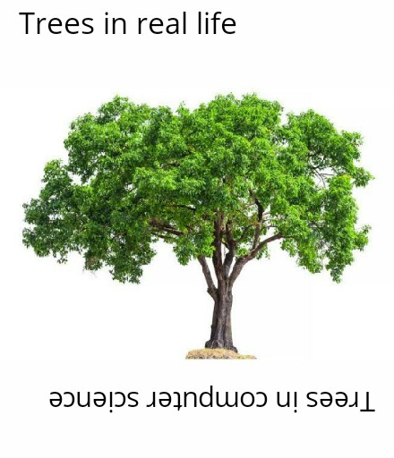

``` r
# r import
library(tidyverse)
library(knitr)
library(kableExtra)
library(Rgraphviz)
library(rpart)
library(rattle)
library(reticulate)
```

``` python
# python import
import pandas as pd
from sklearn import tree
import matplotlib.pyplot as plt
```

## What is CART?

**C**lassification **a**nd **R**egression **T**rees (or **CART** for short) is a type of supervised machine learning algorithm[^1] that is mostly used in classification problems[^2], but can be applied for regression problems[^3] as well. It can handle both categorical and numerical input variables.

In this tutorial, we are going to go step-by-step and build a tree for the **classification** problem. A way to solve the regression problem will be discussed at the end.

Imagine that we have medical data about patients and we have two drugs (Drug A and Drug B) that work differently for each patient based on their health metrics. We have such data for 15 patients. Now, the 16th patient comes in and we want to assign a drug to him based on this information. You can load the sample data set [here](DecisionTree_SampleData.csv).

``` r
patients_df <- read_csv("DecisionTree_SampleData.csv")
kable(patients_df, format = "markdown", caption = "<b>Patients Data</b>")
```

| Patient ID | Gender | BMI        | BP         | Drug   |
|:-----------|:-------|:-----------|:-----------|:-------|
| p01        | M      | not normal | not normal | Drug A |
| p02        | M      | not normal | normal     | Drug B |
| p03        | M      | not normal | not normal | Drug A |
| p04        | M      | normal     | not normal | Drug A |
| p05        | M      | not normal | not normal | Drug A |
| p06        | F      | not normal | normal     | Drug B |
| p07        | F      | normal     | not normal | Drug A |
| p08        | F      | not normal | normal     | Drug B |
| p09        | M      | not normal | not normal | Drug A |
| p10        | M      | normal     | not normal | Drug A |
| p11        | F      | not normal | not normal | Drug B |
| p12        | F      | normal     | normal     | Drug B |
| p13        | F      | normal     | normal     | Drug B |
| p14        | M      | normal     | not normal | Drug B |
| p15        | F      | not normal | normal     | Drug B |
| p16        | M      | not normal | not normal | ???    |

<span id="tab:unnamed-chunk-4"></span>Table 1: <b>Patients Data</b>

Our decision tree is going to look something like this:

}}index_files/figure-html/unnamed-chunk-5-1.png" width="672" />

In case you are wondering why is it called “a tree”, you have to look at it upside down:

<center>
</img>
</center>

Imagine that all our data is located at the **root node** of the tree. We want to split the data by most significant features (that will create new **decision nodes**) until we reach the **leaf nodes** with the most homogeneous target possible (ideally just one class is present in each leaf node).

The question is how do we split the data at each node?

## Information Gain and Entropy

The main metrics to use for dealing with classification problems when building a tree are Information Gain (IG) and Gini impurity. We are going to use IG for this example, however, Gini impurity will be also discussed at the end.

IG is based on the concept of entropy[^4] and information content from information theory[^5]. First of all, let’s build an intuition behind the entropy. Simply saying, entropy is the measure of chaos or uncertainty in the data.

Imagine that I asked you to play the following simple game: I have two coins, one coin is unfair $\left( P(\text{Heads}) = \frac{4}{5} \right)$, the other one is fair $\left( P(\text{Heads}) = \frac{1}{2} \right)$. Your task is to pick a coin, make a prediction of an outcome (either Heads or Tails) and flip it. If your prediction is correct, I will give you \$1. Which coin would you choose?

Well, I hope that you would choose the unfair coin. In this case, you are *more certain* about the outcome of the coin flip (on average it will come up Heads in $80\%$ of the time). For the fair coin, you have the highest level of uncertainty, meaning that Heads and Tails can occur equally likely. Probability mass functions for both coins look as:

$$p_{\text{unfair}} =     \begin{cases}       \frac{4}{5} & \text{Heads}\\       \frac{1}{5} & \text{Tails}\\     \end{cases}$$

$$p_{\text{fair}} =     \begin{cases}       \frac{1}{2} & \text{Heads}\\       \frac{1}{2} & \text{Tails}\\     \end{cases}$$

We can calculate the entropy using the formula:

$$H(X) = - \sum_{i=1}^{n} p(x_i) \cdot log_2 \big( p(x_i) \big)$$

- $n$ is the number of all possible outcomes for random variable $X$;
- $log_2$ is the logarithm with base 2 ($log_2 2 = 1$, $log_2 4 = 2$, etc).

Entropy for the unfair coin:

$$H(\text{unfair}) = - \left( \frac{4}{5} \cdot log_2 \frac{4}{5} + \frac{1}{5} \cdot log_2 \frac{1}{5} \right) \\ \approx 0.72$$
Entropy for the fair coin:

$$H(\text{fair}) = - \left( \frac{1}{2} \cdot log_2 \frac{1}{2} + \frac{1}{2} \cdot log_2 \frac{1}{2} \right) \\ = 1$$

``` r
entropy <- function(p) {
  return(-sum(p*log(p, base = 2)))
}

p_unfair <- c(4/5, 1/5)
p_fair <- c(1/2, 1/2)

entropy(p_unfair)
## [1] 0.7219281
entropy(p_fair)
## [1] 1
```

As you can see, entropy for the fair coin is higher, meaning that the level of uncertainty is also higher. Note that entropy cannot be negative and the minimum value is $0$ which means the highest level of certainty. For example, imagine the unfair coin with the probability $P(\text{Heads}) = 1$ and $P(\text{Tails}) = 0$. In such a way you are sure that the coin will come up Heads and entropy is equal to zero.

Coming back to our decision tree problem we want to split out data into nodes that have reduced the level of uncertainty. Basic algorithm look as follows:

1.  For each node:

- Choose a feature from the data set.
- Calculate the significance (e.g., IG) of that feature in the splitting of data.
- Repeat for each feature.

2.  Split the data by the feature that is the most significant splitter (e.g., highest IG).
3.  Repeat until there are no features left.

## Growing a Tree

We are going to split the data on training (first 15 patients) and test (16th patient) sets:

``` r
train_df <- patients_df[-16, ]
test_df <- patients_df[16, ]
```

### Root Node

The initial entropy of the distribution of target variable (`Drug`) is:

$$H(X) = -\left( p(A) \cdot log_2 p(A) +  p(B) \cdot log_2 p(B) \right)$$

- $p(A)$ - probability of Drug A. Since there are 7 observations out of 15 with the Drug A, $p(A) = \frac{7}{15} \approx 0.47$
- $p(B)$ - probability of Drug B. Since there are 8 observations out of 15 with the Drug A, $p(B) = \frac{8}{15} \approx 0.53$

$$H(X) = -\left(0.47 \cdot log_2 0.47 +  0.53 \cdot log_2 0.53 \right) \\ \approx 0.997$$

``` r
temp_df <- train_df %>% 
  group_by(Drug) %>% 
  summarise(n = n(),
            p = round(n() / dim(train_df)[1], 2))

kable(temp_df, format = "markdown")
```

| Drug   |   n |    p |
|:-------|----:|-----:|
| Drug A |   7 | 0.47 |
| Drug B |   8 | 0.53 |

``` r
entropy(temp_df$p)
## [1] 0.9974016
```

For the next step, we are going to split the data by *each* feature (`Gender`, `BMI`, `BP`), calculate the entropy, and check which split variant gives the highest IG.

#### Gender

Let’s start with `Gender`. We have two labels in the data set: `M` and `F`. After splitting the data we end up with the following proportions:

| Gender Label | Drug A | Drug B |
|:------------:|:------:|:------:|
|      M       |   6    |   2    |
|      F       |   1    |   6    |

Meaning that among 15 patients 6 men were assigned to drug A and 2 were assigned to drug B, whereas 1 woman was assigned to drug A and 6 women were assigned to drug B.

Calculating the entropy for each gender label:

| Gender Label | Drug A | Drug B |       P(A)        |       P(B)        | Entropy |
|:------------:|:------:|:------:|:-----------------:|:-----------------:|:-------:|
|      M       |   6    |   2    | $\frac{6}{8}$ | $\frac{2}{8}$ |  0.811  |
|      F       |   1    |   6    | $\frac{1}{7}$ | $\frac{6}{7}$ |  0.592  |

To measure the uncertainty reduction after the split we are going to use IG:

$$ \scriptsize \text{IG} = \text{Entropy before the split} - \text{Weighted entropy after the split}$$

- Entropy before the split is the entropy at the root in this case
- Weighted entropy is defined as entropy times the label proportion. For example, weighted entropy for male patients equals to:

$$ \text{Weighted Entropy (M)} = \frac{\text{\# Male patients}}{\text{\# All patients}} \cdot H(M) $$

$$ \text{Weighted Entropy (M)} = \frac{8}{15} \cdot 0.811 = 0.433$$

| Gender Label | Drug A | Drug B | P(A) | P(B) | Entropy | Weight | Weighted Entropy |
|:--:|:--:|:--:|:--:|:--:|:--:|:--:|:--:|
| M | 6 | 2 | $\frac{6}{8}$ | $\frac{2}{8}$ | 0.811 | $\frac{8}{15}$ | 0.433 |
| F | 1 | 6 | $\frac{1}{7}$ | $\frac{6}{7}$ | 0.592 | $\frac{7}{15}$ | 0.276 |

Now we can calculate the IG:

$$\text{IG} = 0.997 - (0.433 + 0.276) = 0.288$$

#### BMI

Repeat the previous steps for the `BMI` feature. We have two labels: `normal` and `not normal`.

| BMI Label | Drug A | Drug B | P(A) | P(B) | Entropy | Weight | Weighted Entropy |
|:--:|:--:|:--:|:--:|:--:|:--:|:--:|:--:|
| normal | 3 | 3 | $\frac{3}{6}$ | $\frac{3}{6}$ | 1 | $\frac{6}{15}$ | 0.4 |
| not normal | 4 | 5 | $\frac{4}{9}$ | $\frac{5}{9}$ | 0.991 | $\frac{9}{15}$ | 0.595 |

$$\text{IG} = 0.997 - (0.4 + 0.595) = 0.002$$

#### Blood Pressure

And the same for `BP` column (labels are the same: `normal` and `not normal`):

| BP Label | Drug A | Drug B | P(A) | P(B) | Entropy | Weight | Weighted Entropy |
|:--:|:--:|:--:|:--:|:--:|:--:|:--:|:--:|
| normal | 0 | 6 | $\frac{0}{6}$ | $\frac{6}{6}$ | 0 | $\frac{6}{15}$ | 0 |
| not normal | 7 | 2 | $\frac{7}{9}$ | $\frac{2}{9}$ | 0.764 | $\frac{9}{15}$ | 0.459 |

$$\text{IG} = 0.997 - (0 + 0.459) = 0.538$$

#### Node Summary

As we can see `BP` gives the highest IG, or in other words, if we split the data by this column we will be more certain about the target variable distribution. So our first split will look like this:

}}index_files/figure-html/unnamed-chunk-10-1.png" width="672" />

### `BP:normal` Node

Continue to grow the tree down from the `(normal node)`. We filter observations that have `normal` blood pressure:

``` r
train_df %>% 
  filter(BP == "normal") %>%
  select(-BP) %>% 
  kable(format = "markdown")
```

| Patient ID | Gender | BMI        | Drug   |
|:-----------|:-------|:-----------|:-------|
| p02        | M      | not normal | Drug B |
| p06        | F      | not normal | Drug B |
| p08        | F      | not normal | Drug B |
| p12        | F      | normal     | Drug B |
| p13        | F      | normal     | Drug B |
| p15        | F      | not normal | Drug B |

As we can see, there is no Drug A for this node and entropy is already 0. This node is going to be last for this branch with the drug B as an output with probability of 1. We can also think about this in a way that for all subjects with normal blood pressure drug B worked best.

}}index_files/figure-html/unnamed-chunk-12-1.png" width="672" />

### `BP:not normal` Node

Filter all the observations that have `not normal` blood pressure:

``` r
train_df %>% 
  filter(BP == "not normal") %>% 
  select(-BP) %>% 
  kable(format = "markdown")
```

| Patient ID | Gender | BMI        | Drug   |
|:-----------|:-------|:-----------|:-------|
| p01        | M      | not normal | Drug A |
| p03        | M      | not normal | Drug A |
| p04        | M      | normal     | Drug A |
| p05        | M      | not normal | Drug A |
| p07        | F      | normal     | Drug A |
| p09        | M      | not normal | Drug A |
| p10        | M      | normal     | Drug A |
| p11        | F      | not normal | Drug B |
| p14        | M      | normal     | Drug B |

Now we consider this set as “initial set”. The entropy of target distribution at this node is $0.764$ (as we have already calculated it). At this node we have two features: `Gender` and `BMI`. We perform the same procedure to find the best splitting feature.

#### Gender

| Gender Label | Drug A | Drug B | P(A) | P(B) | Entropy | Weight | Weighted Entropy |
|:--:|:--:|:--:|:--:|:--:|:--:|:--:|:--:|
| M | 6 | 1 | $\frac{6}{7}$ | $\frac{1}{7}$ | 0.592 | $\frac{7}{9}$ | 0.46 |
| F | 1 | 1 | $\frac{1}{2}$ | $\frac{1}{2}$ | 1 | $\frac{2}{9}$ | 0.222 |

$$\text{IG} = 0.764 - (0.46 + 0.222) = 0.082$$

#### BMI

| BMI Label | Drug A | Drug B | P(A) | P(B) | Entropy | Weight | Weighted Entropy |
|:--:|:--:|:--:|:--:|:--:|:--:|:--:|:--:|
| normal | 4 | 1 | $\frac{4}{5}$ | $\frac{1}{5}$ | 0.722 | $\frac{5}{9}$ | 0.401 |
| not normal | 3 | 1 | $\frac{3}{4}$ | $\frac{1}{4}$ | 0.811 | $\frac{4}{9}$ | 0.361 |

$$\text{IG} = 0.764 - (0.401 + 0.361) = 0.002$$

#### Node Summary

`Gender` gives the highest IG after splitting the data. Now the tree will look like this:

}}index_files/figure-html/unnamed-chunk-14-1.png" width="672" />

### `Gender:M` Node

Now we filer the set so that we have only observations with `BP:not normal` and `Gender:M`:

``` r
train_df %>% 
  filter(BP == "not normal" & Gender == "M") %>% 
  select(-c(BP, Gender)) %>% 
  kable(format = "markdown")
```

| Patient ID | BMI        | Drug   |
|:-----------|:-----------|:-------|
| p01        | not normal | Drug A |
| p03        | not normal | Drug A |
| p04        | normal     | Drug A |
| p05        | not normal | Drug A |
| p09        | not normal | Drug A |
| p10        | normal     | Drug A |
| p14        | normal     | Drug B |

There is just one feature left `BMI`. Since we have no more features apart from this one we are going to “grow” last nodes with `BMI:normal` and `BMI:not normal` labels:

| BMI Label  | Drug A | Drug B |       P(A)        |       P(B)        |
|:----------:|:------:|:------:|:-----------------:|:-----------------:|
|   normal   |   2    |   1    | $\frac{2}{3}$ | $\frac{1}{3}$ |
| not normal |   4    |   0    | $\frac{4}{4}$ | $\frac{0}{4}$ |

For the `BMI:normal` node the predicted class is going to be Drug A, since its probability is higher. The same applies to `BMI:not normal` node.

}}index_files/figure-html/unnamed-chunk-16-1.png" width="672" />

### `Gender:F` Node

Now we filer the set so that we have only observations with `BP:not normal` and `Gender:F`:

``` r
train_df %>% 
  filter(BP == "not normal" & Gender == "F") %>% 
  select(-c(BP, Gender)) %>% 
  kable(format = "markdown") 
```

| Patient ID | BMI        | Drug   |
|:-----------|:-----------|:-------|
| p07        | normal     | Drug A |
| p11        | not normal | Drug B |

We are left with just 1 observation in each node. Predicted class for node `BMI:normal` is going to be Drug A ($P = 1.$). Predicted class for node `BMI:not normal` is going to be Drug B ($P = 1.$).

### Final Tree

Given all the calculations we visualize the final tree:

<details>
<summary>
Code
</summary>
<p>

``` r
node0 <- "Blood Pressure"
node1 <- "Drug B (P=1.)"
node2 <- "Gender"
node3 <- "BMI"
node4 <- "BMI "
node5 <- "Drug A (P=0.66)"
node6 <- "Drug A (P=1.)"
node7 <- "Drug A (P=1.) "
node8 <- "Drug B (P=1.) "
nodeNames <- c(node0, node1, node2, node3, 
               node4, node5, node6, node7, node8)
        
# create new graph object
rEG <- new("graphNEL", nodes=nodeNames, edgemode="directed")
rEG <- addEdge(node0, node1, rEG)
rEG <- addEdge(node0, node2, rEG)
rEG <- addEdge(node2, node3, rEG)
rEG <- addEdge(node2, node4, rEG)
rEG <- addEdge(node3, node5, rEG)
rEG <- addEdge(node3, node6, rEG)
rEG <- addEdge(node4, node7, rEG)
rEG <- addEdge(node4, node8, rEG)

plot(rEG, attrs = at)
text(150, 300, "normal", col="black")
text(260, 300, "not normal", col="black")
text(200, 190, "male", col="black")
text(310, 190, "female", col="black")
text(100, 80, "normal", col="black")
text(230, 80, "not normal", col="black")
text(290, 80, "normal", col="black")
text(420, 80, "not normal", col="black")
```

</p>
</details>

}}index_files/figure-html/unnamed-chunk-19-1.png" width="672" />

### Prediction

Let’s look at the 16th patient:

``` r
test_df %>% 
  kable(format = "markdown") 
```

| Patient ID | Gender | BMI        | BP         | Drug |
|:-----------|:-------|:-----------|:-----------|:-----|
| p16        | M      | not normal | not normal | ???  |

To make a prediction we just need to move top to bottom by the branches of our tree.

1.  Check `BP`. Since `BP:not normal`, go to the right branch.
2.  `Gender:M` =\> left branch.
3.  `BMI:not normal` =\> right branch.

The predicted value is going to be `Drug A` with a probability of $1.0$.

## Let Computer Do the Math

### R

We can build a decision tree using `rpart` function (from `rpart` package) and plot it with the help of `fancyRpartPlot` function (from `rattle` package). Note, that R doesn’t require the categorical variables encoding since it can handle them by itself.

``` r
model_dt <- rpart(
  formula = Drug ~ Gender + BMI + BP,
  data = train_df,
  method = "class",
  minsplit = 1,
  minbucket = 1,
  parms = list(
    split = "information" # for Gini impurity change to split = "gini"
  )
)

#plot decision tree model
fancyRpartPlot(model_dt, caption = NULL, type=4)
```

}}index_files/figure-html/unnamed-chunk-21-1.png" width="672" />

Get a prediction for the 16th patient:

``` r
# return the class
predict(object = model_dt, newdata = test_df, type = "class")
##      1 
## Drug A 
## Levels: Drug A Drug B

# return the probability of each class
predict(object = model_dt, newdata = test_df, type = "prob")
##      Drug A    Drug B
## 1 0.8571429 0.1428571
```

Note that since R didn’t split `Gender:M` node by `BMI` the probabilities are quite different that we expected but it doesn’t effect the predicted class.

### Python

Unlike R, Python doesn’t allow categorical input variables, so we need to encode them:

``` python
patients_df = pd.read_csv("DecisionTree_SampleData.csv")
# drop id column
patients_df.drop('Patient ID', axis=1, inplace=True)

# convert to dummy variables
patients_df_labeled = pd.get_dummies(patients_df)
columns_to_drop = ['Gender_F', 'BMI_not normal', 'BP_not normal', 'Drug_???', 'Drug_Drug B']
patients_df_labeled.drop(
    columns_to_drop, 
    axis=1, 
    inplace=True)
unknown_drug = patients_df_labeled.iloc[15, :]
patients_df_labeled.drop(15, axis=0, inplace=True) # unknow drug row
patients_df_labeled.head().to_html(classes='table table-striped')
```

<center>
<table border="0" class="dataframe table table-striped">
<thead>
<tr style="text-align: right;">
<th>
</th>
<th>
Gender_M
</th>
<th>
BMI_normal
</th>
<th>
BP_normal
</th>
<th>
Drug_Drug A
</th>
</tr>
</thead>
<tbody>
<tr>
<th>
0
</th>
<td>
1
</td>
<td>
0
</td>
<td>
0
</td>
<td>
1
</td>
</tr>
<tr>
<th>
1
</th>
<td>
1
</td>
<td>
0
</td>
<td>
1
</td>
<td>
0
</td>
</tr>
<tr>
<th>
2
</th>
<td>
1
</td>
<td>
0
</td>
<td>
0
</td>
<td>
1
</td>
</tr>
<tr>
<th>
3
</th>
<td>
1
</td>
<td>
1
</td>
<td>
0
</td>
<td>
1
</td>
</tr>
<tr>
<th>
4
</th>
<td>
1
</td>
<td>
0
</td>
<td>
0
</td>
<td>
1
</td>
</tr>
</tbody>
</table>
</center>

For example `Gender_M:1` means that subject is Male and `Gender_M:0` means that subject is female.

To build a decision tree model we can use a `DecisionTreeClassifier` function from `sklearn.tree` module.

``` python
# split the data 
X = patients_df_labeled.drop('Drug_Drug A', axis=1)
y = patients_df_labeled['Drug_Drug A']

# fit the decision tree model
model = tree.DecisionTreeClassifier(
  criterion='entropy' # for Gini impurity change to criterion="gini"
)
model.fit(X, y)
```

<style>#sk-container-id-1 {
  /* Definition of color scheme common for light and dark mode */
  --sklearn-color-text: black;
  --sklearn-color-line: gray;
  /* Definition of color scheme for unfitted estimators */
  --sklearn-color-unfitted-level-0: #fff5e6;
  --sklearn-color-unfitted-level-1: #f6e4d2;
  --sklearn-color-unfitted-level-2: #ffe0b3;
  --sklearn-color-unfitted-level-3: chocolate;
  /* Definition of color scheme for fitted estimators */
  --sklearn-color-fitted-level-0: #f0f8ff;
  --sklearn-color-fitted-level-1: #d4ebff;
  --sklearn-color-fitted-level-2: #b3dbfd;
  --sklearn-color-fitted-level-3: cornflowerblue;
&#10;  /* Specific color for light theme */
  --sklearn-color-text-on-default-background: var(--sg-text-color, var(--theme-code-foreground, var(--jp-content-font-color1, black)));
  --sklearn-color-background: var(--sg-background-color, var(--theme-background, var(--jp-layout-color0, white)));
  --sklearn-color-border-box: var(--sg-text-color, var(--theme-code-foreground, var(--jp-content-font-color1, black)));
  --sklearn-color-icon: #696969;
&#10;  @media (prefers-color-scheme: dark) {
    /* Redefinition of color scheme for dark theme */
    --sklearn-color-text-on-default-background: var(--sg-text-color, var(--theme-code-foreground, var(--jp-content-font-color1, white)));
    --sklearn-color-background: var(--sg-background-color, var(--theme-background, var(--jp-layout-color0, #111)));
    --sklearn-color-border-box: var(--sg-text-color, var(--theme-code-foreground, var(--jp-content-font-color1, white)));
    --sklearn-color-icon: #878787;
  }
}
&#10;#sk-container-id-1 {
  color: var(--sklearn-color-text);
}
&#10;#sk-container-id-1 pre {
  padding: 0;
}
&#10;#sk-container-id-1 input.sk-hidden--visually {
  border: 0;
  clip: rect(1px 1px 1px 1px);
  clip: rect(1px, 1px, 1px, 1px);
  height: 1px;
  margin: -1px;
  overflow: hidden;
  padding: 0;
  position: absolute;
  width: 1px;
}
&#10;#sk-container-id-1 div.sk-dashed-wrapped {
  border: 1px dashed var(--sklearn-color-line);
  margin: 0 0.4em 0.5em 0.4em;
  box-sizing: border-box;
  padding-bottom: 0.4em;
  background-color: var(--sklearn-color-background);
}
&#10;#sk-container-id-1 div.sk-container {
  /* jupyter's `normalize.less` sets `[hidden] { display: none; }`
     but bootstrap.min.css set `[hidden] { display: none !important; }`
     so we also need the `!important` here to be able to override the
     default hidden behavior on the sphinx rendered scikit-learn.org.
     See: https://github.com/scikit-learn/scikit-learn/issues/21755 */
  display: inline-block !important;
  position: relative;
}
&#10;#sk-container-id-1 div.sk-text-repr-fallback {
  display: none;
}
&#10;div.sk-parallel-item,
div.sk-serial,
div.sk-item {
  /* draw centered vertical line to link estimators */
  background-image: linear-gradient(var(--sklearn-color-text-on-default-background), var(--sklearn-color-text-on-default-background));
  background-size: 2px 100%;
  background-repeat: no-repeat;
  background-position: center center;
}
&#10;/* Parallel-specific style estimator block */
&#10;#sk-container-id-1 div.sk-parallel-item::after {
  content: "";
  width: 100%;
  border-bottom: 2px solid var(--sklearn-color-text-on-default-background);
  flex-grow: 1;
}
&#10;#sk-container-id-1 div.sk-parallel {
  display: flex;
  align-items: stretch;
  justify-content: center;
  background-color: var(--sklearn-color-background);
  position: relative;
}
&#10;#sk-container-id-1 div.sk-parallel-item {
  display: flex;
  flex-direction: column;
}
&#10;#sk-container-id-1 div.sk-parallel-item:first-child::after {
  align-self: flex-end;
  width: 50%;
}
&#10;#sk-container-id-1 div.sk-parallel-item:last-child::after {
  align-self: flex-start;
  width: 50%;
}
&#10;#sk-container-id-1 div.sk-parallel-item:only-child::after {
  width: 0;
}
&#10;/* Serial-specific style estimator block */
&#10;#sk-container-id-1 div.sk-serial {
  display: flex;
  flex-direction: column;
  align-items: center;
  background-color: var(--sklearn-color-background);
  padding-right: 1em;
  padding-left: 1em;
}
&#10;
/* Toggleable style: style used for estimator/Pipeline/ColumnTransformer box that is
clickable and can be expanded/collapsed.
- Pipeline and ColumnTransformer use this feature and define the default style
- Estimators will overwrite some part of the style using the `sk-estimator` class
*/
&#10;/* Pipeline and ColumnTransformer style (default) */
&#10;#sk-container-id-1 div.sk-toggleable {
  /* Default theme specific background. It is overwritten whether we have a
  specific estimator or a Pipeline/ColumnTransformer */
  background-color: var(--sklearn-color-background);
}
&#10;/* Toggleable label */
#sk-container-id-1 label.sk-toggleable__label {
  cursor: pointer;
  display: block;
  width: 100%;
  margin-bottom: 0;
  padding: 0.5em;
  box-sizing: border-box;
  text-align: center;
}
&#10;#sk-container-id-1 label.sk-toggleable__label-arrow:before {
  /* Arrow on the left of the label */
  content: "▸";
  float: left;
  margin-right: 0.25em;
  color: var(--sklearn-color-icon);
}
&#10;#sk-container-id-1 label.sk-toggleable__label-arrow:hover:before {
  color: var(--sklearn-color-text);
}
&#10;/* Toggleable content - dropdown */
&#10;#sk-container-id-1 div.sk-toggleable__content {
  max-height: 0;
  max-width: 0;
  overflow: hidden;
  text-align: left;
  /* unfitted */
  background-color: var(--sklearn-color-unfitted-level-0);
}
&#10;#sk-container-id-1 div.sk-toggleable__content.fitted {
  /* fitted */
  background-color: var(--sklearn-color-fitted-level-0);
}
&#10;#sk-container-id-1 div.sk-toggleable__content pre {
  margin: 0.2em;
  border-radius: 0.25em;
  color: var(--sklearn-color-text);
  /* unfitted */
  background-color: var(--sklearn-color-unfitted-level-0);
}
&#10;#sk-container-id-1 div.sk-toggleable__content.fitted pre {
  /* unfitted */
  background-color: var(--sklearn-color-fitted-level-0);
}
&#10;#sk-container-id-1 input.sk-toggleable__control:checked~div.sk-toggleable__content {
  /* Expand drop-down */
  max-height: 200px;
  max-width: 100%;
  overflow: auto;
}
&#10;#sk-container-id-1 input.sk-toggleable__control:checked~label.sk-toggleable__label-arrow:before {
  content: "▾";
}
&#10;/* Pipeline/ColumnTransformer-specific style */
&#10;#sk-container-id-1 div.sk-label input.sk-toggleable__control:checked~label.sk-toggleable__label {
  color: var(--sklearn-color-text);
  background-color: var(--sklearn-color-unfitted-level-2);
}
&#10;#sk-container-id-1 div.sk-label.fitted input.sk-toggleable__control:checked~label.sk-toggleable__label {
  background-color: var(--sklearn-color-fitted-level-2);
}
&#10;/* Estimator-specific style */
&#10;/* Colorize estimator box */
#sk-container-id-1 div.sk-estimator input.sk-toggleable__control:checked~label.sk-toggleable__label {
  /* unfitted */
  background-color: var(--sklearn-color-unfitted-level-2);
}
&#10;#sk-container-id-1 div.sk-estimator.fitted input.sk-toggleable__control:checked~label.sk-toggleable__label {
  /* fitted */
  background-color: var(--sklearn-color-fitted-level-2);
}
&#10;#sk-container-id-1 div.sk-label label.sk-toggleable__label,
#sk-container-id-1 div.sk-label label {
  /* The background is the default theme color */
  color: var(--sklearn-color-text-on-default-background);
}
&#10;/* On hover, darken the color of the background */
#sk-container-id-1 div.sk-label:hover label.sk-toggleable__label {
  color: var(--sklearn-color-text);
  background-color: var(--sklearn-color-unfitted-level-2);
}
&#10;/* Label box, darken color on hover, fitted */
#sk-container-id-1 div.sk-label.fitted:hover label.sk-toggleable__label.fitted {
  color: var(--sklearn-color-text);
  background-color: var(--sklearn-color-fitted-level-2);
}
&#10;/* Estimator label */
&#10;#sk-container-id-1 div.sk-label label {
  font-family: monospace;
  font-weight: bold;
  display: inline-block;
  line-height: 1.2em;
}
&#10;#sk-container-id-1 div.sk-label-container {
  text-align: center;
}
&#10;/* Estimator-specific */
#sk-container-id-1 div.sk-estimator {
  font-family: monospace;
  border: 1px dotted var(--sklearn-color-border-box);
  border-radius: 0.25em;
  box-sizing: border-box;
  margin-bottom: 0.5em;
  /* unfitted */
  background-color: var(--sklearn-color-unfitted-level-0);
}
&#10;#sk-container-id-1 div.sk-estimator.fitted {
  /* fitted */
  background-color: var(--sklearn-color-fitted-level-0);
}
&#10;/* on hover */
#sk-container-id-1 div.sk-estimator:hover {
  /* unfitted */
  background-color: var(--sklearn-color-unfitted-level-2);
}
&#10;#sk-container-id-1 div.sk-estimator.fitted:hover {
  /* fitted */
  background-color: var(--sklearn-color-fitted-level-2);
}
&#10;/* Specification for estimator info (e.g. "i" and "?") */
&#10;/* Common style for "i" and "?" */
&#10;.sk-estimator-doc-link,
a:link.sk-estimator-doc-link,
a:visited.sk-estimator-doc-link {
  float: right;
  font-size: smaller;
  line-height: 1em;
  font-family: monospace;
  background-color: var(--sklearn-color-background);
  border-radius: 1em;
  height: 1em;
  width: 1em;
  text-decoration: none !important;
  margin-left: 1ex;
  /* unfitted */
  border: var(--sklearn-color-unfitted-level-1) 1pt solid;
  color: var(--sklearn-color-unfitted-level-1);
}
&#10;.sk-estimator-doc-link.fitted,
a:link.sk-estimator-doc-link.fitted,
a:visited.sk-estimator-doc-link.fitted {
  /* fitted */
  border: var(--sklearn-color-fitted-level-1) 1pt solid;
  color: var(--sklearn-color-fitted-level-1);
}
&#10;/* On hover */
div.sk-estimator:hover .sk-estimator-doc-link:hover,
.sk-estimator-doc-link:hover,
div.sk-label-container:hover .sk-estimator-doc-link:hover,
.sk-estimator-doc-link:hover {
  /* unfitted */
  background-color: var(--sklearn-color-unfitted-level-3);
  color: var(--sklearn-color-background);
  text-decoration: none;
}
&#10;div.sk-estimator.fitted:hover .sk-estimator-doc-link.fitted:hover,
.sk-estimator-doc-link.fitted:hover,
div.sk-label-container:hover .sk-estimator-doc-link.fitted:hover,
.sk-estimator-doc-link.fitted:hover {
  /* fitted */
  background-color: var(--sklearn-color-fitted-level-3);
  color: var(--sklearn-color-background);
  text-decoration: none;
}
&#10;/* Span, style for the box shown on hovering the info icon */
.sk-estimator-doc-link span {
  display: none;
  z-index: 9999;
  position: relative;
  font-weight: normal;
  right: .2ex;
  padding: .5ex;
  margin: .5ex;
  width: min-content;
  min-width: 20ex;
  max-width: 50ex;
  color: var(--sklearn-color-text);
  box-shadow: 2pt 2pt 4pt #999;
  /* unfitted */
  background: var(--sklearn-color-unfitted-level-0);
  border: .5pt solid var(--sklearn-color-unfitted-level-3);
}
&#10;.sk-estimator-doc-link.fitted span {
  /* fitted */
  background: var(--sklearn-color-fitted-level-0);
  border: var(--sklearn-color-fitted-level-3);
}
&#10;.sk-estimator-doc-link:hover span {
  display: block;
}
&#10;/* "?"-specific style due to the `<a>` HTML tag */
&#10;#sk-container-id-1 a.estimator_doc_link {
  float: right;
  font-size: 1rem;
  line-height: 1em;
  font-family: monospace;
  background-color: var(--sklearn-color-background);
  border-radius: 1rem;
  height: 1rem;
  width: 1rem;
  text-decoration: none;
  /* unfitted */
  color: var(--sklearn-color-unfitted-level-1);
  border: var(--sklearn-color-unfitted-level-1) 1pt solid;
}
&#10;#sk-container-id-1 a.estimator_doc_link.fitted {
  /* fitted */
  border: var(--sklearn-color-fitted-level-1) 1pt solid;
  color: var(--sklearn-color-fitted-level-1);
}
&#10;/* On hover */
#sk-container-id-1 a.estimator_doc_link:hover {
  /* unfitted */
  background-color: var(--sklearn-color-unfitted-level-3);
  color: var(--sklearn-color-background);
  text-decoration: none;
}
&#10;#sk-container-id-1 a.estimator_doc_link.fitted:hover {
  /* fitted */
  background-color: var(--sklearn-color-fitted-level-3);
}
</style>
``` python
# plot the tree
plt.figure(figsize=(10,10))
tree.plot_tree(
  model, filled=True, rounded=True,
  feature_names=X.columns.tolist(), proportion=False,
  class_names=['Drug B', 'Drug A']
)
plt.show()
```

<center>
</img>
</center>

Get a prediction for the 16th patient:

``` python
unknown_drug = pd.DataFrame(unknown_drug).T
unknown_drug.drop(['Drug_Drug A'], axis=1, inplace=True)

# return the class
model.predict(unknown_drug)
## array([1], dtype=uint8)
```

``` python
# return the probability of each class
model.predict_proba(unknown_drug)
## array([[0., 1.]])
```

## Numerical Explanatory Variables

In our sample data set, we had only categorical variables (with 2 labels each). But what would the model do, if we had numerical value as an input?

Let’s look again on the Python decision tree and its decision node conditions, for example, `Gender_M <= 0.5`. Where does `0.5` come from? The answer overlaps with the answer on how the model handles numerical input values.

Recall the `Gender_M` column we created for the Python train set. It consisted of two *numerical* values (`0` and `1`). What the model does is filter the data by the average value among these two numbers. Average value was: $\frac{0+1}{2}=0.5$. Now model has two sets of data: one set that matches the condition `Gender_M <= 0.5` (`Gender` is female) and the other set that doesn’t (`Gender` is male).

Imagine that we have added a third category `Non-binary` to the `Gender` feature. First, we would encode the values and create a new column `Gender_encoded`, which would have three numerical values (`0`, `1` and `2`). Say, `Non-binary = 0`, `Male = 1`, `Female = 2`. Now model would have two conditions for filtering the data:

- `Gender_encoded <= 0.5` (`Gender` is non-binary)
- `Gender_encoded <= 1.5` (`Gender` is non-binary OR male)

In a general way, we can say that if we have a numerical feature, the algorithm will convert it to “categorical” by choosing the average value as a threshold between actual input values:

- filter 1: feature \<= threshold
- filter 2: feature \> threshold

For example:

| id  | blood_pressure | drug |
|:---:|:--------------:|:----:|
| p01 |      100       |  A   |
| p02 |      120       |  B   |
| p03 |      150       |  B   |
| p03 |      200       |  B   |

Threshold values are: `110` $\left( \frac{100+120}{2} \right)$, `135` $\left( \frac{120+150}{2} \right)$, `175` $\left( \frac{150+200}{2} \right)$.

## Other Splitting Metrics

### Gini Impurity

As told before, for classification problems one can also use Gini impurity as a way to find the best splitting feature. The idea stays the same, but the only difference is that instead of the Entropy formula we are using the Gini formula:

$$G(X) = 1 - \sum_{i=1}^{n} p(x_i)^2$$
After calculating the Gini impurity value for each feature, we would calculate the gain and choose the feature that provides the highest gain.

$$\scriptsize \text{Gain} = \text{Gini impurity before the split} - \text{Weighted Gini impurity after the split}$$

### Variance Reduction

If we are dealing with the regression problem (predicting numerical variable, rather than a class) we would use the variance reduction. Instead of calculating the probabilities of the target variable we calculate its variance:

$$Var(x) = \frac{\sum_{i=1}^n(x_i- \bar x)^2}{n-1}$$
And in the same way we are looking for a variable that has the highest variance reduction, or in other words variance in the target variable becomes lower after the split.

$$\scriptsize \text{Variance Reduction} = \text{Variance before the split} - \text{Weighted variance after the split}$$

## Summary

We have looked at the example of the CART model for the binary classification problem. It is a relatively simple algorithm that doesn’t require much feature engineering. With the small data set and lots of free time, one can even build a model with “pen and paper”. Compared to other ML algorithms, CART can be considered as a “weak learner” due to the overfitting issue. However, they are often used as a base estimator in more complex bagging and boosting models (for example, Random Forest algorithm). Additionally, CART can help with the hidden data patterns, since they can be visualized.

## References

[^1]: https://en.wikipedia.org/wiki/Supervised_learning
[^2]: https://en.wikipedia.org/wiki/Statistical_classification
[^3]: https://en.wikipedia.org/wiki/Regression_analysis
[^4]: https://en.wikipedia.org/wiki/Entropy_(information_theory)
[^5]: https://en.wikipedia.org/wiki/Information_theory
