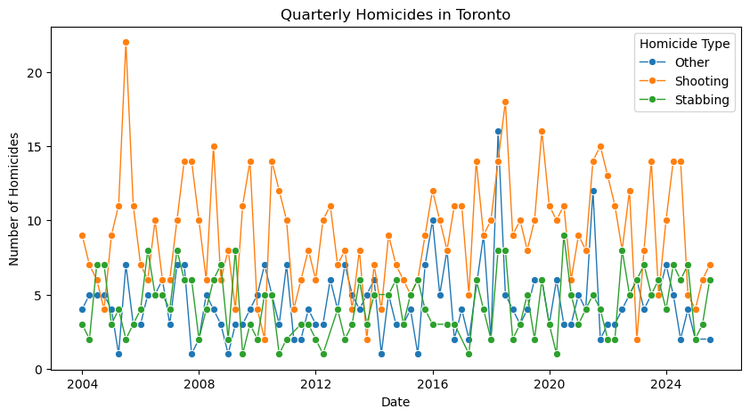
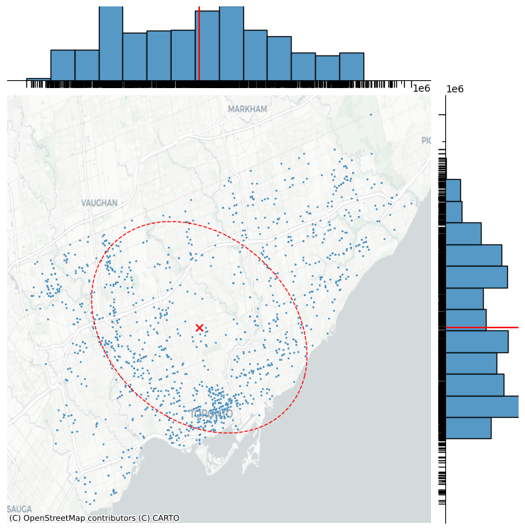
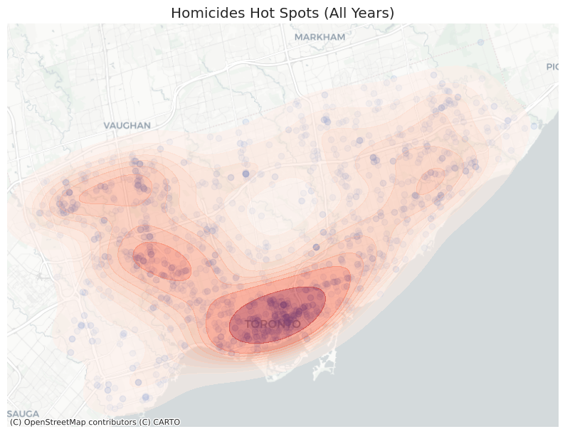
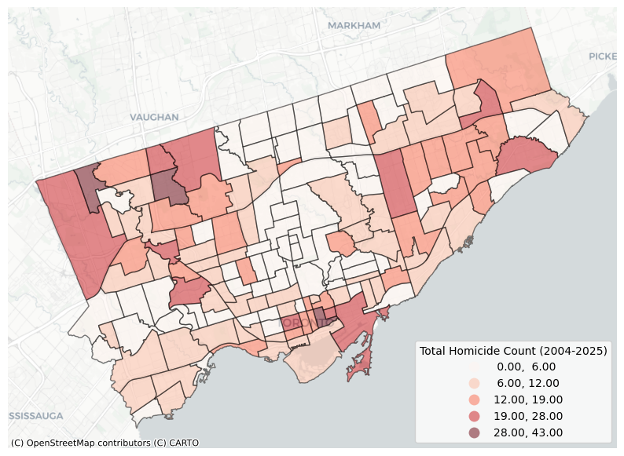

## Introduction

Understanding where crime happens is just as important as understanding why it happens. Spatial crime analysis allows us to explore the geography of criminal activity, particularly uncovering spatial patterns, identifying hotspots, and informing data-driven strategies for prevention and policing.

This tutorial provides a practical introduction to spatial crime analysis using Python, guiding you through several essential techniques for understanding how crime patterns vary across space. You will learn how to:

-   import publicly available data using API requests
-   create density maps to identify spatial hot spots of crime incidents
-   generate summary statistics for neighborhood-level comparisons
-   apply global and local spatial autocorrelation methods (Moran's I and Local Moran's I) to detect clustering structures

Python is a powerful alternative to traditional GIS tools like QGIS because it allows you to fully automate workflows, integrate statistical analysis with spatial data, and reproduce results programmatically. This makes it ideal not only for exploration but also for scalable, repeatable crime analysis pipelines. Note that basic programming/Python knowledge is required for this tutorial.

## Data and Setup

``` python
import pandas as pd
import geopandas as gpd
import seaborn as sns
import numpy as np
import contextily as cx
import requests
import ipywidgets as widgets
import matplotlib.pyplot as plt
from matplotlib.patches import Ellipse
from pointpats import centrography
from IPython.core.pylabtools import figsize
from libpysal.weights import Queen
from esda.moran import Moran, Moran_Local
```

We will use [publicly available data](https://data.torontopolice.on.ca/pages/open-data) on homicides from the Toronto Police Service (TPS). According to the dataset [documentation](https://data.torontopolice.on.ca/datasets/TorontoPS::homicides-open-data-asr-rc-tbl-002/about), it includes records of all homicide occurrences in Toronto since 2004. The TPS Open Data Portal provides several download options, including CSV, GeoJSON, and Excel formats, making it easy to work with in different environments. It also offers an API endpoint, which is especially useful when you want to automate data retrieval or integrate live updates directly into your analysis scripts. In this tutorial, we'll take advantage of the API to demonstrate how to import data programmatically in Python. This approach not only saves time but also makes your workflow more reproducible.

To work with spatial data in Python, we'll use [GeoPandas](https://geopandas.org/en/stable/index.html), a powerful open-source library that extends the functionality of pandas to handle geographic data. It allows you to work with vector data (like points, lines, and polygons) in the same way you'd work with tabular data in pandas, while adding built-in support for geometry operations, map plotting, and coordinate transformations.

The core data structure in GeoPandas is the GeoDataFrame, which works just like a regular pandas DataFrame but includes a special geometry column that stores spatial features, for example, the geographic coordinates of each homicide location. This makes it easy to visualize data on a map, perform spatial joins, or calculate geometric properties such as distances and areas.

``` python
# make an API request to get the data

# define query parameters for the API request
fields_to_retrieve = '*'  # retrieve all available fields
file_format = 'geojson'  # request data in GeoJSON format (easy to load into GeoPandas)

# construct the API endpoint URL
url = f"https://services.arcgis.com/S9th0jAJ7bqgIRjw/arcgis/rest/services/Homicides_Open_Data_ASR_RC_TBL_002/FeatureServer/0/query?outFields={fields_to_retrieve}&where=1%3D1&f={file_format}"

# send the API request
response = requests.get(url)
# parse the response as JSON
data = response.json()
# convert the obtained data into a GeoDataFrame
homicides_df = gpd.GeoDataFrame.from_features(data['features'])

# preview the first few records
homicides_df.head()
```

<div style="overflow-y: scroll;">
  <table>
<thead>
<tr>
<th></th>
<th>geometry</th>
<th>OBJECTID</th>
<th>EVENT_UNIQUE_ID</th>
<th>OCC_DATE</th>
<th>OCC_YEAR</th>
<th>OCC_MONTH</th>
<th>OCC_DAY</th>
<th>OCC_DOW</th>
<th>OCC_DOY</th>
<th>DIVISION</th>
<th>HOMICIDE_TYPE</th>
<th>HOOD_158</th>
<th>NEIGHBOURHOOD_158</th>
<th>HOOD_140</th>
<th>NEIGHBOURHOOD_140</th>
<th>LONG_WGS84</th>
<th>LAT_WGS84</th>
</tr>
</thead>
<tbody>
<tr>
<td>0</td>
<td>POINT (-79.393 43.685)</td>
<td>1</td>
<td>GO-2004111878</td>
<td>1073106000000</td>
<td>2004</td>
<td>January</td>
<td>3</td>
<td>Saturday</td>
<td>3</td>
<td>D53</td>
<td>Other</td>
<td>098</td>
<td>Rosedale-Moore Park (98)</td>
<td>098</td>
<td>Rosedale-Moore Park (98)</td>
<td>-79.392828</td>
<td>43.685026</td>
</tr>
<tr>
<td>1</td>
<td>POINT (-79.234 43.782)</td>
<td>2</td>
<td>GO-2004125755</td>
<td>1073538000000</td>
<td>2004</td>
<td>January</td>
<td>8</td>
<td>Thursday</td>
<td>8</td>
<td>D42</td>
<td>Shooting</td>
<td>142</td>
<td>Woburn North (142)</td>
<td>137</td>
<td>Woburn (137)</td>
<td>-79.233852</td>
<td>43.781782</td>
</tr>
<tr>
<td>2</td>
<td>POINT (-79.206 43.811)</td>
<td>3</td>
<td>GO-2004136086</td>
<td>1073538000000</td>
<td>2004</td>
<td>January</td>
<td>8</td>
<td>Thursday</td>
<td>8</td>
<td>D42</td>
<td>Shooting</td>
<td>146</td>
<td>Malvern East (146)</td>
<td>132</td>
<td>Malvern (132)</td>
<td>-79.205574</td>
<td>43.810544</td>
</tr>
<tr>
<td>3</td>
<td>POINT (-79.434 43.67)</td>
<td>4</td>
<td>GO-2004148623</td>
<td>1075006800000</td>
<td>2004</td>
<td>January</td>
<td>25</td>
<td>Sunday</td>
<td>25</td>
<td>D13</td>
<td>Shooting</td>
<td>171</td>
<td>Junction-Wallace Emerson (171)</td>
<td>093</td>
<td>Dovercourt-Wallace Emerson-Junction (93)</td>
<td>-79.434387</td>
<td>43.670467</td>
</tr>
<tr>
<td>4</td>
<td>POINT (-79.205 43.823)</td>
<td>5</td>
<td>GO-2004148619</td>
<td>1075006800000</td>
<td>2004</td>
<td>January</td>
<td>25</td>
<td>Sunday</td>
<td>25</td>
<td>D42</td>
<td>Shooting</td>
<td>144</td>
<td>Morningside Heights (144)</td>
<td>131</td>
<td>Rouge (131)</td>
<td>-79.204958</td>
<td>43.822997</td>
</tr>
</tbody>
</table>
</div>

You can still perform all the usual data analysis operations you would with a regular pandas DataFrame, such as filtering, aggregation, and plotting. For example, we can aggregate homicides by quarter and visualize trends over time to see how the number of occurrences changes across the years.

The `OCC_DATE` column in the dataset is stored as a timestamp in milliseconds. Here, we convert it to pandas datetime objects so that we can perform date-based operations and groupings easily.

``` python
# convert date column from timestamp to datetime format
homicides_df['OCC_DATE_conv'] = homicides_df['OCC_DATE'].apply(lambda x: pd.Timestamp(x, unit='ms'))

# calculate the number of events by the quarter of occurrence (converted from the datetime column)
# and the type of homicide
temp_df = homicides_df\
    .groupby([homicides_df['OCC_DATE_conv'].dt.to_period("Q"), 'HOMICIDE_TYPE'])\
    .agg({"EVENT_UNIQUE_ID": "count"})\
    .reset_index(drop=False)\
    .rename(columns={"EVENT_UNIQUE_ID": "count"})

# convert date column back to timestamp for plotting
temp_df['OCC_DATE_conv'] = temp_df['OCC_DATE_conv'].dt.to_timestamp()

plt.figure(figsize=(10, 5))

sns.lineplot(
    data=temp_df,
    x='OCC_DATE_conv',
    y='count',
    hue='HOMICIDE_TYPE',  # separate lines for each homicide type
    marker="o",  # add markers to emphasize data points
    linewidth=1
)

plt.title("Quarterly Homicides in Toronto")
plt.xlabel("Date")
plt.ylabel("Number of Homicides")
plt.legend(title="Homicide Type")
plt.show()
```

<figure>
  </img>
</figure>

Now to the spatial analysis. As the columns `LONG_WGS84` and `LAT_WGS84` suggest, the location coordinates are based on the WGS 84 geographic coordinate system (EPSG:4326). We will convert those geographic coordinates into the Web Mercator projection (EPSG:3857). This projected coordinate system represents the Earth on a flat, two-dimensional plane using meters as units, the same system used by most online mapping services (like OpenStreetMap, Google Maps, or CartoDB).

``` python
homicides_df = homicides_df \
    .set_crs(epsg=4326) \
    .to_crs(epsg=3857)
```

## Pin Map and Centrography

Before moving on to more advanced analysis, it's a good idea to visually inspect the data to ensure everything looks as expected. That's where the `.explore()` function from GeoPandas comes in. It allows you to create interactive web maps directly from a GeoDataFrame with just a single line of code --- making it easy to pan, zoom, and click on individual features to explore their attributes.

Note that crime locations in this dataset are offset to the nearest intersection to protect privacy. Coordinates are approximate and should not be interpreted as exact addresses.

``` python
homicides_df.explore()
```

<iframe src="https://rklymentiev.com/spatial-crime-analysis-in-python/homicides_df.html" width="100%" height="450" frameborder="0"></iframe>

The first example computes two fundamental centrographic measures commonly used in spatial crime analysis: the mean center and the standard deviational ellipse. The mean center shows the geographic "average" location of all homicide events, essentially the spatial gravity point of the dataset. The standard deviational ellipse summarizes the shape, orientation, and dispersion of the crime pattern by indicating the primary directional trend (e.g., northeast--southwest) and spread of incidents. Plotting these measures on top of incident points and a basemap makes it easy to understand where homicides concentrate overall and whether their pattern stretches along a particular corridor or axis. This is helpful for detecting city-wide directional trends, comparing different time periods, and supporting strategic policing or resource deployment.

``` python
# extract x and y coordinates from geometry
homicides_df['x'] = homicides_df['geometry'].apply(lambda x: x.xy[0][0])
homicides_df['y'] = homicides_df['geometry'].apply(lambda x: x.xy[1][0])

# compute the mean center of all homicide locations
# (i.e., the geographic "average" of all x/y coordinates)
mean_center = centrography.mean_center(homicides_df[["x", "y"]])

# compute the parameters of the Standard Deviational Ellipse
major, minor, rotation = centrography.ellipse(homicides_df[["x", "y"]])

# create a joint plot (scatter plot + marginal distributions of x/y coordinates)
ax = sns.jointplot(
    x="x", y="y", data=homicides_df, height=8, s=4,
)

# add a web basemap to the jointplot's main axis
cx.add_basemap(ax.ax_joint, source=cx.providers.CartoDB.Positron)
# add marginal rug plots to show density along each axis
ax.plot_marginals(sns.rugplot, color="black", height=-.1, clip_on=False)

# plot the mean center on the map
ax.ax_joint.scatter(
    *mean_center, color="red", marker="x", s=50, label="Mean Center"
)

# add vertical and horizontal lines showing the mean center in the marginal distributions
ax.ax_marg_x.axvline(mean_center[0], color="red")
ax.ax_marg_y.axhline(mean_center[1], color="red")

# create the standard deviational ellipse patch
ellipse = Ellipse(
    xy=mean_center,
    width=major * 2,
    height=minor * 2,
    angle=np.rad2deg(rotation),
    facecolor="none",
    edgecolor="red",
    linestyle="--"
)

# add the ellipse to the main jointplot axis
ax.ax_joint.add_patch(ellipse)

# remove axis labels for a cleaner appearance
ax.ax_joint.set_axis_off()
```

<figure>
  </img>
</figure>

## Density Plot (Kernel Density Estimation)

While the mean center and standard deviational ellipse provide a useful summary of the overall spatial distribution of homicides, they don't show where crimes are most concentrated within the city. To reveal these high-intensity areas, a more informative approach is Kernel Density Estimation (KDE). KDE creates a continuous surface that highlights hot spots, locations where incidents cluster more tightly. To create a density plot, we first need to extract the numeric coordinates from each point's geometry, because the KDE (Kernel Density Estimation) function in Seaborn requires regular x--y values rather than geometric objects. Once the coordinates are available, we can plot the incident points on a basemap and overlay a smooth KDE surface to highlight areas where homicides are more concentrated. This results in a clear visual representation of spatial crime intensity across the city.

``` python
# plot all homicide points as the base layer
ax = homicides_df\
    .plot(figsize=(10, 10), alpha=0.1)

# add a web basemap underneath (CartoDB Positron)
cx.add_basemap(ax, source=cx.providers.CartoDB.Positron)

# add Kernel Density Estimation (KDE) heatmap to show homicide hotspots
sns.kdeplot(homicides_df, x='x', y='y', fill=True, ax=ax, cmap='Reds', alpha=0.5)

plt.title("Homicides Hot Spots (All Years)")
plt.axis('off')
plt.show()
```

<figure>
  </img>
</figure>

The plot above shows the density plot of homicides aggregated for all available years. Sometimes it might be useful to aggregate the data for each year separately. If you are using Jupyter Notebooks, there is a way to create an interactive plot using [Jupyter Widgets](https://ipywidgets.readthedocs.io/en/stable/). Unfortunately, the result of the code below cannot be demonstrated in a post environment, but the short video demonstration is included.

``` python
def plot_homicides(year):
    # filter dataset to include only homicides from the selected year
    year = str(year)
    df_year = homicides_df.query(f"OCC_YEAR == '{year}'")

    # make a plot
    fig, ax = plt.subplots(figsize=(10, 10))
    df_year.plot(ax=ax, alpha=0.5)
    cx.add_basemap(ax, source=cx.providers.CartoDB.Positron)
    # add Kernel Density Estimation (KDE) surface on top of the basemap
    sns.kdeplot(df_year, x='x', y='y', fill=True, ax=ax, cmap='Reds', alpha=0.5)

    plt.title(f"Homicides Hot Spots ({year})", fontsize=14)
    plt.axis('off')
    plt.show()


# create a list of available years from the dataset
years = sorted(homicides_df["OCC_YEAR"].dropna().unique())
# build an interactive slider in Jupyter using ipywidgets
# the slider lets the user choose a year, which automatically triggers plot_homicides()
widgets.interact(plot_homicides, year=widgets.SelectionSlider(
   options=years,
   description='Year:',
   continuous_update=False,
   layout=widgets.Layout(width='600px')
))
```

<video controls width="100%">

<source src="widget.webm" type="video/webm" />

</video>

## Neighborhood-Level Aggregation and Choropleth Maps

In many analytical or policy-oriented contexts, we are also interested in how crime varies across administrative units, such as neighborhoods. Aggregating incidents to these regions allows us to create choropleth maps, which summarize crime counts (or rates) for each area. Of course, you could do this numerically by aggregating the data, for example:

``` python
homicides_df\
    .groupby('NEIGHBOURHOOD_158')\
    .agg({"EVENT_UNIQUE_ID": "count"})\
    .sort_values(by="EVENT_UNIQUE_ID", ascending=False)\
    .reset_index(drop=False)\
    .rename(columns={"EVENT_UNIQUE_ID": "count"})\
    .head(5)
```

<div style="overflow-y: scroll;">
<table>
<thead>
<tr>
<th><p></p></th>
<th><p>NEIGHBOURHOOD_158</p></th>
<th><p>count</p></th>
</tr>
</thead>
<tbody>
<tr>
<td><p>0</p></td>
<td><p>Mount Olive-Silverstone-Jamestown (2)</p></td>
<td><p>43</p></td>
</tr>
<tr>
<td><p>1</p></td>
<td><p>Moss Park (73)</p></td>
<td><p>42</p></td>
</tr>
<tr>
<td><p>2</p></td>
<td><p>Glenfield-Jane Heights (25)</p></td>
<td><p>39</p></td>
</tr>
<tr>
<td><p>3</p></td>
<td><p>Black Creek (24)</p></td>
<td><p>28</p></td>
</tr>
<tr>
<td><p>4</p></td>
<td><p>Weston (113)</p></td>
<td><p>27</p></td>
</tr>
</tbody>
</table>
</div>

This gives a quick look at the neighborhoods with the highest number of homicides. However, for this tutorial, we want to use the data for spatial demonstrations. One challenge is that our homicide dataset only contains the names of neighborhoods and not their geometries, that are needed for visualization. To solve this, we'll load another dataset that includes the polygon boundaries of each neighborhood, allowing us to map and analyze homicide counts spatially. By looking through available datasets on TPS Data Portal, one can see that [Neighbourhood Crime Rates Open Data](https://hub.arcgis.com/datasets/TorontoPS::neighbourhood-crime-rates-open-data/about) has the relevant information. This dataset also has information on population and neighborhood area, which might be useful for assessing population density and its relationship with crime rates across neighborhoods.

``` python
# we request only the relevant columns: the neighborhood name, ID, and geometric properties
fields_to_retrieve = 'AREA_NAME,HOOD_ID,POPULATION_2024,Shape__Area,Shape__Length'

# set the output format to GeoJSON
file_format = 'geojson'

# construct the API request URL
url = f"https://services.arcgis.com/S9th0jAJ7bqgIRjw/arcgis/rest/services/Neighbourhood_Crime_Rates_Open_Data/FeatureServer/0/query?where=1%3D1&outFields={fields_to_retrieve}&f={file_format}"

# make the request and convert to GeoDataFrame
response = requests.get(url)
data = response.json()
neighborhoods_df = gpd.GeoDataFrame.from_features(data['features'])

neighborhoods_df.sample(5)
```

<div style="overflow-y: scroll;">
  <table>
    <thead>
        <tr>
            <th></th>
            <th>geometry</th>
            <th>AREA_NAME</th>
            <th>HOOD_ID</th>
            <th>Shape__Area</th>
            <th>Shape__Length</th>
        </tr>
    </thead>
    <tbody>
        <tr>
            <th>137</th>
            <td>POLYGON ((-79.526 43.601, -79.526 43.601, -79....</td>
            <td>Long Branch</td>
            <td>19</td>
            <td>2.261914e+06</td>
            <td>7808.451620</td>
        </tr>
        <tr>
            <th>112</th>
            <td>POLYGON ((-79.358 43.765, -79.357 43.765, -79....</td>
            <td>St.Andrew-Windfields</td>
            <td>40</td>
            <td>7.345556e+06</td>
            <td>12863.420551</td>
        </tr>
        <tr>
            <th>90</th>
            <td>POLYGON ((-79.317 43.667, -79.317 43.666, -79....</td>
            <td>Greenwood-Coxwell</td>
            <td>65</td>
            <td>1.675166e+06</td>
            <td>6843.006889</td>
        </tr>
        <tr>
            <th>87</th>
            <td>POLYGON ((-79.356 43.665, -79.356 43.665, -79....</td>
            <td>North Riverdale</td>
            <td>68</td>
            <td>1.786063e+06</td>
            <td>5475.708476</td>
        </tr>
        <tr>
            <th>60</th>
            <td>POLYGON ((-79.397 43.696, -79.397 43.696, -79....</td>
            <td>Yonge-St.Clair</td>
            <td>97</td>
            <td>1.161371e+06</td>
            <td>5873.159373</td>
        </tr>
    </tbody>
</table>
</div>

Once we load the neighborhood boundary data, we can merge it with the homicide dataset to attach the corresponding polygon geometry to each homicide event. Note that neighborhood IDs (`HOOD_ID`) in the boundary dataset are stored as integers (e.g., 1, 2, 3), while in the homicide dataset they are stored as zero-padded text strings (e.g., "001", "002", "003"). To ensure a successful merge, we first need to convert the integer IDs into 3-digit string codes.

Then we will aggregate the data to calculate the count of homicides within each neighborhood.

``` python
# convert integer to a zero-padded 3-digit string (e.g., 1 -> "001")
neighborhoods_df['HOOD_ID'] = neighborhoods_df['HOOD_ID']\
    .apply(lambda x: str(x).rjust(3, '0'))

# merge neighbourhood polygons with homicide data
# left-join homicide records to neighbourhoods using matching HOOD_ID fields
# count how many homicide events fall into each neighbourhood
# reset index and rename the count column
# merge counts back into the neighbourhoods_df to retain geometry
combined_df = neighborhoods_df\
    .merge(homicides_df, left_on='HOOD_ID', right_on='HOOD_158', how='left')\
    .groupby(['HOOD_ID'])\
    .agg({'EVENT_UNIQUE_ID': 'count'})\
    .reset_index()\
    .rename(columns={'EVENT_UNIQUE_ID': 'HOM_TOTAL_COUNT'})\
    .merge(neighborhoods_df)

# convert the merged DataFrame into a GeoDataFrame and assign the original
# geographic coordinate system (WGS84, EPSG:4326).
# This ensures that the geometry column is recognized as spatial data
# before transforming it to a projected CRS (e.g., Web Mercator EPSG:3857).
combined_df = gpd.GeoDataFrame(
    combined_df,
    geometry='geometry',
    crs='EPSG:4326'
)
```

``` python
# reproject data to Web Mercator (EPSG:3857) for compatibility with web basemaps,
# then plot neighborhood polygons colored by total homicide count.
ax = combined_df\
    .to_crs(epsg=3857)\
    .plot(
        figsize=(10, 10),
        column="HOM_TOTAL_COUNT",  # variable used to determine color of each polygon
        scheme="FisherJenks",  # statistical classification method (natural breaks)
        cmap="Reds",
        alpha=0.5,
        legend=True,  # Show legend
        legend_kwds={'loc': 'lower right', 'title': 'Total Homicide Count (2004-2025)'},
        edgecolor='black'  # Edge color for better visibility
    )

# add a web basemap (CartoDB Positron) under the polygons
cx.add_basemap(ax, source=cx.providers.CartoDB.Positron)
# remove axes for a cleaner map visualization
ax.set_axis_off()
plt.show()
```

<figure>
  </img>
</figure>

Similarly, there is a method to create an interactive map.

``` python
combined_df.explore(
    column="HOM_TOTAL_COUNT",
    cmap="Reds",
    style_kwds={'color': 'grey'},
)
```

<iframe src="/spatial-crime-analysis-in-python/toronto_homicides_map.html" width="100%" height="450" frameborder="0">

</iframe>

## Spatial Statistics: Moran's I and LISA

In the next part of this tutorial, we'll move from visualization to spatial statistics, focusing on two key measures: Moran's I and Local Moran coefficients (LISA). These statistics help us understand whether homicide counts are spatially clustered, dispersed, or randomly distributed across Toronto's neighborhoods.

Moran's I is a global measure of spatial autocorrelation. A positive value indicates that similar values (e.g., high homicide counts) tend to occur near each other, while a negative value suggests a checkerboard-like pattern where high values are surrounded by low values. Values near zero imply no meaningful spatial pattern. Local Moran statistics take this a step further by identifying specific neighborhoods that contribute most to the overall pattern. They highlight "hot spots" (high values surrounded by high values), "cold spots," and potential spatial outliers. These tools allow us to quantify and map spatial patterns rather than relying on visual intuition alone.

To compute Moran's I and Local Moran statistics, we need a way to formally describe which neighborhoods are considered neighbors. This is where a contiguity-based spatial weights matrix comes in. By defining areas as neighbors when they share a border or corner (Queen contiguity), we capture real-world spatial relationships, or areas that touch are more likely to influence each other. These weights tell the statistical model how observations are connected in space, allowing Moran's I to evaluate whether similar homicide values cluster among adjacent neighborhoods. Without a spatial weights matrix, the analysis would treat neighborhoods as independent, ignoring the geographic structure that is central to spatial autocorrelation.

``` python
# create a Queen contiguity spatial weights matrix
# neighborhoods are considered neighbors if they share a border OR a corner.
w = Queen.from_dataframe(combined_df, geom_col='geometry', ids='AREA_NAME')

# row-standardize the weights so each row sums to 1
w.transform = 'R'
```

``` python
# select the variable for which we want to measure spatial autocorrelation
# in our case it is total homicide counts per neighborhood.
y = combined_df["HOM_TOTAL_COUNT"]

# compute Moran's I statistic using the chosen variable and weights matrix
mi = Moran(y, w)

print(f"Moran's I: {mi.I:.3f}")
print(f"p-value: {mi.p_sim:.3f}")
```

```         
Moran's I: 0.295
p-value: 0.001
```

For our dataset, the global Moran's I value is 0.295 with a p-value of 0.001. This indicates a statistically significant positive spatial autocorrelation in homicide counts across Toronto's neighborhoods. In practical terms, neighborhoods with high homicide counts tend to be located near other high-count neighborhoods, and the same is true for low-count areas. The low p-value confirms that this pattern is unlikely to be due to random chance and reflects a meaningful spatial structure in the data.

After computing the global Moran's I, the next step is to explore local spatial autocorrelation using the Local Moran statistic (LISA). This helps identify where clusters occur rather than whether clustering exists overall.

``` python
# compute Local Moran's I for each neighborhood
li = Moran_Local(y, w)

# store results in the dataframe
combined_df["local_I"] = li.Is  # local Moran statistic for each polygon
combined_df["p_val"] = li.p_sim  # local p-values

# extract cluster quadrant codes:
# 1 = High-High, 2 = Low-High, 3 = Low-Low, 4 = High-Low
combined_df["quadrant"] = li.q
cluster_types = {1: 'HH', 2: 'LH', 3: 'LL', 4: 'HL'}
combined_df["quadrant_label"] =  combined_df["quadrant"].apply(lambda x: cluster_types[x])
```

The code below visualizes only the statistically significant Local Moran clusters (p \< 0.05). First, the dataset is filtered to include only neighborhoods where the Local Moran p-value indicates a meaningful spatial pattern.

``` python
ax = combined_df\
    .query("p_val < .05")\
    .to_crs(epsg=3857)\
    .plot(
        figsize=(10, 10),
        column="quadrant_label",  # variable used to determine color of each polygon
        categorical=True,
        cmap="Set1",
        alpha=0.5,
        legend=True,  # Show legend
        legend_kwds={'loc': 'lower right'},
        edgecolor='black'  # Edge color for better visibility
    )

# add a web basemap (CartoDB Positron) under the polygons
cx.add_basemap(ax, source=cx.providers.CartoDB.Positron)
# remove axes for a cleaner map visualization
ax.set_title("Local Moran Cluster Map (LISA)")
ax.set_axis_off()
plt.show()
```

<figure>
  </img>
</figure>

The resulting Local Moran cluster map highlights neighborhoods that exhibit statistically significant spatial clustering of homicide counts. High--High (HH) areas represent neighborhoods with high homicide counts that are surrounded by similarly high-count neighbors, true "hot spot clusters." In contrast, Low--Low (LL) areas indicate clusters of neighborhoods with consistently low homicide counts. The High--Low (HL) and Low--High (LH) categories identify spatial outliers: HL neighborhoods have high homicide counts while their neighbors have low values, whereas LH neighborhoods have low counts surrounded by higher-intensity areas.

## Conclusions

In this tutorial, we explored spatial crime analysis using Python with publicly available homicide data from the Toronto Police Service. We demonstrated several key steps in analyzing and visualizing crime patterns:

1.  Data acquisition and preparation -- Importing data via API requests, converting coordinates to a projected system, and merging with neighborhood polygons for spatial aggregation.
2.  Exploratory spatial analysis -- Mapping point locations, calculating mean centers and standard deviational ellipses, and creating KDE surfaces to identify areas with high concentrations of incidents.
3.  Neighborhood-level analysis -- Aggregating crime counts to administrative units and creating choropleth maps to compare neighborhoods.
4.  Spatial statistics -- Computing global Moran's I to assess overall spatial autocorrelation, and Local Moran (LISA) to detect significant clusters and spatial outliers.

These analyses illustrate the power of Python for integrating GIS, statistics, and data visualization in a reproducible workflow. Unlike purely GUI-based tools, Python allows analysts to automate data processing, customize visualizations, and apply advanced spatial statistics, all within a single environment. Moving forward, this workflow can be extended to include space--time analysis, hotspot detection using HDBSCAN or Gi\*, spatial regression, and predictive modeling, providing even deeper insights for researchers, policy makers, and law enforcement agencies.

## Useful Links and Resources

-   Rey, S., Arribas-Bel, D., & Wolf, L. J. (2023). *Geographic Data Science with Python*. <https://doi.org/10.1201/9780429292507>

    -   Online version of the book: <https://geographicdata.science/book/intro.html>

-   Online course "Mapping and Spatial Analysis of Crime- Open Software Edition" at Udemy: <https://www.udemy.com/course/mapping-and-spatial-analysis-of-crime-free-software-edition/>

-   GeoPandas Documentation with lots of examples: <https://geopandas.org/en/stable/docs.html>
